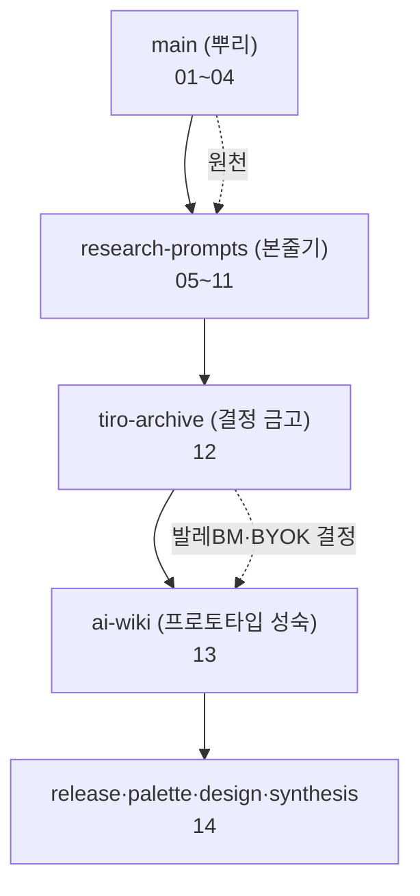

📅 2026-06-08 · 📁 02_몸소 서비스 / 02_브랜치별 자료 정독 · cover(표지)
> **한 줄 정의:** momso 저장소(github.com/mow-coding/momso)의 **8개 브랜치를 하나씩 정독**해, "main의 날것 → 정제된 공모전 산출물·프로토타입"으로 이어지는 momso의 전모를 14개 노트로 남긴 폴더의 표지.

---

## A. 핵심 요약

- 이 폴더는 **github 데이터를 브랜치별로 정독한 학습 기록**이다(2026-06-08, 무인 정독 포함).
- 8개 브랜치 = `main`(뿌리) → `research-prompts`(본줄기) → `tiro-archive`(결정 금고) → `ai-wiki`(프로토타입 성숙) → `release/palette/design/synthesis`(곁가지).
- 노트 14개: **main 정독(01~04)** + **본줄기 분해(05~11)** + **tiro 아카이브(12)** + **ai-wiki(13)** + **마무리 브랜치(14)**.
- 관통 한 줄: 어느 브랜치를 봐도 **HITL(AI는 초안만·강사가 검수·원본 비공개·검수된 기록만 발행)**과 **발레파킹 BM(데이터는 고객 소유, momso는 운영)**이 척추다.
- ⚠️ `private-raw/`·노션 export엔 사적 자료가 있어 **공개·외부공유 시 솎아내야** 함(노트 12 참조).

## B. 흐름도

## C. 내용 — 14개 노트를 잇는 흐름 (색인)

**① main 정독 — momso의 날것 원천 (01~04)**
| 노트 | 무엇 |
|---|---|
| [01](01_momso_탄생_시간선.md) | momso 탄생 시간선 (3월 빅블루 OS → 5/13 작명) |
| [02](02_main의_두_공모전.md) | 두 공모전 (모두의창업 완료 / InBodyLIKE 본무대) |
| [03](03_리뷰123건_역순분석.md) | ★리뷰 123건 역순 분석 (브랜드 원형·3시대) |
| [04](04_20260513_기획회의.md) | ★5/13 기획회의 (momso 작명·출품 결정) |

**② research-prompts 본줄기 분해 — 정제된 산출물 (05~11)**
| 노트 | 무엇 |
|---|---|
| [05](05_본줄기_research-prompts.md) | 본줄기 개요(06~11 색인) |
| [06](06_정의와_제품원칙.md) | 정의·포지셔닝·HITL 5원칙 |
| [07](07_사업계획서와_피치덱.md) | 사업계획서 5항목·피치덱 v2→v3 |
| [08](08_시장BM_인바디연동_검증.md) | 시장·BM 숫자·인바디 연동 검증 |
| [09](09_Tiro_파트너십.md) | Tiro 파트너십(전략 vs 실제 미팅) |
| [10](10_제품철학_발레파킹BM.md) | 제품철학·발레파킹 Web2.5 BM |
| [11](11_프로토타입과_개발자표면.md) | 프로토타입 구조·발행게이트·API/CLI/MCP |

**③ 결정 금고 & 프로토타입 성숙 (12~13)**
| 노트 | 무엇 |
|---|---|
| [12](12_tiro_아카이브.md) | tiro 아카이브 — 6/3 통화서 발레BM·BYOK·Claude 확정 |
| [13](13_ai위키_프로토타입.md) | ai위키 프로토타입 — 초점 검수·AI 위키·회수 루프 |

**④ 마무리 (14)**
| 노트 | 무엇 |
|---|---|
| [14](14_마무리_브랜치들.md) | release(배포 게이트)·palette·design(동환)·synthesis(옛 흡수) |

> **읽는 순서 추천:** 처음이면 01(시간선) → 05(본줄기 개요) → 06(정의)만 봐도 큰 그림. 깊이 보려면 ③④까지.

## D. 참조

- **인용 (상류):** (없음 — 이 폴더의 표지)
- **피인용 (하류):** 01~14 전체 (위 색인)
- **상위 맥락:** `02_몸소 서비스`(momso 저장소), `01_시스템 적응하기`(Git·브랜치·PR 개념)
- **Joplin:** 노트북 `몸소 서비스`
- **태그:** (나중)
