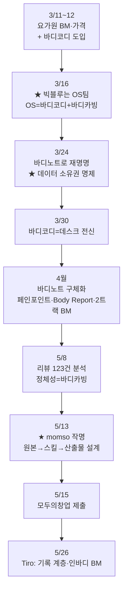

📅 2026-06-08 · 📁 02_몸소 서비스 / 02_브랜치별 자료 정독 · note
> **한 줄 정의:** main 브랜치에 보존된 3~5월 회의록을 시간순으로 이으면, momso는 "갑자기 나온 앱"이 아니라 *요가원 장사 → 빅블루 OS → 바디노트 → momso*로 3개월간 사고가 진화한 결론임이 보인다.

---

## A. 핵심 요약

- main의 노션 회의록(3/11~5/26)을 시간순으로 이으면 **momso의 탄생 과정 전체**가 한 줄기로 드러난다.
- **3월:** 요가원 BM 논의 → "수련에도 OS가 필요" → **빅블루 OS = 바디코디(운영) + 바디카빙/바디노트(3D 해부학)** + "데이터 소유권" 명제.
- **4월:** 바디노트가 *"방문 전 챗봇 체험 + 수업 기록"* 제품으로 구체화 + 페인포인트 마케팅 로직 + 2트랙 BM.
- **5월:** 리뷰 123건 분석 → **5/13 "momso(몸소)" 작명** + "AI도구가 아니라 원본→스킬→산출물→수신자 설계" 결론 → **5/15 모두의창업 제출** → 5/26 Tiro에서 "기록 계층" 정의.
- 3~4월 회의엔 "몸소"라는 단어가 **0번** 나온다. 이름은 5/13에 처음 등장 — *몸을 **소**중하게 / 몸과 **소**통하고 / **몸소** 실천*.

## B. 흐름도

## C. 본문

### 1. 질문 — 무엇이 궁금했나

- momso는 어디서, 어떻게 시작됐나? 처음부터 "요가 수업 기록 앱"이었나?
- 옛 "Body Note(3D 해부학)"와 지금 momso는 무슨 관계인가?
- "몸소"라는 이름은 언제, 왜 정해졌나?

### 2. 목적 — 왜 했나

기획 단계에서 momso의 **원래 의도와 진화 경로**를 정확히 알아야, 지금 다듬는 방향이 뿌리에서 벗어나지 않았는지 판단할 수 있다. main은 그 진화를 통째로 보존한 유일한 원천 아카이브다.

### 3. 내용 — 시간선 (알맹이)

**(1) 3월 — "빅블루 OS" 개념의 탄생**

- **3/11~12:** 시작은 평범한 요가원 장사. 가격 개편(아가르 2인→빅블루 1인 전환, 고정 수련생 20명 중 절반 이탈 복기), 그룹 티켓 명명(숨티켓/쉼티켓/무제한), 개인 단가 인상, **바디코디 앱 도입**. 회의 끝에 *"수련에도 OS가 필요하다"*(어반플레이 "동네에도 OS가 필요하다" 차용)는 비유가 처음 등장. 몸=디바이스, 원장의 맞춤 시퀀스=운영체제.
- **3/16:** ⭐ *"빅블루는 OS를 개발하는 팀이다."* **빅블루 OS = (가칭)바디코디 + 바디카빙**. 바디카빙 = 생활체육지도자용 **경량 3D 해부학 SW**(동양 경락 통합, 핵심기능 'RUN'=시퀀스를 해부학 데이터로 함수화해 실시간 시각화). 수업 2축(정렬/호흡) 확립.
- **3/24:** OS의 한 축이 **바디노트(Body Note)**로 재명명(데스크 + 바디노트 구조). ⭐ 핵심 명제 — *"데이터 소유권이 있어야 AI로 무제한 성장한다."* 예약(네이버)·메모(노션)·소통(카톡)이 흩어져 AI 질의 불가 → 자체 OS로 통합·소유해야 함. (3/25 UOS 창업동아리 발표 리허설.)
- **3/30:** UOS 창업동아리 **선발**. *"바디코디 = 스튜디오의 메타버스 = 미래 OS '데스크'의 전신"*으로 연결. 유동환의 투병 경험이 "아픈 사람을 위한 치유" 가치로 BM 철학 재정향.

**(2) 4월 — 바디노트 구체화 + 사업 논리 완성**

- **4/1:** 수업 성문화·"칠판에 그날 주제 표기" 같은 **수업 기록의 맹아** + 법인화 구상(지분·의결권 명확화).
- **4/17:** ⭐ *"빅블루 OS = 수련관리 + 바디노트"* 공식 정의. **리뷰/콘텐츠 마스터 DB**(구글시트+노션, AI 자동요약)로 데이터 축적 시작. **Body Report**(신체 데이터 진단 세션, 연희 요가 위크 한정) 기획. 바디코디 **API/MCP 협업** 제안("데이터는 내 손에 있어야"). 고객층 변화 포착: 중장년("안 아프려고") → 30~40대 직장인("더 좋은 움직임").
- **4/23:** ⭐ momso 아이디어 폭발. **페인포인트 로직** — 오붓이 해결한 '탐색 비용' 너머의 **'탐색 실패 경험'**을 공략 → *"꼭 가봐야만 판단하나? 방문 전에 확신을 주자(요가 배달/시식)."* **바디노트** = 3D해부학+경혈 레이어, 요가원 시퀀스 등록(오픈소스), **빅블루 챗봇과 대화해 집에서 체험**. + **2트랙 BM**(OS 장사=김성균 주도 / 콘텐츠 장사=유동환 주도). 동양철학을 브랜드 코어, 목공·비트박스는 "증거"로.

**(3) 5월 — momso 작명 & 출품**

- **5/8:** **리뷰 123건** 역순 분석(→ [03_리뷰123건_역순분석](03_리뷰123건_역순분석.md)). 정체성 = "신체 사용법 재교육·바디카빙". 연희 요가 위크 데이터(예약 ~1,601건) 확보.
- **5/13:** ⭐ **"momso(몸소)" 작명** — *몸을 **소**중하게 / 몸과 **소**통하고 / **몸소** 실천 / 몸을 **소**개*. *"AI 도구를 고르는 게 아니라 원본→스킬→산출물→수신자를 설계한다"* 결론. "맛보기 스푼" 비유. (→ [04_20260513_기획회의](04_20260513_기획회의.md))
- **5/15:** **모두의창업 지원서 제출 완료** (14:42). (→ [02_main의_두_공모전](02_main의_두_공모전.md))
- **5/26:** Tiro 점심 회의 — momso를 **"기록 계층 / 세컨드 바디"**로 정의. "인바디는 스펙을, 몸소는 수업을 기록한다." BM 숫자: 요가원당 연 600만 → 1,000곳 = 3년차 연 60억.

**(4) 두 개의 "Body Note" 구분 (혼동 주의)**

- ⓐ **옛 3D 해부학 *앱*** "Body Note": main의 `apps/web`에 실제 구현돼 있던 전문가용 뷰어. 지금은 미래 자매 제품으로 **파킹**.
- ⓑ **바디노트 *사상***: "수업을 기록·구조화해 AI가 전달" → momso로 **흡수**됨.
- 같은 이름이지만 ⓐ는 앱, ⓑ는 개념. momso의 현재 프로토타입(`InbodylikePrototype`)은 ⓐ와 별개의 후속 앱.

### 4. 근거·출처

- main 브랜치 `docs/notion-archive/official-export-20260526-relevant/` 의 회의록 10건(3/11~5/15), `momso-raw-20260526/`, `notion-research/` 정독.
- 8개 읽기 담당 에이전트의 전수 정독 결과(2026-06-08).
- 상세 근거: [03_리뷰123건_역순분석](03_리뷰123건_역순분석.md), [04_20260513_기획회의](04_20260513_기획회의.md).

### 5. 논의 과정

- 🧍 환: "main의 특정 자료 더 깊이 파줘" → "main 안에 안 읽은 파일 전부 읽어줘."
- 🤖 클로드: 8개 에이전트 병렬로 main 전 텍스트 정독 → 회의록을 시간순으로 이어 momso 탄생 흐름 도출.
- 🧍 환: "momso 탄생의 시간선 보완해서 note로 남겨줘."

### 6. 클로드 이해

momso의 정체를 한 장면이 아니라 **궤적**으로 봐야 한다. 핵심은 "데이터 소유권(3/24) → 방문 전 체험+수업 후 리포트(4/23) → 기록 계층(5/26)"으로 이어지는 한 줄기다. 지금 프로토타입을 다듬을 때도 이 줄기(수업 맥락을 기록·검수·공유)에서 벗어나면 안 된다.

### 7. 환의 생각

- 환은 momso를 *"갑자기 만든 앱"이 아니라 자기와 성균의 3개월 사고가 쌓인 결론*으로 인식하고 싶어 한다. 그래서 시간선 보완을 요청했다.
- "깃허브 데이터를 명확히 인식한다"는 목표 아래, 뿌리(main)부터 차분히 짚는 방식을 택했다.
- 옛 Body Note와 지금 momso의 관계를 분명히 구분하려는 의지가 보인다.

## D. 참조

- **만든 파일:** `02_브랜치별 자료 정독/01_momso_탄생_시간선.md`
- **인용 (상류):** [03_리뷰123건_역순분석](03_리뷰123건_역순분석.md) · [04_20260513_기획회의](04_20260513_기획회의.md)
- **피인용 (하류):** [02_main의_두_공모전](02_main의_두_공모전.md)
- **태그:** (나중)
