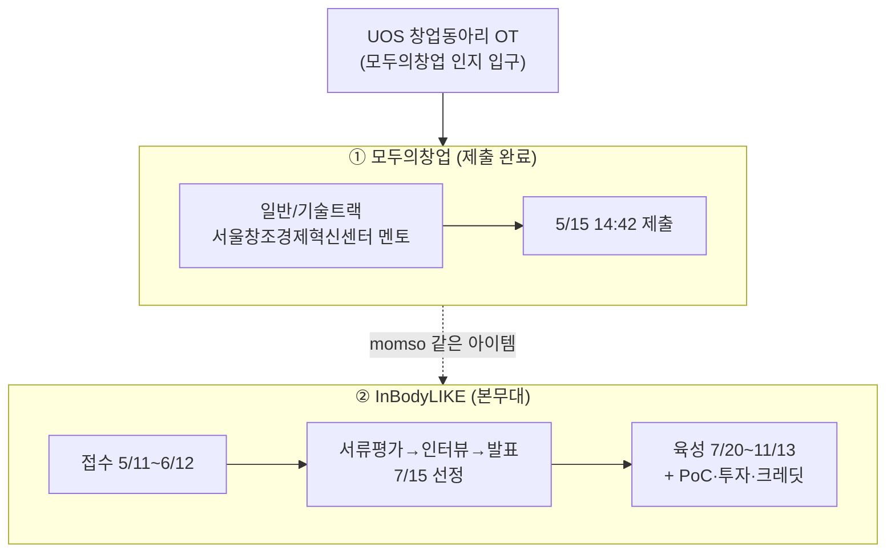

📅 2026-06-08 · 📁 02_몸소 서비스 / 02_브랜치별 자료 정독 · note
> **한 줄 정의:** main에 보존된 공모전 자료는 두 개다 — 이미 제출 완료한 **모두의창업**(5/15)과, momso의 진짜 본무대인 **InBodyLIKE**(인바디×블루포인트, 6/12 마감).

---

## A. 핵심 요약

- main은 momso가 노리는 **두 공모전**의 원천 자료를 담고 있다.
- **① 모두의창업:** 중기부 사업, 일반/기술 vs 로컬 트랙. momso는 **일반/기술트랙 + 서울창조경제혁신센터** 멘토로 **5/15 제출 완료**. 김성균이 기창업자라 로컬트랙(예비창업자만)은 부적격.
- **② InBodyLIKE:** 인바디 × 블루포인트 **오픈이노베이션**. 접수 5/11~6/12, 약 4개월 액셀러레이팅+PoC. 사업계획서 골격 = **Problem·Solution·Scale-up·Team·인바디 협업포인트**.
- 두 공모전 모두 **AI/데이터 기반 사업화**를 보는 자리라, AI 리포트·챗봇 기반 momso와 결이 맞는다.
- InBodyLIKE 혜택에 **Claude AI $10,000 크레딧, 네이버클라우드 2,000만원** 등이 포함.

## B. 흐름도

## C. 본문

### 1. 질문 — 무엇이 궁금했나

- main에는 어떤 공모전 자료가 있고, momso는 어디에 어떻게 지원하나?
- 두 공모전의 자격·일정·혜택·심사 기준은 무엇인가?

### 2. 목적 — 왜 했나

momso의 실행 동력은 공모전이다. 제도(트랙·자격·마감·지원금·심사 골격)를 정확히 알아야 사업계획서와 일정 전략을 짤 수 있다.

### 3. 내용 — 알맹이

**(1) 모두의창업 — 이미 제출 완료**

- **운영:** 중소벤처기업부. 일반/기술트랙(창업진흥원, 4,000명) + 로컬트랙(소진공, 1,000명).
- **자격:** 일반/기술 = 예비창업자 또는 **업력 3년 이내 창업기업**(선정 시 이종창업 필수). 로컬 = **예비창업자만**(기창업자 불가).
  - → 김성균이 업력 3년 내 기창업자라 **로컬트랙 부적격 → 일반/기술트랙이 유일 경로.**
- **momso 지원 내용:** 멘토기관 = **서울창조경제혁신센터**(서울·경기·인천), 분야 = 생활, 팀원 = 김성균. Q1~Q4는 [03·04 노트] 및 지원서 원문 참조.
- **마감:** 원공고(208호) 5/15 16:00 → **수정공고(342호) 20:00로 연장**. 342호 신설 = **신속심사**(4/23 24시까지 접수분 조기 선발).
- **혜택 흐름(일반/기술):** 활동자금 200만 → **AI 솔루션 월 최대 100만(2개월, 솔루션 조합 가능)** → MVP 최대 1,000만 → 상위 라운드(TOP1 상금 5억 + 사업화 1억).
- **심사:** 5단계(아이디어→지역예선→지역오디션→권역오디션→전국오디션). 수도권 30 : 비수도권 70 비율.
- **제출 경위:** 5/13 회의 초안 → 유동환이 5/14 밤~5/15 새벽 마무리 → **5/15 14:42 접수**.
- **입구:** UOS 창업동아리 OT(4/9 설명회)에서 *"로컬분야는 기창업자 불가"* 안내를 보고 모두의창업을 인지. (빅블루는 UOS 동아리 사업도 병행 — 최대 150만원.)

**(2) InBodyLIKE — momso의 본무대**

- **주최:** **인바디**(세계 최고 체성분 분석 기업) × **블루포인트**(테크 액셀러레이터, 포트폴리오 400+). 사이트 inbodylike.com, 문의 steve@bluepoint.ac.
- **성격:** 발명대회가 아닌 **오픈이노베이션** — 이미 기술·거점 있는 팀이 파트너사 자원과 결합(현업 협업·본사업 검토·CVC 투자·TIPS).
- **모집 대상:** 헬스케어/라이프스타일 기술·서비스·제품 보유 예비·초기 창업팀. **4개 분야**(① 헬스 인텔리전스 라이프스타일 ② 데이터 기반 환자 관리 ③ 글로벌 헬스케어 확장 ④ 차세대 프론티어 기술).
- **사업계획서 골격(필수):** **Problem · Solution · Scale-up · Team · 인바디와의 협업포인트 제안.** 자유양식 PPT→PDF, 파일명 `[사업계획서] 회사명_대표자명.pdf`. (선택) 3분 피칭 영상.
- **혜택 6종:** 인프라(인바디 측정기·14개 해외법인·110개국 수출망), 멘토링(신체데이터+SW 결합·글로벌 UX·의료기기 실증), 투자·TIPS, 네트워크(블루포인트 400+ 포트폴리오), 홍보, **외부 파트너십 크레딧** — 네이버클라우드 **2,000만원**, **Claude(Anthropic) AI $10,000**, 서울창업허브 1,000만원(3개사), 서울바이오허브 입주.
- **일정:** 접수 5/11~6/12 → 서류평가 6/15~6/26 → 사전 인터뷰 6/29~7/3 → 최종 발표 7/6~7/10 → **선정 7/15** → **육성 7/20~11/13** → 11월 4주차 성과공유회.
- **momso 포지셔닝(main 시점):** *"인바디는 스펙을 기록하고, 몸소는 수업을 기록한다. 둘이 융합돼야 의미 있는 기록 계층."* 역할 분담 = momso(도메인·현장 검증·매뉴얼) / 인바디(인력·디바이스·하드웨어 렌탈). 교보생명(SW)보다 인바디(하드웨어·생체데이터)가 momso에 적합하다고 판단.
- **BM 숫자(Tiro 5/26 합의):** 요가원 월 30만 + 수련생 월 ~7천 → 요가원당 연 600만 → 1,000곳 = **3년차 연 60억**, 필라테스/PT 확장 시 5년 300억 시나리오.

### 4. 근거·출처

- main `docs/inbodylike/`(competition_findings + 공식 PDF 24쪽), `docs/notion-archive/.../모두의창업 공고·지원서·UOS 창업동아리`, `docs/tiro-meetings/20260526_lunch_tiro_meeting_notes.md`.
- 8개 읽기 담당 에이전트 정독 결과(2026-06-08).

### 5. 논의 과정

- 🧍 환: "main이 품은 공모전 2개 관련 내용 보완해서 note로."
- 🤖 클로드: 공고·지원서·InbodyLike PDF·Tiro BM 숫자를 종합해 두 공모전을 자격·일정·혜택·심사·BM 축으로 정리.

### 6. 클로드 이해

모두의창업은 **이미 끝난 관문**(제출 완료), InBodyLIKE는 **앞으로의 본게임**(6/12 마감)이다. 지금 프로토타입·사업계획서 작업의 진짜 목표는 InBodyLIKE 제출이며, 사업계획서 5개 항목(Problem~협업포인트)이 모든 작업의 뼈대다.

### 7. 환의 생각

- 환은 두 공모전을 헷갈리지 않고 분리해 인식하려 한다 — 하나는 완료, 하나는 본무대.
- InBodyLIKE의 "인바디=스펙, 몸소=수업" 프레이밍을 momso 정체성의 핵심으로 받아들이고 있다.
- 공모전 제도(특히 자격·마감·혜택)를 정확히 알아야 한다는 실무 감각이 있다.

## D. 참조

- **만든 파일:** `02_브랜치별 자료 정독/02_main의_두_공모전.md`
- **인용 (상류):** [01_momso_탄생_시간선](01_momso_탄생_시간선.md)
- **피인용 (하류):** (아직 없음)
- **태그:** (나중)
