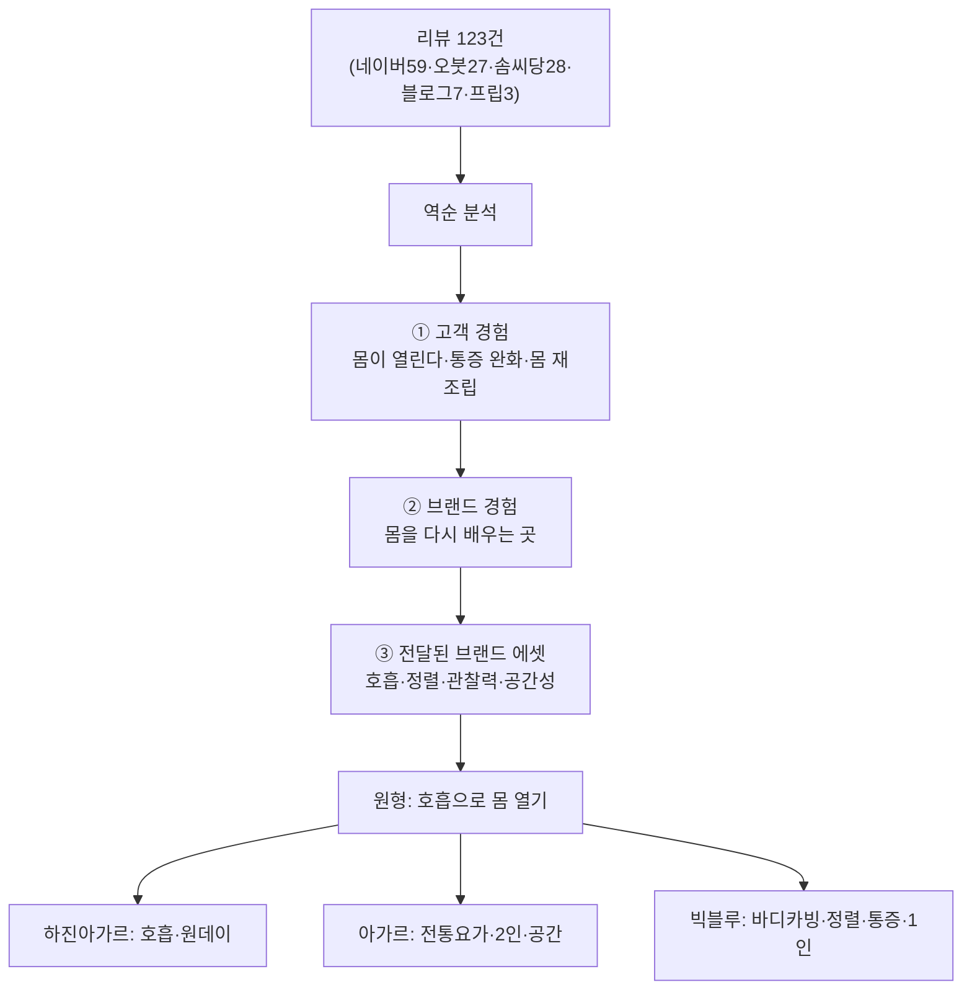

📅 2026-06-08 · 📁 02_몸소 서비스 / 02_브랜치별 자료 정독 · note
> **한 줄 정의:** 빅블루 요가(전신 포함) 온라인 리뷰 123건을 *역순*(고객 경험 → 브랜드 경험 → 브랜드 에셋)으로 분석해, "이 요가원이 고객에게 실제로 전달한 것"을 거꾸로 추정한 상징적 보고서. momso의 "왜?"가 고객 언어로 증명된 1차 근거.

---

## A. 핵심 요약

- 김성균이 **리뷰 123건**(약 3.5년치)을 수집 → Notion AI로 분석 → 5/8 회의에서 유동환과 해석.
- **역순 분석:** "우리가 뭘 팔았나"가 아니라 **"고객이 뭘 경험했다고 썼나"**에서 출발해 브랜드 자산을 역추정. (리뷰만 근거, 홍보글 제외)
- 모든 리뷰를 관통하는 **원형(原型):** *"호흡을 통해 몸을 열고, 몸이 개운해지는 요가의 맛을 직접 체험하게 하는 수업."*
- 3시대 진화: **하진 아가르(호흡·원데이) → 아가르(고전요가·2인 소그룹·공간) → 빅블루(바디카빙·정렬·통증개선·1인 전문성).**
- 결론: 이 요가원은 *"자세를 잘하게 만드는 곳"이 아니라, **자기 몸을 다시 느끼고 열고 쓰는 법을 배우게 하는 수련 공간".***

## B. 흐름도

## C. 본문

### 1. 질문 — 무엇이 궁금했나

- 고객은 빅블루 요가를 *실제로* 어떻게 경험하고 묘사했나?
- 우리가 가진 진짜 브랜드 자산은 무엇이고, 시대별로 어떻게 변했나?
- momso가 풀려는 "수업 맥락이 사라진다"는 문제는 고객 데이터로 증명되나?

### 2. 목적 — 왜 했나

홍보 문구가 아니라 **고객의 자발적 언어**에서 출발해, 브랜드가 *의도한 것*이 아니라 *실제로 전달된 것*을 확인하기 위해. 이는 momso 포지셔닝과 인바디라이크 서사의 근거가 된다.

### 3. 내용 — 알맹이 (아주 구체적으로)

**(1) 분석 방법 — 역순 3층**

- ① **고객은 무엇을 경험했는가** (체감·감정·신체 감각·재방문 의지)
- ② **고객은 브랜드를 어떻게 묘사했는가** (고객이 자발적으로 만든 "리뷰 기반 마케팅 언어")
- ③ **전달된 브랜드 에셋은 무엇이었는가** (경험의 원인을 역추적: 수업 구조·지식·기술·공간·관계)
- 한계 명시: 리뷰만 근거(홍보글 미대조), 통증완화 등은 **주관적 체감**으로 다룸(의학적 효과 단정 금지).

**(2) 전체 결론 — 원형과 도식**

- 원형: *"호흡을 통해 몸을 열고, 몸이 개운해지는 요가의 맛을 직접 체험하게 하는 수업."*
- 역순 도식:
  - **고객 경험:** 몸이 열린다 · 호흡이 편해진다 · 굳은 곳이 풀린다 · 불편하던 부위가 덜 불편 · "기본 동작인데 이상하게 깊고 힘들다" · 선생님이 몸을 세세히 본다 · 끝나면 "몸이 재조립된 것 같다" · 공간이 "마음의 휴게소".
  - **브랜드 경험:** 몸을 *다시 배우는* 곳 / 호흡·정렬로 몸을 *여는* 곳 / 몸과 마음을 *함께 다루는* 수련 공간.
  - **전달된 에셋:** 호흡 기반 몸 열림 / 전통요가 설명력 / 소수정예 맞춤 / 핸즈온 관찰력 / 무리 없지만 깊은 수련 설계 / 나무향·햇살·티타임의 공간 경험 / 1인 원장의 응축된 전문성.

**(3) 고객 경험 5갈래 (리뷰 실제 표현)**

- **호흡에서 출발한 몸 열림:** "호흡부터 자세히 알려줌", "몸이 열린다는 느낌", "쉬운 동작·호흡 위주인데 개운".
- **기본 동작인데 깊고 힘든 수련:** "국민체조만큼 간단한데 왜 힘들지", "한 동작을 오래 지속하니 깊은 근육이 이완", "속근육이 후들후들", "수업 후 몸이 재조립".
- **몸의 문제를 발견하는 경험:** "내 몸에 무심했음을 반성", "20년 허리 통증의 원인을 알게 됨", "몸을 제대로 쓰는 게 이런 거구나" → **신체 인식의 재교육**.
- **통증 완화·회복 체감:** 허리·골반·어깨·목·거북목·두통·디스크·생리통 등 — "허리 통증 줄었다", "거북목 개선", "두통 완화", "생리통 사라진 느낌", "마사지 받은 듯 개운". (주관적 체감)
- **공간·관계 경험(아가르 시기 강함):** 나무향·햇살·목소리·티타임·"마음의 휴게소"·"판단 없는 대화"·"일주일을 버틸 에너지".

**(4) 3시대 브랜드 변천**

| 시대 | 시기 | 경험 키워드 | 브랜드로 느껴진 모습 |
|---|---|---|---|
| **하진 아가르** | ~2023초 | 호흡·기초·원데이·몸 열림·티타임 | 요가의 맛을 처음 느끼게 하는 입문적이지만 깊은 곳 |
| **아가르** | 2023.2~2024.12 | 고전/전통요가·2인 티칭·소수정예·긴 수련·"숨겨진 1인치"·아쉬람 공동체 | 몸과 마음을 깊이 수련하는 전통요가 소그룹 공간 |
| **빅블루** | 2025~ | **바디카빙·정렬 에센스·호흡 리커버리·관절공간·통증 완화·1인 원장 전문성** | 몸의 구조·사용법을 다시 배우는 정렬 기반 전문 수련 공간 |

- 고객이 만든 마케팅 언어(빅블루 시기): "정렬 에센스", "호흡 리커버리", "후굴의 정렬", "바디카빙", "관절공간", "몸의 숨겨진 공간", "통증이 완화되는 수업", "원장님이 직접 세심히 봐주는 수업".

**(5) 리스크 — momso·피치덱으로 직결**

- **기대 불일치:** 일반 플로우 요가를 기대한 고객에겐 정렬·호흡 중심 수업이 "스트레칭만 했다"로 느껴질 수 있음 → 강사·시간·아사나 비중·정렬/호흡 중심 여부를 **사전 명확히 설명** 필요. (부정 리뷰의 핵심은 품질이 아니라 **설명과 기대 설정**의 문제.)
- **의학적 효과 표현 주의:** "치유한다/낫게 한다"가 아니라 "고객이 덜 불편하다고 느꼈다 / 몸을 관찰·정렬하는 수업"으로 완곡하게. → 인바디라이크 피치덱의 면책 문구로 그대로 계승.

**(6) 다음 분석 제안 + 브랜드 에셋 후보**

- 홍보 게시물 아카이빙 후 *정방향* 분석(의도 메시지 ↔ 실제 경험 대조) 권장.
- 내부 정의 후보: 바디카빙(움직임의 문법) · 원장 전문성(관찰·핸즈온·교정) · 수련 철학(자세 완성보다 상태 중시) · 공간성/관계성 · 운영 체제(2인→1인 변화).

### 4. 근거·출처

- main `docs/notion-archive/official-export-20260526-relevant/@2026년 5월 8일 온라인 창구 리뷰 분석`(566줄, 전문 정독).
- 원천 데이터: `온라인 창구 아카이브` CSV(124행, 리뷰 123 + 홍보 1).
- 해석 회의: `@2026년 5월 8일 회의` (123건 = 네이버 플레이스 59·오붓 27·솜씨당 28·블로그 7·프립 3).

### 5. 논의 과정

- 🧍 환: "리뷰 123건 역순 분석 아주아주 구체적으로 읽어보고 note로. 이건 아주 상징적인 자료."
- 🤖 클로드: 566줄 보고서를 방법·결론·경험5갈래·3시대·리스크·후속제안까지 전부 정독해 압축 없이 구조화.

### 6. 클로드 이해

이 보고서는 momso의 **존재 이유를 고객 언어로 증명한 문서**다. "수업 중 얻은 감각·교정이 일회성으로 사라진다"는 momso의 문제의식이, 리뷰 속 "그날의 깨달음", "재조립된 몸" 같은 표현으로 실재함을 보여준다. 동시에 "스트레칭 불일치"·"효능 표현" 리스크는 momso/피치덱이 반드시 안고 가야 할 경계선이다.

### 7. 환의 생각

- 환은 이 자료를 **"상징적"**이라 불렀다 — 빅블루의 정체성(바디카빙·정렬·몸 재교육)이 *남의 평가(리뷰)*로 객관 증명된 드문 자료이기 때문이다.
- 자기 브랜드를 "내가 주장하는 것"이 아니라 "고객이 실제 경험한 것"으로 보려는 태도가 있다.
- 이 분석의 브랜드 에셋·리스크를 momso 서사와 인바디라이크 발표에 그대로 쓰려는 의도로 읽힌다.

## D. 참조

- **만든 파일:** `02_브랜치별 자료 정독/03_리뷰123건_역순분석.md`
- **인용 (상류):** (없음 — main 원천 자료 직접 정독)
- **피인용 (하류):** [01_momso_탄생_시간선](01_momso_탄생_시간선.md)
- **태그:** (나중)
