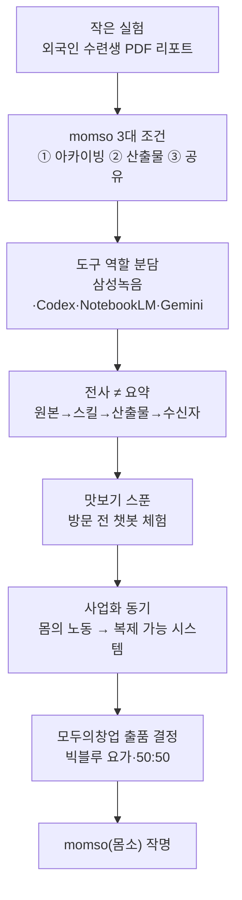

📅 2026-06-08 · 📁 02_몸소 서비스 / 02_브랜치별 자료 정독 · note
> **한 줄 정의:** 하루 종일(오후 1시~10시) 이어진 마라톤 회의. 작은 AI 리포트 실험에서 출발해 momso의 3대 조건과 "맛보기 스푼"이 잡히고, "momso(몸소)" 작명과 모두의창업 출품 결정이 내려진 상징적 회의.

---

## A. 핵심 요약

- 2026-05-13, 삼각지 피자 → 용산공원 산책 → 카페 → 저녁 → 카페로 이어진 **하루 종일 회의**.
- 시작은 *"외국인 수련생에게 수업 후 PDF 리포트를 보냈더니 반응이 좋았다"*는 작은 실험 → 여기서 **momso의 3대 조건**(아카이빙·산출물·공유)이 정의됨.
- 도구 역할 분담(삼성 녹음=전사 / Codex=문서화 / NotebookLM=공유방 / Gemini=PDF), **"전사 ≠ 요약"** 통찰, **"원본→스킬→산출물→수신자"** 흐름 정립.
- **"맛보기 스푼"**(방문 전 AI 챗봇 체험)과 **사업화 동기**("몸에 묶인 노동을 복제 가능한 시스템으로") 등장.
- 뒷부분에서 **모두의창업 출품 결정**(브레이크 사일런스 아닌 빅블루 요가, 50:50 공동대표)과 **"momso(몸소)" 작명**.
- ⚠️ 회의 중반(약 1시간 분량)은 **사적인 대화**(가족·지인·관계 문제) — 내용은 들추지 않음.

## B. 흐름도

## C. 본문

### 1. 질문 — 무엇이 궁금했나

- 유동환에게 *진짜로* 맞는 AI 활용 방식은 무엇인가? (단순 "똑똑한 AI"가 아니라)
- 수업 기록·리포트·공유를 어떻게 시스템화하나?
- 어떤 공모전에, 어떤 팀(브레이크 사일런스 vs 빅블루)으로 나갈 것인가?

### 2. 목적 — 왜 했나

핵심 문제의식: *"유동환 개인의 몸·에너지를 갈아 넣는 방식으로는 오래 못 간다."* 그의 전문성·관찰·언어를 **기록·구조화·복제 가능한 시스템**으로 바꾸는 길을 찾는 것.

### 3. 내용 — 알맹이 (아주 구체적으로)

**(1) momso의 3대 조건 (회의의 핵심 정의)**

작은 실험(수련생에게 Gemini로 PDF 리포트 전달, "한 번을 하더라도 제대로" 인상)에서 김성균이 도출:

1. **아카이빙** — 수련생별 기록·수업 기록을 잘 쌓기
2. **산출물** — 그 기록으로 PDF·요약·바디 리포트를 편히 만들기
3. **공유·접근성** — 수련생도 그 자료에 접근/질문하기

**(2) 도구 비교와 역할 분담**

- **Notion:** 자료 정리·보관엔 강하나, 긴 맥락 AI 산출물엔 불안정. (회의록 요약 테스트 — **36,492자 회의록을 약 3만 자에서 끊김.**)
- **Gemini:** PDF/구글 산출물 편의 좋음. 단 한 채팅방에 여러 사람 넣으면 맥락이 섞임 → **세션(사람별) 분리** 중요.
- **NotebookLM:** 자료 업로드 기반 답변 + **수련생별 노트북 + 공유** 가능("크리스틴 전용 NotebookLM" 예시). 단 소스 300개 제한.
- **로컬 AI(Codex):** 내 컴퓨터의 파일·긴 전사본을 깊게 다룸(긴 회의록·Word/PPT/PDF 생성 강함). 단 사양 의존·공유 어려움.
- **삼성 녹음기:** 온디바이스 전사 → 발화자 구분·타임스탬프 우수.
- **결론:** 하나의 도구로 다 하려 말고 역할 분담 — **삼성 녹음(전사) · Codex(깊은 문서화) · NotebookLM(공유형 수련생 지식방) · Gemini(빠른 PDF).**

**(3) 핵심 통찰 — "전사 ≠ 요약", 그리고 "원본→스킬→산출물→수신자"**

- 전사(음성→텍스트)와 요약(논점·감정선·맥락·할 일 파악)은 완전히 다른 일. 두 사람 회의는 1시간 전 발언을 다시 끌어오므로 단순 분할 요약은 맥락을 놓침.
- 김성균 방식: **로컬 AI + Notion 연결(MCP) + 긴 전사본** → 기존 워크스페이스 문서를 읽고 오늘 전사본을 그 맥락에서 "해감"(잡음 걷어내고 핵심 건지기).
- (API = 읽기 권한, MCP = 읽기+쓰기·실행 권한 — 비유로 설명.)
- → 결론: *"어떤 AI를 쓸까가 아니라, **빅블루의 지식·경험을 어떤 원본으로 남기고, 어떤 스킬로 가공하고, 어떤 산출물로 만들고, 누구에게 어떻게 공유할 것인가**."* (이것이 momso의 골격.)

**(4) "맛보기 스푼" 개념**

- *아직 돈 안 낸 사람도 가치를 미리 맛보게 하자* → 베스킨라빈스 맛보기 스푼 비유.
- 신규 방문자: 공개형 챗봇으로 요가원 관점 미리 맛보기 / 개인지도: 전용 방에서 "오늘 내 몸 특징" 질의 / 그룹: 누적 요약 확인.
- → 모두의창업 지원서 Q3의 "신규 수련생: 맛보기 스푼" 항목으로 직결.

**(5) 사업화 동기 (BM의 뿌리)**

- "유동환은 좋은 선생님이지만, 개인의 몸·시간에 묶인 노동은 단가를 무한히 올릴 수 없다."
- 두 층위: ① 유동환의 시스템을 **복제 가능한 형태로 보급**(AI 바디 리포트·관리·맛보기) ② 빅블루·유동환의 **오리지널리티는 더 높은 가치로 격상**. 시스템은 넓게, 원본성은 빅블루에.
- "몸의 노동을 부가가치로 만들려면 그 몸의 시스템을 복제 가능하게 만들어야 한다."

**(6) 모두의창업 출품 결정 (구조화된 결정사항)**

- **결정:** 브레이크 사일런스(성수동, 다른 팀)가 아니라 **빅블루 요가로 출품** (마감 5/15, 2일 전).
- **이유:** 빅블루는 유동환·김성균 **50:50 공동대표**로 관계가 깔끔, 둘 다 발표 가능, 진정성이 큼. (브레이크 사일런스는 지분·역할 복잡, 발표자 문제.)
- **전략:** "사업자 구분 없이 아이디어만" 제출 → **현장 경험 전면에**. 멘토링 인사이트: *"거창한 계획보다 실제 운영 중인 소상공인이 높은 평가."*
- **정체성 선언:** 유동환 = *"요가 선생님이 아닌 **웰니스 사업가**"*. *"좋은 수업보다 **반복 방문 유도**가 핵심"*(영어학원처럼).
- **참고 사례:** 시이작 요가원(박준형 PD, 골목창업경진대회 A랭크, 법인화·콘텐츠 분리).

**(7) "momso(몸소)" 작명**

- 이 회의에서 이름·슬로건이 처음 등장: *몸을 **소**중하게 / 몸과 **소**통하고 / **몸소** 실천 / 몸을 **소**개.*
- 외부 심사자에겐 `바디노트` 같은 내부 기술명 대신 **경험 언어("몸소")**로 설명하는 전략.

**(8) ⚠️ 사적 내용 (들추지 않음)**

- 회의 중반(2:17~3:15 산책 구간 등, 약 1시간)은 **가족·지인의 법적 문제, 친구 관계 갈등** 등 사업과 무관한 사담. 제품 자료로서의 알맹이는 앞·뒷부분(AI 도구·출품 결정)에 있음.
- → 이 저장소를 외부 공유 시 이런 전사본은 먼저 솎아내야 함.

### 4. 근거·출처

- main `docs/notion-archive/official-export-20260526-relevant/@2026년 5월 13일 회의`(1,784줄), 하위 두 녹음(12:58~14:09, 14:17~15:15).
- 작명·슬로건 근거: `momso-raw-20260526/02_2026-05-13_meeting_fetch_status.md` (이 회의를 "몸소 기획의 핵심 원문"으로 명시).
- 결정사항·액션아이템: 회의록 후반 "용산 아이파크몰 카페" 섹션.

### 5. 논의 과정

- 🧍 환: "5/13 기획회의도 아주 구체적으로 보완해서 note로. 이것도 아주 상징적인 자료."
- 🤖 클로드: 회의록 구조(요약+세션별)와 액션·결정을 정독해, 사담은 표시만 하고 momso 골격·출품 결정·작명을 구체적으로 정리.

### 6. 클로드 이해

이 회의가 상징적인 이유: **momso의 사고 골격("원본→스킬→산출물→수신자")과 이름이 같은 날 함께 태어났기 때문**이다. 동시에 "개인의 몸 노동 → 복제 가능 시스템"이라는 사업화 동기가 명문화됐고, 출품 팀까지 확정됐다. momso의 제품·사업·이름이 한 회의에서 수렴한 분기점.

### 7. 환의 생각

- 환은 이 회의를 momso의 **탄생 현장**으로 기억하고 싶어 한다("아주 상징적").
- "어떤 AI를 쓸까"가 아니라 "무엇을 원본으로 남기고 누구에게 공유할까"라는 사고 전환을 자기 것으로 받아들였다.
- 자신을 "요가 선생님"이 아니라 "웰니스 사업가"로 재정의한 선언을 중요하게 본다.
- 사적 대화가 섞인 원본의 프라이버시 민감성도 함께 인지하고 있다.

## D. 참조

- **만든 파일:** `02_브랜치별 자료 정독/04_20260513_기획회의.md`
- **인용 (상류):** (없음 — main 원천 자료 직접 정독)
- **피인용 (하류):** [01_momso_탄생_시간선](01_momso_탄생_시간선.md)
- **태그:** (나중)
