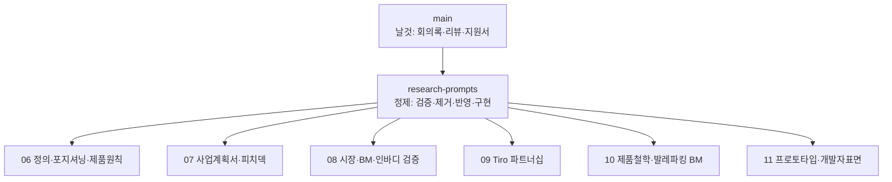

📅 2026-06-08 · 📁 02_몸소 서비스 / 02_브랜치별 자료 정독 · note
> **한 줄 정의:** `codex/inbodylike-research-prompts`는 main의 날것 자료를 "GPT 검증 → 위험표현 제거 → 도메인 우려 반영 → 작동하는 프로토타입"으로 정제한 **본줄기**. momso의 모든 공식 산출물이 여기서 태어났다. (이 노트는 그 정독의 개요·색인.)

---

## A. 핵심 요약

- 30커밋·109파일 추가. 이름은 "리서치 프롬프트"지만 **지금까지의 momso 작업 거의 전부**가 여기 있다.
- main(원천) → research-prompts(정제): 사업계획서·피치덱·리서치·전략 종합·프로토타입·배포가 전부 이 브랜치 소산.
- 10개 읽기 담당 에이전트로 109파일을 전수 정독(2026-06-08). 리서치 4건은 main 복사본임을 바이트 단위 확인.
- 이 브랜치를 6개 주제로 분해해 별도 노트로 남김(06~11).

## B. 흐름도

## C. 내용 — 이 브랜치를 잇는 6개 주제 (색인)

| 노트 | 무엇을 담았나 |
|---|---|
| [06_정의와_제품원칙](06_정의와_제품원칙.md) | momso 정체성 확정("수업 맥락 기록 레이어"), 피해야 할 5포지션, HITL 5대 원칙, 1→2단계 |
| [07_사업계획서와_피치덱](07_사업계획서와_피치덱.md) | 사업계획서 5항목, 피치덱 v2(위험표현 제거)→v3(도메인 우려 반영) 진화 |
| [08_시장BM_인바디연동_검증](08_시장BM_인바디연동_검증.md) | BM 숫자 확정(500개=20~26억, 60억=공격), 인바디 연동 제약, GPT 스팟체크 |
| [09_Tiro_파트너십](09_Tiro_파트너십.md) | 전략 플레이북 vs 실제 미팅 결과, 파트너 재정의, 협상 카드 |
| [10_제품철학_발레파킹BM](10_제품철학_발레파킹BM.md) | Web2.5 데이터주권, 발레파킹 BM, adaptive archiving, 듀얼 디자인 철학 |
| [11_프로토타입과_개발자표면](11_프로토타입과_개발자표면.md) | 프로토타입 구조(강사용/수련생용·발행게이트·면책), API/CLI/MCP v0 |

**관통하는 한 가지:** 6개 주제 어디를 봐도 **HITL(AI는 초안만·강사가 검수·원본 비공개·검수된 기록만 발행)**이 깨지지 않는다. 이게 momso의 척추다.

## D. 참조

- **만든 파일:** `02_브랜치별 자료 정독/05_본줄기_research-prompts.md`
- **인용 (상류):** [01_momso_탄생_시간선](01_momso_탄생_시간선.md)
- **피인용 (하류):** [06](06_정의와_제품원칙.md) · [07](07_사업계획서와_피치덱.md) · [08](08_시장BM_인바디연동_검증.md) · [09](09_Tiro_파트너십.md) · [10](10_제품철학_발레파킹BM.md) · [11](11_프로토타입과_개발자표면.md)
- **태그:** (나중)
