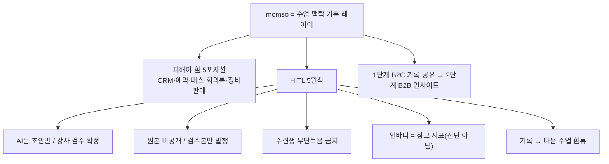

📅 2026-06-08 · 📁 02_몸소 서비스 / 02_브랜치별 자료 정독 · note
> **한 줄 정의:** 본줄기에서 momso의 정체성이 "수업 맥락 기록 레이어"로 확정되고, 피해야 할 5개 포지션과 HITL 5대 제품 원칙이 명문화됐다.

---

## A. 핵심 요약

- **대표 문장:** *"인바디가 몸의 스펙을 기록한다면, momso는 수업의 맥락을 기록합니다."*
- momso = 예약·결제 CRM이 아니라, 수업에서 사라지는 **지도자의 말·교정·수련생의 감각·정량 신체 데이터를 잇는 기록 계층**.
- **피해야 할 5포지션**: 요가원 CRM / 예약·결제앱 / 웰니스 패스 / AI 회의록앱 / 인바디 장비판매.
- **HITL 5원칙**: AI는 초안만 · 원본 비공개 · 수련생 무단녹음 금지 · 인바디는 참고 지표 · 기록은 다음 수업으로 환류.
- **단계**: 1단계 B2C(수업 기록·공유, CRM 아님) → 2단계 B2B(운영 인사이트). 반대로 시작 금지.

## B. 흐름도

## C. 본문

### 1. 질문 — 무엇이 궁금했나
- momso를 한 문장으로 무엇이라 정의했나? 무엇이 아니라고 선을 그었나?
- 모든 작업이 공유하는 제품 원칙은 무엇인가?

### 2. 목적 — 왜 했나
초보 심사자·원장이 "이게 뭔데요?"라고 물을 때의 **첫 답(=포지셔닝)**을 확정하고, 그 정의가 흔들리지 않도록 제품 원칙으로 못 박기 위해.

### 3. 내용 — 알맹이

**(1) 정체성 확정**
- 한 문장: *"momso는 요가 수업의 언어·피드백·감각을 수련생의 장기 웰니스 기록으로 전환하고, 인바디의 정량 신체 데이터와 연결하는 수업 맥락 기록 레이어."*
- 반박 문구(경쟁 대비): "바디코디는 센터 운영을, momso는 수업 경험을 기록한다" / "오붓은 수업에 가게 하고, momso는 수업이 남게 한다" / "Tiro는 음성을 글로 바꾸고, momso는 수업을 수련 기록으로 바꾼다."

**(2) 피해야 할 5포지션 (포화 시장)**
- 요가원 CRM → 바디코디(4,000센터·170만 사용자)와 정면충돌
- 예약·결제앱 → 범용 솔루션 다수, 인바디 연결성 약함
- 웰니스 패스 → 오붓·ClassPass와 고객유입 싸움
- AI 회의록앱 → Tiro와 비교됨(전사 자체가 아니라 도메인 변환이 핵심)
- 인바디 장비판매 → 장비는 비싸고 본질이 아님

**(3) HITL 5대 제품 원칙** (PRD·프로토타입·피치덱·철학 전부 공유)
1. **AI는 초안(draft)만** 만들고, 강사가 검수해 `공유/내부/보류/제외`로 확정. 자동 발송 금지.
2. **원본 녹음·전체 전사본 기본 비공개.** 검수된 문장만 발행.
3. **수련생 무단 녹음 금지.** 수련생 앱엔 녹음 기능이 없음(강사·요가원 노하우 보호).
4. **인바디는 참고 지표.** "진단·평가·처방 아님" 면책 필수.
5. **기록은 다음 수업 맥락으로 환류.** 1회성 리포트가 아니라 누적 아카이브.

**(4) 1→2단계 순서**
- 1단계: 수련생이 수업 후 개인 기록을 받는 **B2C 경험**(CRM 아님, "메모 앱에 가깝다").
- 2단계: 기록이 쌓인 뒤 요가원이 수업 품질·재방문·강사 교육을 보는 **B2B 인사이트 레이어**.
- 반드시 **B2C 먼저 → B2B 나중.** "CRM입니다"로 시작하면 기존 도구와 충돌.

### 4. 근거·출처
- `research/20260527_momso_macro_positioning.md`, `research/outputs/20260527_macro_positioning_gpt_response.md`
- `strategy/20260529_momso_total_direction_synthesis.md`, `meetings/internal/20260527_evening_call...`, `20260529_post_professor_meeting...`
- `planner/briefs/20260602_inbodylike_prd_v0.md`

### 5. 논의 과정
- 🧍 환: "본줄기 정독을 note로, 핵심 분해해서."
- 🤖 클로드: 정의·포지셔닝·제품원칙을 한 노트로 분해.

### 6. 클로드 이해
이 노트는 momso의 **헌법**이다. 나머지 모든 노트(사업계획서·피치덱·BM·프로토타입)는 이 정의와 HITL 원칙의 *적용 사례*다. 프로토타입을 다듬을 때도 이 5원칙을 깨면 안 된다.

### 7. 환의 생각
- 환은 "momso가 무엇인가"를 한 문장으로 쥐고 싶어 한다 — 심사·영업의 첫 답이기 때문.
- "녹음/요약 앱"으로 오해받는 걸 가장 경계하며, HITL(강사 검수)을 정체성의 핵심으로 받아들였다.

## D. 참조
- **만든 파일:** `02_브랜치별 자료 정독/06_정의와_제품원칙.md`
- **인용 (상류):** [05_본줄기_research-prompts](05_본줄기_research-prompts.md) · [03_리뷰123건_역순분석](03_리뷰123건_역순분석.md)
- **피인용 (하류):** [07_사업계획서와_피치덱](07_사업계획서와_피치덱.md)
- **태그:** (나중)
