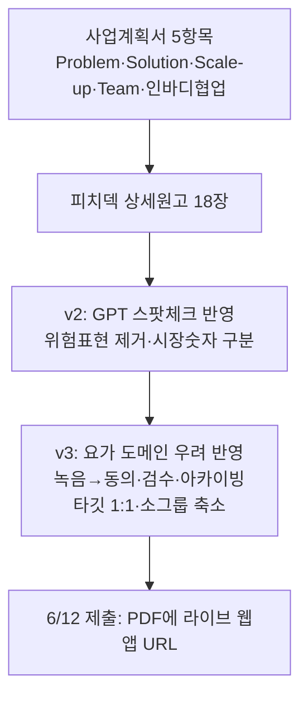

📅 2026-06-08 · 📁 02_몸소 서비스 / 02_브랜치별 자료 정독 · note
> **한 줄 정의:** 인바디라이크 제출용 사업계획서 5항목과 피치덱이 만들어지고, GPT 스팟체크 반영(v2) → 유동환 도메인 우려 반영(v3)으로 두 번 진화했다.

---

## A. 핵심 요약

- **사업계획서 5항목**(Problem·Solution·Scale-up·Team·인바디 협업포인트) 초안 완성.
- **피치덱 18장** 상세 원고 + 텍스트 v2 + v3.
- **v2** = GPT-5.5 스팟체크로 **위험 표현 제거** + 시장숫자 공식/대리 구분.
- **v3** = 유동환 요가 도메인 우려 반영 → "녹음/요약"을 **"동의·검수·아카이빙"**으로 재정의, 타깃 축소, 데이터 계층 분리.
- 공동대표 발표 가능(블루포인트 확인, 사전 안내 조건). 6/12 제출 = **PDF에 라이브 웹앱 URL 심기.**

## B. 흐름도

## C. 본문

### 1. 질문 — 무엇이 궁금했나
- 공모전에 실제로 낼 사업계획서·피치덱은 무엇을 담았나?
- v2와 v3는 무엇이 왜 달라졌나?

### 2. 목적 — 왜 했나
6/12 인바디라이크 제출물(사업계획서 PPT→PDF)의 완성도와, "위험 표현·도메인 리스크 없이 설득력 있게" 만드는 것.

### 3. 내용 — 알맹이

**(1) 사업계획서 5항목**
- **Problem:** 요가·필라테스·PT 같은 참여형 수업에서 지도자의 언어·교정·감각이 핵심 데이터인데 수업 후 사라진다. CRM(예약·결제)·예약앱·전사도구·인바디(수치)는 각자 일부만 기록 → 정량 데이터와 수업 언어를 함께 기록하는 계층이 빈다.
- **Solution:** 수업 전(인바디 참고·컨디션) → 중(녹음·큐잉·교정 전사, 용어 보정) → 후(AI 초안 → 강사 검수 → 개인 리포트) → 월간 리포트. MVP 8단계. 원칙: 동의·자동발송 금지·검수 문장만 공유·노하우 보호.
- **Scale-up:** B2B2C 혼합 구독(업장 B2B + 수련생 B2C 기록권). 기존 CRM 위에 얹는 "수업 맥락 기록 레이어". 빅블루 PoC → 연희동 → 요가·필라테스·PT → 명상·골프·테니스·시니어·기업 웰니스.
- **Team:** 유동환(요가 도메인·현장 PoC·연희동 네트워크) + 김성균(전략·기술·제품화·문서화·파트너 협의). 요가 수업은 음악·호흡·산스크리트/해부학 용어가 섞이고 개인정보가 민감 → 현장+기술 동시 필요.
- **인바디 협업:** 정량 데이터를 수업 언어·감각과 연결, 재방문으로 이어지는지 검증하는 PoC 제안. 요청 5종(데이터 해석 멘토링·측정 환경 협력·리포트 UX 공동검토·8~12주 공동 PoC·사업화 멘토링). 핵심 메시지: "장비 판매 앱이 아니라 인바디 데이터의 웰니스 현장 적용 레이어."

**(2) 피치덱 18장 구성**
- 표지 → 한 문장 포지셔닝 → Problem 1·2 → 기존 솔루션 공백 → Solution → Product Flow(4화면) → Sample Report → Trust Design → PoC → BM → Positioning → Market(TAM/SAM/SOM) → Scale-up → Team → Why InBody → 협업 → Closing.
- 중심 문장: "인바디가 몸의 스펙을 기록하면, momso는 수업의 맥락을 기록합니다."

**(3) v2 — GPT-5.5 스팟체크 반영**
- 제거한 위험 표현: "요가로 체성분 개선", "momso가 인바디 변화를 만든다", "API로 바로 연동", "요가원 TAM 확정 ○만 개", "수업 녹음은 문제없다".
- 시장 숫자를 **공식 통계 vs 2차 대리 지표**로 구분. ECW Ratio·위상각은 "전문가용 일부 제품군" 조건. 브랜드 `momso` 소문자 통일. 슬라이드마다 인바디 비진단 면책.

**(4) v3 — 요가 도메인 우려 반영 (가장 큰 변화)**
- **재정의:** "녹음 공유 서비스" → **"동의·필터링·지도자 검수를 거친 검수된 개인별 수련 기록 서비스."** 원본·전체 전사본 **기본 비공개.** 핵심 자산 = "전사 엔진"이 아니라 **"장기 아카이빙 구조."**
- **새 슬라이드:** Problem 2를 "요가 수업은 단순히 녹음해 공유할 콘텐츠가 아니다"로 교체. Data Layers(원본/전사/구조화메모/개인리포트/몸데이터 분리 + 검수 옵션 6종), Session Modes(1:1·소그룹 2~4인·오픈그룹 5+) 신설.
- **타깃 축소:** 대형 그룹 → **1:1·2~4인 소그룹·프리미엄 케어형.** 대형 그룹은 PoC·브랜드 실험장으로 격하.
- **인바디 위상:** "전부 아니라 첫 번째 정량 신체 데이터 파트너."
- **BM 재구성:** PoC/파운딩(무료~4.9만) / Software Basic(4.9~9.9만) / Studio Pro(15~30만) / InBody Partner(30만+) / B2C 기록권(5천~7천). "앱 구독료가 아니라 수업 기록 인프라 사용료."
- **영어 보조 포지션:** Voice Auto Archiving for Embodied Coaching / Wellness Session Archiving & Sharing SaaS.

**(5) 제출 운영**
- **공동대표 발표:** 블루포인트(steve@bluepoint.ac) 답변 — 공동대표 김성균 발표 **가능**, 단 평가 전 공동대표 체제·발표자 변경 사전 안내 조건.
- **라이브 웹앱 제출 전략:** PPT→PDF에 **클릭 가능한 데모 URL**을 심어 심사자가 직접 모바일앱형 웹앱 접속. 벤치마크 = 솜씨당. 실연동(Naver/NCP/CLOVA/인바디 API)은 PoC로 미루고 제출엔 "PoC 가설"로만.

### 4. 근거·출처
- `admin/applications/`: business_plan_5_sections_draft, pitch_deck_detailed_content, pitch_deck_text_only_v2/v3, live_webapp_submission_strategy
- `admin/inquiries/2026-05-26-inbodylike-representative-attendance.md`
- BM 숫자 근거 → [08_시장BM_인바디연동_검증](08_시장BM_인바디연동_검증.md)

### 5. 논의 과정
- 🧍 환: "본줄기 분해, 사업계획서·피치덱 노트로."
- 🤖 클로드: 5항목 + v2→v3 진화 + 제출 전략을 한 노트로.

### 6. 클로드 이해
v2→v3 진화가 이 노트의 핵심이다. **v2는 "거짓말 안 하기"(팩트체크), v3는 "현장이 납득하기"(도메인 우려).** 둘 다 통과해야 제출 가능한 수준이 된다.

### 7. 환의 생각
- 환은 자기 요가 도메인 우려가 v3에 실제로 반영된 것을 중요하게 본다(자기 목소리가 제품이 됨).
- "위험 표현"과 "현장 리스크"를 둘 다 거른 자료라야 발표에 자신감이 생긴다고 느낀다.

## D. 참조
- **만든 파일:** `02_브랜치별 자료 정독/07_사업계획서와_피치덱.md`
- **인용 (상류):** [05_본줄기_research-prompts](05_본줄기_research-prompts.md) · [06_정의와_제품원칙](06_정의와_제품원칙.md) · [08_시장BM_인바디연동_검증](08_시장BM_인바디연동_검증.md)
- **피인용 (하류):** (아직 없음)
- **태그:** (나중)
