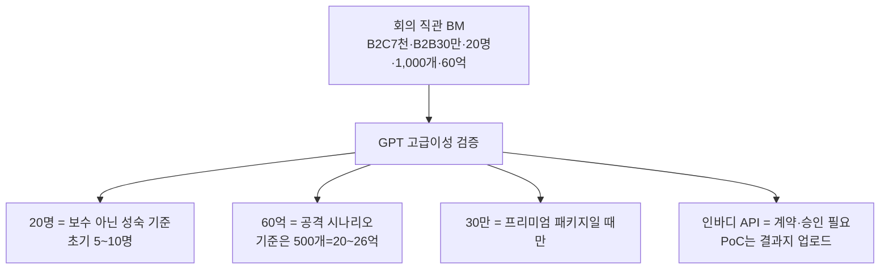

📅 2026-06-08 · 📁 02_몸소 서비스 / 02_브랜치별 자료 정독 · note
> **한 줄 정의:** 회의에서 직관으로 세운 BM 숫자(7천·30만·20명·1,000개·60억)를 GPT 고급이성으로 검증·정정하고, 인바디 연동의 실제 제약을 확인한 노트. "연 60억은 기준이 아니라 공격 시나리오"가 핵심 결론.

---

## A. 핵심 요약

- **발표 기준 시나리오** = 3년차 **500개 업장 = 연 20.4~26.4억.** "연 60억"은 **1,000개 + 업장당 유료 수련생 30명 조건의 공격 시나리오로만.**
- **B2B 월 30만**: 단순 SaaS(시장가 15~22만)론 비쌈 → **기록+리포트+세팅 프리미엄 패키지일 때만** 방어.
- **B2C 월 7천**: 저장비론 비쌈 → **"개인 수련 기록권"**으로 포지셔닝하면 방어 가능.
- **인바디 연동**: 공식 Web API/OAuth는 **유료 구독+신청·승인·계약 전제** → 즉시연동 불가. PoC는 **결과지 PDF 업로드**로. 장비는 비싸 패키지 포함 어려움 → momso는 **데이터 레이어.**
- **공식 통계만 확정**: 스포츠산업 사업체 131,764 / 시설업 49,082. 요가원 단독 통계는 약함 → 대리 지표로만.

## B. 흐름도

## C. 본문

### 1. 질문 — 무엇이 궁금했나
- 회의에서 세운 BM 숫자가 시장 기준으로 타당한가?
- 인바디와 실제로 연동이 가능한가? 조건·제약은?

### 2. 목적 — 왜 했나
발표자료의 숫자가 과장으로 보이면 신뢰가 무너진다. 검증된 숫자와 안전한 인바디 표현을 확보하기 위해.

### 3. 내용 — 알맹이

**(1) BM 가정 정정표 (핵심)**

| 항목 | 첫 추정 | 빗나간 점 | 보정 |
|---|---|---|---|
| B2C 월가 | 7,000원 | 저장비론 비쌈 | 유지("기록권/리포트"로 설명) |
| B2B 월가 | 30만 | 단순 SaaS면 10~20만 높음 | SaaS-only 10~20만 / 프리미엄 30~40만 |
| 업장당 유료 수련생 | 20명("보수적") | **실은 성숙 기준**, 초기엔 과대 | 초기 5~10 / 성숙 20 / 공격 30 |
| 1,000개 매출 | 60억 | 20명 기준 실제 52.8억 | 20명=52.8억 / 30명=61.2억 |
| 3년차 업장 | 1,000개 | **기준 아닌 공격** | 보수 300 / 기준 500 / 공격 1,000 |
| 3년차 매출 | 60억 | 기준으로 과대 | 기준 20.4~26.4억 / 공격 52.8~61.2억 |

- **고정 원칙:** ① 60억은 기준 전망으로 쓰지 않는다 ② 쓰려면 "1,000개+유료 30명" 조건 명시 ③ 본문은 500개·20.4~26.4억 중심, 성장 슬라이드에만 공격 시나리오.
- ARPA 계산: 기준 = B2B 20만 + 20명×7천 = 월 34만 = 연 408만. 프리미엄 = B2B 30만 + 20명×7천 = 월 44만 = 연 528만.

**(2) 시장 규모 (TAM/SAM/SOM, 전부 추정)**
- 공식 confirmed: 스포츠산업 사업체 **131,764개**, 스포츠시설업 **49,082개**(문체부).
- Middle TAM(방어 가능): 기타 스포츠 교육기관 23,483 + 체력단련장 12,669~15,548 = 약 **3.6만~3.9만 개** → 약 1,470억~2,060억원.
- Middle SAM: **4,000~8,000개** → 163억~422억.
- 주의: **요가원·필라테스 단독 공식 통계는 약함** → "요가 단독"이 아니라 "요가+필라테스+PT 프리미엄 스튜디오"로 정의. 23,483·15,548은 "2차 대리 지표"로 표기.

**(3) 인바디 연동 타당성**
- 인바디는 Web API·OAuth API·Open Protocol·LB120 CSV/IMG·HL7/GDT 등 공식 연동 수단 보유.
- **그러나 공식 Web API는 유료 서비스 + 활성 구독 + 신청·승인·API Key·Webhook·IP 등록 절차 필요** → "즉시 무료 연동" 불가.
- 연동 5단계: 0 수동입력(PoC 최적) → 1 PDF/이미지 → 2 CSV/Excel export → 3 앱 데이터 공유 → 4 공식 API/파트너(계약·유료구독·승인, 공모전 이후).
- 권장 최소 현실 방식 = **"수련생 동의 기반 결과지(PDF/이미지) 업로드."**
- 장비 도입비: 렌탈 36개월 InBody270S 월 11.64만 ~ 970 월 93.85만. **월 30만 패키지에 전문 장비 포함은 매우 어려움** → momso는 장비 유통 아닌 **데이터 활용 레이어.**

**(4) 경쟁 지형 (차별점)**
- 인바디=몸 수치 / 체형분석기(Exbody·Bodydot)=자세·외형 / CRM(바디코디 4,000센터·170만 사용자)=예약·결제. → **momso = 수업 안의 언어·피드백·감각 기록.** 대체가 아니라 위에 얹힘.
- 가장 직접적 간접 경쟁 = **AI 체형분석기(Exbody·Bodydot류)**, 가장 가까운 인접 = **포인티**(PT 운동기록).

**(5) GPT 스팟체크 5단계 판정 핵심**
- confirmed: 인바디라이크 공식 정보, 인바디 기술 방향, 경쟁사 비교 문장, 바디코디 수치, 공식 스포츠 통계.
- 수정: ECW Ratio·위상각 "전문가용 일부 제품군"으로, API "즉시연동 아님", 시장숫자 "대리 지표"로, 요가원 TAM 단정 금지, 30만 "프리미엄 패키지 한정".
- 피해야 할 표현 5: "인바디 변화를 만든다"/"요가로 체성분 개선"/"API 바로 연동"/"요가원 TAM ○만"/"녹음은 문제없다".

### 4. 근거·출처
- `research/`: external_competitor_market_research, external_market_bm_validation, market_bm_research, bm_assumption_correction_summary, inbody_integration_feasibility_research, external_research_brief
- `research/outputs/20260528_pitch_deck_spotcheck_gpt55_response.md`, `outputs/20260527_macro_positioning_gpt_response.md`
- ⚠️ 렌탈가·기관 수·TAM/SAM/SOM은 **2차 대리 지표·추정**.

### 5. 논의 과정
- 🧍 환: "본줄기 분해, BM 노트로."
- 🤖 클로드: 가정 정정표·시장·인바디 연동·스팟체크를 한 노트로.

### 6. 클로드 이해
이 노트는 발표의 **안전벨트**다. 특히 "연 60억"을 어떻게 쓰느냐가 신뢰를 가른다 — 조건 없이 쓰면 과장, 조건 붙이면 야심. 인바디 "즉시연동" 표현도 반드시 피해야 한다.

### 7. 환의 생각
- 환은 숫자가 "있어 보이는 게" 아니라 "방어 가능한가"를 본다.
- 인바디를 본질로 과대평가하지 않으려는 태도(데이터 레이어 포지션)를 지지한다.

## D. 참조
- **만든 파일:** `02_브랜치별 자료 정독/08_시장BM_인바디연동_검증.md`
- **인용 (상류):** [05_본줄기_research-prompts](05_본줄기_research-prompts.md)
- **피인용 (하류):** [07_사업계획서와_피치덱](07_사업계획서와_피치덱.md)
- **태그:** (나중)
