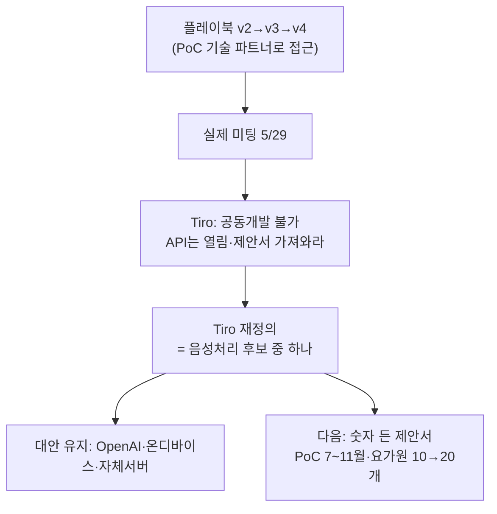

📅 2026-06-08 · 📁 02_몸소 서비스 / 02_브랜치별 자료 정독 · note
> **한 줄 정의:** Tiro를 PoC 기술 파트너로 보고 짠 플레이북(v2~v4)과, 실제 미팅에서 Tiro가 "공동개발은 불가, 구체적 제안서를 가져와라"고 선 그은 결과를 함께 담은 노트. Tiro는 필수 파트너가 아니라 음성처리 후보 중 하나로 재정의됐다.

---

## A. 핵심 요약

- **전략(문서)**: Tiro를 "이미 깊게 쓰는 진성 고객"으로서 **PoC 기술 파트너 후보**로 대함. 확인할 6가지(표현 허용·증빙·API 지원·크레딧·데이터 조건·현장 미팅).
- **현실(미팅)**: Tiro는 **"공동개발 여력 없다"**고 선 그음. API는 열려 있으니 **구체적 사용량·비용·지원 요청 제안서**를 먼저 가져오라.
- → **Tiro 재정의**: 필수 파트너 아님. 음성처리 후보 중 하나(OpenAI/온디바이스/자체서버 대안 항상 유지).
- **v3→v4 진화**: 유동환 도메인 우려 반영 → 원본 비공개·지도자 검수·노출통제·개인 리포트·1:1 우선 원칙 추가.
- **최대 기술 리스크** = 산스크리트어 전문용어 STT 보정.

## B. 흐름도

## C. 본문

### 1. 질문 — 무엇이 궁금했나
- Tiro를 어떤 파트너로 대해야 하나? 무엇을 확인하고, 무엇을 약속하면 안 되나?
- 실제 미팅에서 Tiro는 어떻게 반응했나?

### 2. 목적 — 왜 했나
Tiro에 종속되지 않으면서 그 전사·요약 기술을 PoC에 활용하고, 발표에 쓸 수 있는 협력 근거를 안전하게 확보하기 위해.

### 3. 내용 — 알맹이

**(1) 플레이북 진화 (v2 → v3 → v4)**
- **v2(전략):** 진성 고객 포지션. 확인 6가지(① 제출자료에 "Tiro와 협력 논의 중" 표기 허용 ② LOI/MOU 증빙 형태 ③ 선정 후 API·템플릿·기술지원 ④ PoC 크레딧·요금 ⑤ 데이터 보관·삭제·학습 미사용 ⑥ 연희동 현장 미팅). 절대 먼저 약속 금지(지분·독점·매출쉐어·"공식 파트너").
- **v3:** + **시장 확장성 논리** — momso가 작은 요가 프로젝트가 아니라 Tiro 기술의 새 시장 사례임을 강조.
- **v4(미팅 당일):** + **유동환 도메인 우려 5원칙**(원본 비공개·지도자 검수·노출통제·개인 리포트·1:1 우선). 기술 흐름에 "지도자 검수" 삽입. 기술 질문에 "원본 비공개 분리"·"검수 워크플로우" 추가. 반응별 4종 대응 시나리오. 한 줄: **"크게 보이되 허풍 안 치고, 조심스럽되 작아 보이지 않기."**

**(2) 실제 미팅 결과 (가장 중요)**
- 상대 = Tiro 파운더(CEO), 10인 미만 조직.
- **Tiro의 선 긋기:** API·MCP·CARI는 이미 제공(셀프서브). 그러나 **"공동개발 수준으로 붙을 여력 없다"**(인력 파견 부담). 단 초기 창업팀이 좋은 문제 푸는 것엔 열려 있음.
- **Tiro가 먼저 물은 것:** ① 실시간 기록 필요 vs 사후 업로드로 충분? ② 모바일/PC 어디서? (momso는 "실시간·모바일"이라 답했으나 **사후 재검토 필요** — 실시간이 MVP 필수인지 의문)
- **후속:** Tiro = API 문서·유사 사례(동물병원 상담 기록 등) 메일 공유. momso = **사용량·비용·협력 의향서·할인 조건을 제안서로 작성해 재제안.**
- 연희동 대면 = 확정 아님(긍정 뉘앙스만).

**(3) Tiro 재정의**
- Tiro = **반드시 붙잡을 필수 파트너가 아니라 음성처리 레이어 후보 중 하나.** "Tiro 없으면 멈추는 구조" 금지. 대안 5선(OpenAI 직접·온디바이스·자체서버·녹음앱+후처리 등) 비교표 유지.
- **Tiro vs 블루포인트/인바디 구분:** Tiro = 더 성숙한 스타트업, 협력 의무 없고 경우에 따라 갑 → 구체적 사용량·비용·이득 제시. 블루포인트/인바디 = 공모전 운영·지원 주체 → 팀 성장성·문제 정의·PoC 설계 제시.

**(4) 기술 준비 (technical prep)**
- Tiro 공식 문서 기준: 처리 흐름(job→upload→complete→polling→fetch), MP3/WAV/M4A/MP4, **최대 500MB/4시간**(60~90분 수업 OK), locale `ko_KR` 등 — **`transcriptLocaleHints`는 최대 1개, 산스크리트 전용 locale 미확인.**
- **요가 전문용어 = 최대 STT 리스크.** 자세명 오전사 시 리포트 신뢰 붕괴. Word Memory/용어집 API·팀 적용 가능 여부 확인. 테스트용 요가 용어 21종 표 준비.
- 미팅 후 샘플 3종(10~15분 용어 / 30분 소음 / 60~90분 긴 파일).

**(5) 보상·계약 가드레일**
- 안전 포지션 = **"제한적 기술 PoC 파트너."** 1차 보상은 무료/할인 크레딧 또는 소액 유료. **금지**: 지분 선약속, 전체 매출쉐어, 독점권, "투자받으면 % 드리겠다", 무단 로고 사용.
- 데이터/IP: Tiro는 음성을 AssemblyAI·OpenAI·AWS 등 국외 처리자로 이전 가능 → 동의문에 **외부 AI 처리·국외 이전·학습 미사용·삭제** 반영 필요.

**(6) 교수님 멘토링 경고 (발표 프레임)**
- RISE 발표 피드백 = **공공성 vs 사업성 프레임 충돌.** → 인바디라이크 발표는 "요가의 가치"가 아니라 **"수업 맥락 데이터의 부재"**를 문제로 먼저 제시. 추상적 건강효과 주장 대신 데이터 기록·활용을 선명하게.

### 4. 근거·출처
- `meetings/partners/`: tiro_b2b_meeting_strategy, playbook_v3, playbook_v4, technical_prep, recordings_digest, evening_professor_mentoring_rise_inbodylike
- `research/20260526_tiro_partnership_compensation_research.md`
- `source-materials/20260529-tiro-and-domain-notes/` (실제 미팅 raw)

### 5. 논의 과정
- 🧍 환: "본줄기 분해, Tiro 노트로."
- 🤖 클로드: 전략(v2~v4) vs 실제 미팅 결과 + 재정의 + 보상 가드레일을 한 노트로.

### 6. 클로드 이해
이 노트의 교훈: **계획(플레이북)과 현실(미팅)은 다르다.** Tiro는 우리가 원하는 만큼 붙어주지 않으니, 종속을 피하고 대안을 쥔 채 "숫자 든 제안서"로 다시 접근해야 한다. 발표에선 Tiro를 전면에 세우지 않는다.

### 7. 환의 생각
- 환은 "Tiro가 협력 안 하면 자체 개발해야 하나"를 실제로 고민했고, 그 답이 "대안 유지"로 정리된 것을 받아들였다.
- 파트너 관계에서 함부로 약속하지 않는 신중함(지분·독점 금지)을 중요하게 본다.

## D. 참조
- **만든 파일:** `02_브랜치별 자료 정독/09_Tiro_파트너십.md`
- **인용 (상류):** [05_본줄기_research-prompts](05_본줄기_research-prompts.md)
- **피인용 (하류):** (아직 없음)
- **태그:** (나중)
