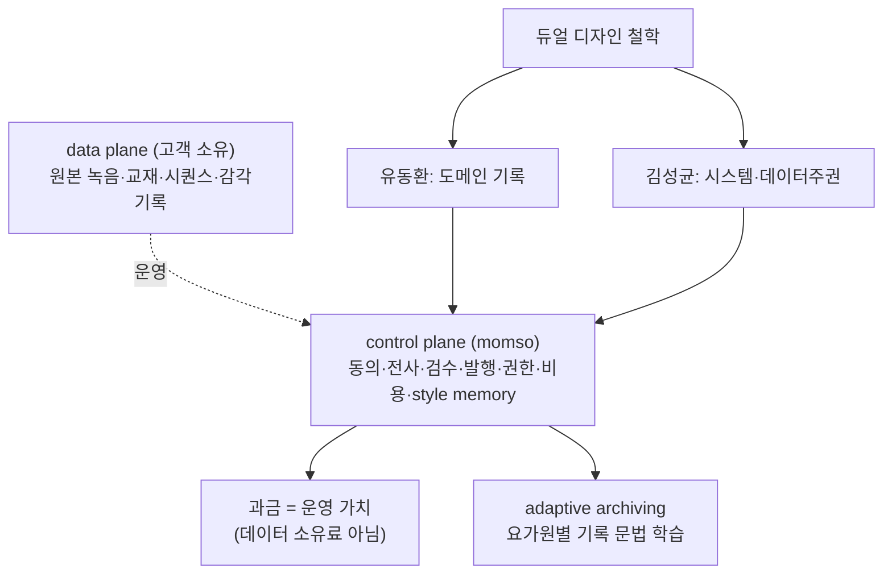

📅 2026-06-08 · 📁 02_몸소 서비스 / 02_브랜치별 자료 정독 · note
> **한 줄 정의:** momso의 BM 철학 = 데이터는 고객(요가원) 소유, momso는 운영만 맡는 "발레파킹/Web2.5 데이터 주권" 모델. 그 위에 요가원별 기록 문법을 학습하는 adaptive archiving과, 유동환·김성균을 같은 위계로 통합하는 듀얼 디자인 철학이 얹힌다.

---

## A. 핵심 요약

- **Web2.5 데이터 주권**: 원본 데이터·저장소는 **고객 소유(data plane)**, momso는 **운영만(control plane)**. 데이터 *소유료*가 아니라 *운영 가치*로 과금.
- **발레파킹 비유**: 차(원본)도 차고지(저장소)도 고객 것, 발렛(momso)은 소유 안 해도 주차의 복잡함을 줄여 돈 번다.
- **Adaptive archiving**: 템플릿 강요 X → 요가원별 수업 언어·기록 문법을 학습(`style memory`) = 락인 아닌 context retention(J-커브 근거).
- **듀얼 디자인 철학**: 유동환(도메인 기록) + 김성균(시스템·데이터 주권)을 **같은 위계**로 통합.
- 투자자 설명: "Web3 철학으로 껍데기만"(자선처럼 들림) ✗ → "데이터는 고객에게, 운영 복잡도는 momso가 흡수"(신뢰 인프라) ✓.

## B. 흐름도

## C. 본문

### 1. 질문 — 무엇이 궁금했나
- momso는 데이터를 소유하는 앱인가? 수익은 어디서 나나?
- "데이터 주권"을 어떻게 BM과 신뢰로 연결하나?

### 2. 목적 — 왜 했나
민감한 수업 데이터를 다루는 제품이 신뢰받으려면, "우리가 다 가져간다"가 아니라 "데이터는 너에게 남기고 운영만 돕는다"는 구조와 그 수익 논리를 세워야 한다.

### 3. 내용 — 알맹이

**(1) 발레파킹 BM (핵심 비유)**
- 차(원본 데이터)도 차고지(저장소)도 **고객 것.** 발렛(momso)은 차를 소유하지 않지만 주차의 복잡함·동선·위험·책임을 줄여주고 돈을 번다.
- momso 수익 = 데이터 소유료가 아니라 **운영 가치** — 저장소 세팅·녹음/업로드·동의 UX·전사/요약·검수 워크플로우·리포트 발행·다음 수업 회수·권한/감사 로그·AI 비용 통제·요가원별 기록 문법 학습.

**(2) control plane / data plane 분리**
- **data plane(고객 소유):** 원본 녹음·교재·시퀀스·철학 문서·감각 기록 원본. momso 서버에 장기 보관 안 함, 고객 export 가능.
- **control plane(momso):** 권한·동의·object key·AI 작업 큐·검수/발행 상태·요가원별 기록 문법 프로필·검색 색인·비용 ledger·감사 로그. momso는 "어디 있고 누가 어떤 권한으로 무엇을 하는지"만 관리.
- 산업 참조: Fivetran Hybrid / Union.ai BYOC / Airbyte Enterprise Flex.

**(3) Web2.5 단계형 아키텍처**
- 1단계(6/12 MVP 서사, 실연동 없음) → 2단계(PoC: Naver Login=identity, NCP per-user/studio prefix, encrypted object, DB엔 object key·consent·review·retention만, signed URL 접근) → 3단계(BYOS: 사용자 자기 NCP/Drive/OneDrive 연결, momso는 metadata만) → 4단계(Web3-like subject-owned identity, momso=coordinator not sole owner).
- 안전선: NAVER Login은 OAuth 인증일 뿐 개인 저장소 자동생성 근거 없음(인증/저장 계층 분리). CLOVA **Speech**(Note 아님)가 전사 후보. "이미 연동됨"처럼 말하지 않기.

**(4) Adaptive archiving = AX**
- "우리 템플릿대로 기록하라"(강의팔이 메모법)와 **정반대.**
- 명시 신호(스타일 선택·금지 표현·교재 업로드) + 암묵 신호(무엇을 공유 확정/내부 전환하는지, 어떤 표현을 매번 고치는지)를 읽어 요가원별 `workspace_style_profile`로 학습.
- AX(AI Experience) = "대단한 답"이 아니라 **다 설명 안 해도 점점 그 사람에게 맞는 기록 운영자가 되는 경험** = 살아있는 workspace wiki(RAG).
- J-커브 근거: 반복 가능한 control plane + 도메인별 starter pack + 고객별 style memory(락인 아닌 retention) + 비용 통제(무제한 AI 금지) + B2B2C 확장.

**(5) BM 상품 층**
- Starter / Studio Pro(월 15~30만+사용량) / InBody Partner Package(월 30만+) / Sovereign Workspace(BYOC 연결비) / B2C Record Pass(월 5천~7천).
- 추가 과금: 전사 시간·AI 생성량·저장 용량·리포트 발행량·외부 연결. AI 비용은 기본 momso 부담 후 "구독+포함량+초과 과금", 프리미엄은 BYOC.

**(6) 듀얼 디자인 철학**
- 두 입력을 **같은 위계**로 통합(한쪽을 "도메인 감각", 다른 쪽을 "기술 야망"으로 낮추지 않음). 한쪽만 반영 시 이유 문서화.
- **유동환(도메인 기록):** 수업 중 말·감각·피드백을 흘려보내지 않고 검토·보류 후 다음 수업으로 회수. 원본 docx 3개(Self Optimizing Archiving·Tetris Logic·SOA 개념도) 보존.
- **김성균(시스템·데이터 주권):** 원본은 사용자/수업 주체 귀속 source, momso는 동의·전사·제안·확정·발행·권한 계층. "사람 간 소통을 안전·진실·지속가능하게"라는 팀 비전을 제품 구조로.
- ⚠️ 외부 표현 규칙: `zet/ZET/objet/Web3 SNS/네이버 자동저장/CLOVA Note 연동` 같은 내부 용어는 제출자료에 쓰지 않고 심사자용 제품 언어로 번역.

### 4. 근거·출처
- `product/philosophy/20260603_momso_web25_adaptive_archiving_bm_baseline.md`, `20260602_momso_dual_design_philosophy_baseline.md`
- `planner/briefs/20260602_momso_web25_user_owned_recording_strategy.md`
- `planner/codex-sessions/20260602_web25_data_sovereignty_research_log.md`

### 5. 논의 과정
- 🧍 환: "본줄기 분해, 제품 철학·BM 노트로."
- 🤖 클로드: 발레파킹·control/data plane·adaptive archiving·듀얼 철학을 한 노트로.

### 6. 클로드 이해
이 노트가 momso를 **"또 하나의 SaaS"가 아니라 독창적 BM**으로 만드는 부분이다. "데이터 주권 = 매출 포기"가 아니라 "민감 데이터를 고객이 믿고 결제하는 신뢰 인프라"라는 재해석이 핵심. 단 6/12 제출엔 내부 용어를 빼고 번역해 써야 한다.

### 7. 환의 생각
- 환은 자기 철학(기록·정리, Self-Optimizing Archiving)이 제품 BM과 동등하게 반영된 것을 중요하게 본다.
- "데이터를 고객에게 남긴다"는 원칙이 요가원 도입 거부감을 푸는 열쇠라고 이해한다.

## D. 참조
- **만든 파일:** `02_브랜치별 자료 정독/10_제품철학_발레파킹BM.md`
- **인용 (상류):** [05_본줄기_research-prompts](05_본줄기_research-prompts.md)
- **피인용 (하류):** [11_프로토타입과_개발자표면](11_프로토타입과_개발자표면.md)
- **태그:** (나중)
