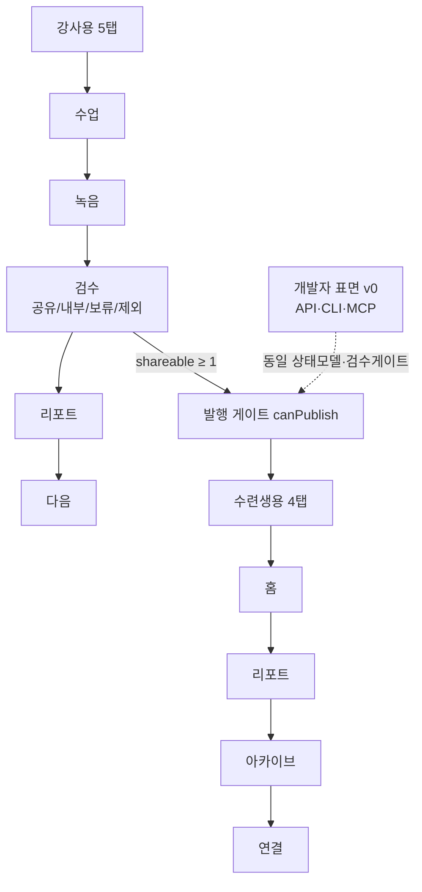

📅 2026-06-08 · 📁 02_몸소 서비스 / 02_브랜치별 자료 정독 · note
> **한 줄 정의:** 동환이 지금 다듬는 인바디라이크 프로토타입의 최초 버전 — 단일 파일 React로 강사용 5탭 + 수련생용 4탭을 토글하며, 발행 게이트와 면책 문구로 HITL 원칙을 UI에 못 박았다. + API/CLI/MCP v0 개발자 표면 설계.

---

## A. 핵심 요약

- **프로토타입 = 단일 파일 React 데모**(`InbodylikePrototype.tsx`, 백엔드·라우터 없음, 하드코딩 시드).
- **강사용 5탭**: 수업 → 녹음 → **검수** → 리포트 → 다음.
- **수련생용 4탭**: 홈 → 리포트 → 아카이브 → 연결 (역할 토글, 짙은 녹색 톤).
- **발행 게이트**: `공유` 확정 문장이 1개 이상일 때만 발행 가능. 검수 바꾸면 발행 자동 무효화.
- **면책 문구가 UI에 박힘**(AI는 제안만 / 강사가 확정 / 검수본만 발행 / 인바디는 진단 아님). OG 이미지도 같은 원칙 영문 새김.
- **개발자 표면(API·CLI·MCP v0)**: 모든 표면이 동일 상태 모델(draft→published)과 강사 검수 게이트를 강제 (PoC 설계, 구현 선언 아님).

## B. 흐름도

## C. 본문

### 1. 질문 — 무엇이 궁금했나
- 지금 다듬는 프로토타입은 무엇을 어떻게 보여주나? 어떤 구조인가?
- HITL 원칙이 코드/화면에 실제로 어떻게 구현됐나?

### 2. 목적 — 왜 했나
6/12 제출용으로 심사자가 3분 안에 이해하는 **작동형 모바일 웹앱 데모**를 만들고, 디자인을 다듬을 때 건드릴 지점을 파악하기 위해.

### 3. 내용 — 알맹이

**(1) 강사용(teacher) 흐름 5탭**
- **수업(today):** 수업 카드(BigBlue Yoga·하타 베이직·19:30·3명), **동의 상태 3종**(녹음/전사/리포트 공유), 인바디 참고 지표(골격근량·체지방률·좌우 균형) + 면책. "수업 기록 시작" → 녹음.
- **녹음(recording):** *"강사만 기록을 시작합니다. 수련생의 무단 녹음은 허용하지 않습니다."* 1초 타이머(실제 동작), 가짜 파형, "민감 대화 제외"(일시정지), "원본 음성: 기본 비공개". "AI 초안 만들기" → 검수.
- **검수(review) — 가장 핵심:** 5개 문장을 강사가 `공유/내부/보류/제외`로 분류. AI가 "AI 제안: 보류" 배지로 미리 제안(HITL), 요가 용어엔 "요가 용어 확인 필요" 배지. 상단 카운터(공유 확정/확인 필요/검토 대기). *"AI는 공유 범위를 제안만 합니다. 수련생 리포트에는 강사가 확정한 항목만 발행됩니다."*
- **리포트(report):** 미발행 시 "검수 화면으로" 안내만. 발행 후 공유 링크 카드(`momso.vercel.app/r/harin-0602`, "원본·전체 전사 비공개"), 인바디 지표, 강사가 공유한 문장, 감각 메모. **"수련생 앱으로 보기"**로 역할 전환.
- **다음(next):** 지난 기록(05.29/06.01)이 다음 수업 관찰 포인트로 환류.

**(2) 수련생(student) 흐름 4탭** (헤더·네비 짙은 녹색 `#163f38`)
- **홈:** "강사가 검수한 기록만 표시, 원본 음성·전체 전사는 비공개." 보관 상태 3종, 공유·연결 허브(PoC 배지).
- **리포트:** 인바디 지표, 강사 검수 발행 문장, 감각 메모. 공유 범위 3원칙(검수 리포트만/원본 비공개/외부 연결은 동의 후).
- **아카이브:** 검수된 기록만 시간순 누적.
- **연결:** 4개 연결 후보(내 AI로 열기·개인 저장소(Naver)·SNS형 피드·읽기 API — 모두 "검수 리포트만"), 4단계 공유 흐름, 권한 범위(차단=원본·전체 전사, 상태=PoC 검증 예정), 동의/철회 관리.

**(3) 발행 게이트 (HITL의 코드 구현)**
- `canPublish = shareableCount > 0` — `공유`로 확정한 문장이 1개 이상이어야만 발행 버튼 활성. 0이면 비활성 + 라벨 **"공유 항목을 확정하세요."**
- 강사가 검수 상태를 바꾸면 `setPublished(false)`로 **발행 자동 무효화**(검수 바뀌면 다시 발행).

**(4) 데이터 3계층 (원본 → 메타데이터 → 공유)**
- **원본:** 음성·전체 전사 = 기본 비공개·차단 데이터. 어디서도 미공개.
- **메타데이터/검수:** AI 초안 → 강사가 5상태(draft/shareable/internal/hold/excluded). `internal`(TTC 시퀀스·노하우)은 강사만.
- **공유:** `shareable` 문장만 수련생 리포트/아카이브/연결로 흐름.

**(5) 기술 구조·배포**
- 단일 파일(1,337줄) React, 순수 `useState`(라우터·외부 상태관리 없음). 화면 전환 = 상태값 + 조건부 렌더. 데이터 = 하드코딩 시드. 디자인 = Tailwind + 인라인 색(`#163f38`).
- `App.tsx` = `<InbodylikePrototype />` 하나만 반환(`/`가 곧 프로토타입). `vercel.json` = 모든 경로를 `/`로 SPA 폴백 + 보안 헤더(nosniff·X-Frame-Options DENY). `index.html` OG/Twitter = "AI는 초안을 제안하고, 강사가 공유 범위를 확정하며, 검수된 기록만 발행." `og-momso.svg` = 영문으로 같은 원칙.
- ⚠️ **이 버전엔 `/prototype` 경로가 없다**(루트가 곧 프로토타입). 빌드 로그상 이후 브랜치에서 `/prototype` rewrite·역할 토글·모바일 셸 보강이 더해짐.

**(6) 개발자 표면 (API/CLI/MCP v0)**
- 6/12엔 웹앱 데모 먼저, PoC용으로 세 표면을 **미리 설계**(구현 선언 아님). 모두 **동일 상태 모델**(draft→shareable→published, +internal/hold/excluded)과 강사 검수권을 강제.
- **API v0:** `/recordings/intake`(원본 파일 본문에 안 넣고 object key만), `/transcripts/draft`(AI=draft 시작), `/review-items`(강사 확정), `/reports/publish`(shareable 없으면 발행 안 됨), 리포트엔 원본 URL·전체 전사 미포함.
- **CLI v0:** `momso smoke prototype`(5화면 점검), `report publish --dry-run`(공유 확정 없으면 실패) 등 안전 점검 중심.
- **MCP v0:** `propose_review_status`(상태 변경 X, 제안만), `update_review_status`(강사 승인 컨텍스트), `publish_report`(shareable 없으면 실패). 원칙: 원본 안 읽음·검수권은 강사·자동 발송 금지.

**(7) 빌드/검증 흐름**
- Claude 1·2차 리뷰 P0 반영(인바디 면책·요가 용어 배지·감각 메모·AI 제안 배지·동의 affordance). 매 단계 `npm run build`·`lint`·`git diff --check`·Playwright/스크린샷. (Vite chunk size 경고는 비차단.)

### 4. 근거·출처
- `apps/web/src/prototype/InbodylikePrototype.tsx`, `App.tsx`, `index.html`, `public/og-momso.svg`, `vercel.json`
- `planner/codex-sessions/20260602_inbodylike_prototype_build_log.md`, `prd_implementation_checklist.md`
- `development/`: developer_surface_baseline, api/cli/mcp v0 draft
- `planner/briefs/20260602_inbodylike_prd_v0.md`

### 5. 논의 과정
- 🧍 환: "본줄기 분해, 프로토타입 노트로."
- 🤖 클로드: 프로토타입 화면·발행게이트·면책·기술구조 + 개발자 표면을 한 노트로.

### 6. 클로드 이해
프로토타입은 **HITL 원칙을 눈에 보이게 만든 증거물**이다. 발행 게이트(`canPublish`)와 면책 문구가 곧 "AI는 제안만, 강사가 확정"을 코드로 증명한다. 디자인을 다듬을 땐 이 한 파일의 시드·조건부 렌더만 건드리면 되고, 원칙(게이트·면책)은 유지해야 한다.

### 7. 환의 생각
- 환은 자기가 지금 다듬는 화면이 "어디서 와서 무엇을 증명하는지" 알고 싶어 한다 — 이 노트가 그 지도다.
- 디자인 수정 시 건드릴 지점(시드·렌더)과 건드리면 안 되는 원칙(발행 게이트·면책)을 구분하려 한다.

## D. 참조
- **만든 파일:** `02_브랜치별 자료 정독/11_프로토타입과_개발자표면.md`
- **인용 (상류):** [05_본줄기_research-prompts](05_본줄기_research-prompts.md) · [10_제품철학_발레파킹BM](10_제품철학_발레파킹BM.md)
- **피인용 (하류):** (아직 없음)
- **태그:** (나중)
