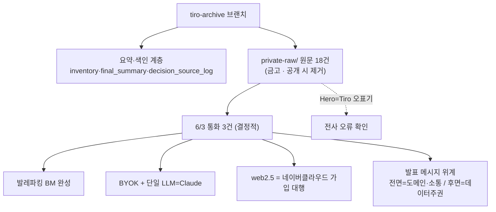

📅 2026-06-08 · 📁 02_몸소 서비스 / 02_브랜치별 자료 정독 · note
> **한 줄 정의:** `codex/tiro-archive-raw-preservation`는 Tiro 녹취 원문 18건을 금고처럼 보존하고 결정의 출처를 매핑한 **추적성 브랜치**. 그 안 6/3 통화 3건에서 **발레파킹 BM·BYOK·단일 LLM(Claude)·web2.5(네이버클라우드)·발표 메시지 위계**가 확정됐다.

---

## A. 핵심 요약

- 이 브랜치 = Tiro 회의 35건 목록화 + 제품에 영향 준 **18건 원문 보존**(`private-raw/`) + 결정 출처 로그 + 요약 계층.
- ⚠️ **금고 성격**: `private-raw/`엔 김성균·유동환의 통화 전사본(사적 대화 다수 포함)이 들어 있음. *저장소 공개·외부 공유 시 반드시 제거*해야 함(브랜치 자체 경고).
- **6/3 통화 3건이 결정적**: 여기서 **발레파킹 BM**이 비유로 완성되고, **BYOK·단일 LLM 프로바이더=Claude·web2.5=네이버클라우드 가입 대행·발표 메시지 위계**가 확정됐다.
- "Hero" = 별도 파트너가 아니라 **Tiro의 전사 오표기**로 사실상 확정.
- 모든 핵심 결정이 "어느 회의에서 나왔는지" **출처 로그**로 추적 가능.

## B. 흐름도

## C. 본문

### 1. 질문 — 무엇이 궁금했나
- tiro-archive 브랜치는 무엇을 보존하나? research-prompts에 없던 무엇이 더 있나?
- 발레파킹 BM·BYOK 같은 결정은 정확히 어디서 나왔나?

### 2. 목적 — 왜 했나
제품 결정(PRD·프로토타입·BM)을 **원천 회의까지 역추적**할 수 있게 하고, 6/3 제출 임박 통화에서 굳어진 결정들을 보존하기 위해.

### 3. 내용 — 알맹이

**(1) 아카이브의 3계층 보존 구조**
- L0 목록(35건) → L1 요약(Tiro AI + Codex 해석) → L2 발화자 매핑(바순 통화 5건) → L3 원문 전문(`private-raw/` 18건, ~4MB).
- 결정 출처 로그: `bassoon_decision_source_log`(통화 결정 15개) + `product_meeting_decision_source_log`(제품 회의 결정 24개) — "어느 결정이 어느 GUID 회의에서 나왔나" 매핑.
- ⚠️ **민감 자료 16건(실제 수업·수련생 이름)은 원문 저장 보류** — 인벤토리만, 익명화·권한 선결 필요.

**(2) "바순" = 김성균·유동환 내부 통화** (유동환 폰에 김성균이 `바순`으로 저장돼 생긴 Tiro 제목). 발화자 라벨(A/B)은 통화마다 뒤집혀, 통화별 호칭 단서로 매핑됨.

**(3) 6/3 통화 3건에서 확정된 것 (이 브랜치의 핵심 기여)**
- **발레파킹 BM 완성** (13:10 통화): 차(데이터)·차고지(저장소)는 고객 것, momso는 "주차(정리)" 대행 → **운영 자동화 비용**으로 과금. 택시(서버 보관) 대비 발레파킹(보관 안 함). "중요하나 귀찮은 일 대행"으로 **J-커브** 정당화. *메모법 강요 금지*(정리법엔 정답 없음 → AI가 각 요가원 고유 정리법을 발굴).
- **데이터 3계층 + 관리자/수련생 앱 분리** (14:21): raw → metadata(AI 위키/RAG "지도") → shareable. "대화의 초점(focus)" 검수 기능을 핵심으로 점찍음(초점 단위로 공유/제외).
- **BYOK + 단일 LLM 프로바이더** (15:14): 사용자가 자기 Claude 키 연결 시 할인(월 1만 → 3,300원). 위키 "지도"를 3개 AI로 그릴 수 없어 **자체 앱은 Claude 단일 지원**(API 반출은 어떤 AI든). 잠정 프로바이더 = **Claude(앤트로픽)** — 인바디라이크 스폰서가 앤트로픽인 것과 우연히 일치.
- **web2.5 = 네이버클라우드 가입 대행** (15:14): 자사 서버 구축 전까지 사용자를 네이버 오브젝트 스토리지에 (제휴가로) 가입시키는 하이브리드. PoC 기간(7~11월) 네이버 클라우드 사업부와 기술 제휴 협의 과제. "이중 결제처럼 보이면 안 됨."
- **발표 메시지 위계** (15:14, 중요): **전면 = 요가 도메인(암묵지가 가장 큰 웰니스) + "안전·진실·지속가능한 소통"** / **후면 = 데이터 주권·web3.0**(헤드라인 금지 — 사람들은 데이터의 소중함을 모르므로 숨은 마케팅으로).

**(4) 제품·전략 회의에서 보강된 것**
- 인바디라이크 = 인바디×블루포인트 자유양식 공모전, momso는 **라이프스타일·예비창업팀**으로 지원. 하드웨어·파견·고용은 협력사 부담, momso는 도메인·현장검증·시연 담당(상생 모델).
- 요가 문제 = **비정형성·블랙박스 → 기록 계층 부재.** "내부고발" 아닌 "체득에 집중하다 놓쳤다" 우호적 프레임.
- BM 수치: B2C 월 5달러(기록권) + B2B 월 30만(장비·세팅·노무 포함) → 요가원당 연 600만 → 오부시 벤치마크로 3년 1,000개·60억(보수), 웰니스 확장 시 1,500억 엑싯 서사.
- momso API("세컨드 바디" — 자기 기록을 ChatGPT/Claude로 꺼내봄)가 "요가인이 가장 좋아할 진짜 필수 기능"으로 지목. 4번째 탭의 SNS화(요가원 AI봇이 수련생 피드에 리포트 포스팅)로 바이럴.

**(5) "Hero" 정체** — 별도 파트너 아님. **Tiro의 STT 오표기**로 사실상 확정(실시간 요약·MCP/CLI·API 키 발급·tiro.ooo 녹음 등 정황 일치). 해당 미팅 = Tiro의 유료 사용자 리서치 콜 겸 PoC·할인 타진.

**(6) ⚠️ 프라이버시 (이 브랜치의 본질적 주의점)**
- `private-raw/`엔 6/3 통화 외에도 `desire-relationships`(전적으로 사적), `values-yoga-philosophy`(개인 성찰), 바디카빙 독백(원장 개인 심리·가족·재정) 등 **사업과 무관한 사적 대화가 다수**. (에이전트들이 내용은 들추지 않고 표시만 함)
- 브랜치 자체가 *"repo 공개·외부 심사자 공유 시 private-raw 제거"*를 명시. **공개 전 반드시 솎아낼 것.**

### 4. 근거·출처
- `meetings/tiro-archive/`: README, inventory, final_summary, app_function_bm_valet_summary, bassoon_decision_source_log, product_meeting_decision_source_log, bassoon_speaker_archive, private_raw_export_manifest
- `meetings/tiro-archive/private-raw/`: 18건 전사본(6/3 바순 3건 포함)
- `meetings/internal/20260603_bassoon_calls_tiro_intake.md`

### 5. 논의 과정
- 🧍 환: "끝까지 진행, tiro-archive는 깊이 읽되 사적부분 표시만."
- 🤖 클로드: 5개 에이전트로 요약계층+원문 정독 → 발레파킹 BM 확정·결정 출처·Hero=Tiro·프라이버시를 한 노트로.

### 6. 클로드 이해
이 브랜치의 진짜 가치는 **"결정의 출처"**다. 발레파킹 BM(노트 10)·HITL(노트 06)이 *어느 통화에서 어떻게 굳어졌는지*가 여기 다 추적된다. 동시에 이 브랜치는 가장 민감한 원문 금고라, 공개 처리에서 1순위로 솎아내야 할 대상이다.

### 7. 환의 생각
- 환은 자기 통화가 제품 결정의 근거로 보존되는 것을 받아들이되, 사적 대화가 섞인 만큼 프라이버시에 민감하다(그래서 "사적부분 표시만"으로 정함).
- 발레파킹 BM·BYOK 같은 큰 결정이 "언제 어디서 정해졌는지" 추적 가능한 것을 중요하게 본다.

## D. 참조
- **만든 파일:** `02_브랜치별 자료 정독/12_tiro_아카이브.md`
- **인용 (상류):** [05_본줄기_research-prompts](05_본줄기_research-prompts.md) · [10_제품철학_발레파킹BM](10_제품철학_발레파킹BM.md) · [09_Tiro_파트너십](09_Tiro_파트너십.md)
- **피인용 (하류):** (아직 없음)
- **태그:** (나중)
