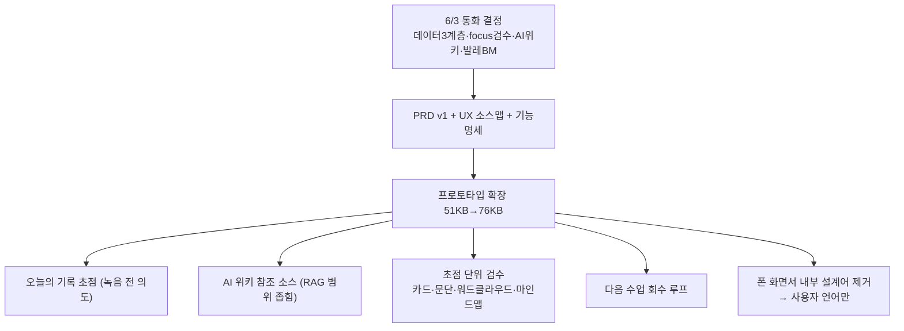

📅 2026-06-08 · 📁 02_몸소 서비스 / 02_브랜치별 자료 정독 · note
> **한 줄 정의:** `codex/inbodylike-ai-wiki-prototype-ui`는 6/3 통화 결정(데이터 3계층·초점 검수·AI 위키/RAG·발레 BM)을 프로토타입(51KB→76KB)과 PRD v1로 흡수시킨 브랜치. "녹음→리포트 앱"이 "수업 지식이 순환하는 AI 작업대"로 성숙했다.

---

## A. 핵심 요약

- 프로토타입이 **단순 리포트 앱 → AI 위키(지식 순환) 작업대**로 확장. 핵심 추가: **오늘의 기록 초점(녹음 전 의도)·AI 위키 참조 소스(RAG)·"대화의 초점" 단위 검수(카드/문단/워드클라우드/마인드맵 4보기)·다음 수업 회수 루프.**
- 회의 결정을 제품 요구로 끌어올린 **3문서**: PRD v1(회의 근거판) · 회의→UX 소스맵 · 기능 명세.
- 홈 탭이 **"동의 체크리스트" → "오늘 수업·참여자·기록 초점 고르는 RAG 필터 시작점"**으로 재정의.
- 중요한 정정: **raw/metadata/shareable/RAG 같은 내부 설계어를 폰 화면에서 걷어내고** 사용자 언어만 남김(심사자용 맥락은 폰 밖에).
- Vercel **production 게이트** 구성(유동환 push = Preview만, production은 김성균 수동 promote).

## B. 흐름도

## C. 본문

### 1. 질문 — 무엇이 궁금했나
- ai-wiki 브랜치는 프로토타입을 어떻게 바꿨나? 6/3 통화 결정이 화면에 어떻게 들어갔나?

### 2. 목적 — 왜 했나
6/3 통화에서 굳어진 결정(발레 BM·데이터 3계층·초점 검수·AI 위키)을 **실제 작동 화면과 PRD v1**로 구현해 6/12 제출 데모를 완성하기 위해.

### 3. 내용 — 알맹이

**(1) 프로토타입의 4대 신규 요소 (코드로 확인)**
- **오늘의 기록 초점(녹음 전 의도):** `TodayScreen`에 신설. "녹음 전 강사가 남길 의도(수련생 감각/다음 수업 준비/공유 후보 정리)를 고르면 관련 이전 기록만 좁혀 봅니다." → AI 위키 필터의 출발점. 녹음 화면에 "기록 초점: 호흡·접지" 칩으로 이어짐.
- **AI 위키 참조 소스(RAG):** 검수 화면에 "이번 초안에 참고한 기록" 섹션. `지난 3회 기록(김하린·접지/호흡 반복)`·`요가원 지식(골반·호흡 시퀀스 교재)`·`공유 기준(사적 상담·타인 정보 제외)`. "오늘 선택한 수업·수련생에 연결된 지식 소스만 좁혀 초안 근거로."
- **"대화의 초점" 단위 검수 (가장 큰 변화):** 전사본 통편집이 아니라 AI가 나눈 **초점 단위**(호흡·접지/민감 대화/요가 용어/지도자 노하우/타인 정보)로 `공유/내부/보류/제외` 확정. 상태가 3→5단계(`internal`·`hold` 추가). **4가지 보기**: 카드 / 문단 / 워드클라우드(실단어 버튼) / 마인드맵(중앙 "오늘 녹음"→5개 초점 노드, SVG line). 각 보기 어디서 골라도 같은 검수 패널로 연결. 각 초점에 `source`(전사 12:40-16:05 같은 RAG 출처 구간)가 박힘.
- **다음 수업 회수 루프:** `NextContextScreen` — "지난 기록이 다음 수업의 관찰 포인트로 돌아옵니다." `검수 결과 → 수업 기억 정리 → 다음 수업 준비` 3단계. *"한 번 보고 끝나는 회의록이 아니라 다시 회수되는 수업 지식."*

**(2) 발레 BM·데이터 계층의 UI 표현 (절제)**
- 발레 신호: TodayScreen "요가원 앱과 수련생 앱이 같은 수업에 연결" + "자동 연결" 배지 + 참여자 연결/권한 상태. "소유=요가원 계정, 운영=momso."
- 데이터 계층: 명시 라벨 대신 `상태 분류(공유/내부/보류/제외/검토)` + `source` 필드 + "원본 음성·전체 전사는 비공개" 반복으로 raw→metadata→shareable을 코드화.

**(3) 회의 기반 3문서 (추적성)**
- **PRD v1(회의 근거판):** 데이터 3계층을 "제품 원칙 4"로 승격, focus 검수를 핵심 흐름(FR-5)으로 고정, 발레 BM을 "소유는 고객·운영은 momso"로, BYOK·web2.5·Naver는 "PoC 검증 가설"로 격하, 홈 탭 재정의.
- **회의→UX 소스맵:** "어느 회의(GUID·줄번호)의 어느 결정이 어느 UX 요소가 됐나" 추적표 — 김성균이 매번 맥락 재설명 안 하도록.
- **기능 명세:** 2앱 1데이터, 역할(Owner/Teacher/Student/AI Assistant)별 권한, `StudioStudentConnection`·`ClassSession` 데이터 모델, 화면별 기능, 안전 카피 규칙("자동 동의"·"동의로 간주" 금지).

**(4) 중요한 정정 — 폰 화면서 내부 설계어 제거**
- 6/3 빌드 로그: 폰 안의 `데이터 변환`·`발행된 데이터 계층` 섹션 삭제. `metadata`→"수업에서 중요한 초점", `RAG` 배지→"참조", 초점 `metadata:`→"분류:", `연결 가능/차단 데이터`→"연결 대상/연결 제외".
- 원칙: **raw/metadata/shareable/RAG는 문서·폰 밖에만**, 앱엔 "원본은 숨김/강사가 검수/검수된 기록만 발행" 같은 사용자 언어만. momso 소문자(`uppercase` 클래스 제거).

**(5) Vercel production 게이트**
- PR #4 Preview 취소 원인 = `requireVerifiedCommits: true` + Codex unverified 커밋 → `false`로 변경.
- `release/inbodylike-submission` 브랜치 + Ignored Build Step으로 **"유동환 push = Preview만, production은 김성균 수동 promote"** 게이트 구성. (이게 release 브랜치의 존재 이유)

**(6) 원칙 유지** — 발행 게이트(`canPublish`)·원본 비공개·인바디 면책("진단·처방 아님")·HITL 전부 유지·강화. 여전히 단일 파일 React(2,008줄), `focusViewMode` state 추가, 차트 라이브러리 없이 div/SVG로 직접 그림.

### 4. 근거·출처
- `apps/web/src/prototype/InbodylikePrototype.tsx`(76KB), `styles/index.css`
- `planner/briefs/`: 20260603_inbodylike_prd_v1_meeting_grounded, momso_full_meeting_ux_source_map, momso_meeting_grounded_functional_spec
- `planner/codex-sessions/`: 빌드 로그 6/3 추가분, valet_bm_ui_plan·uiux 리뷰 프롬프트

### 5. 논의 과정
- 🧍 환: "끝까지 진행." (무인)
- 🤖 클로드: 2개 에이전트로 프로토타입 코드 + 회의기반 문서 정독 → 한 노트로.

### 6. 클로드 이해
ai-wiki는 **"통화에서 정한 것을 화면으로 만든" 브랜치**다. 노트 12(tiro 결정)와 노트 11(프로토타입 최초본)을 잇는 다리. 특히 "내부 설계어를 폰에서 걷어냈다"는 점이 중요 — 심사자에겐 깔끔한 앱으로, 설계 의도는 문서로 분리.

### 7. 환의 생각
- 환은 자기가 다듬는 프로토타입이 "초점 검수·AI 위키"까지 갖춘 이 버전 위에 있음을 안다.
- 디자인 수정 시 "폰 안엔 사용자 언어만, 설계어는 폰 밖" 원칙을 지켜야 함을 인식한다.

## D. 참조
- **만든 파일:** `02_브랜치별 자료 정독/13_ai위키_프로토타입.md`
- **인용 (상류):** [05_본줄기_research-prompts](05_본줄기_research-prompts.md) · [11_프로토타입과_개발자표면](11_프로토타입과_개발자표면.md) · [12_tiro_아카이브](12_tiro_아카이브.md)
- **피인용 (하류):** (아직 없음)
- **태그:** (나중)
