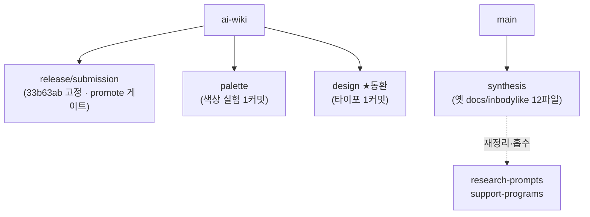

📅 2026-06-08 · 📁 02_몸소 서비스 / 02_브랜치별 자료 정독 · note
> **한 줄 정의:** 고유 변경이 적은 4개 브랜치를 한 노트로 묶음 — `release`(제출 스냅샷·고유 0)·`palette`(색상 실험 1커밋)·`design`(동환님 타이포 1커밋)·`synthesis`(옛 구조, 지금은 본줄기에 흡수). 8개 브랜치 정독의 마무리.

---

## A. 핵심 요약

- **release/inbodylike-submission**: 고유 커밋 **0**. ai-wiki의 한 지점(`33b63ab`)에 깃발을 꽂은 **production promote 게이트용 스냅샷.** 새 내용 없음.
- **palette**: 프로토타입 **색상 실험 1커밋**(딥그린 → 따뜻한 살구/라벤더). 리뷰용, production 미반영.
- **design(동환님)**: 프로토타입 **타이포 위계 + 소문자 momso 1커밋.** 지금 동환님이 선 갈래.
- **synthesis**: 가장 **오래된 옛 구조**(`docs/inbodylike/`) 12파일. 내용은 이후 본줄기의 `support-programs/`로 재정리됨 → **지금 기준 아님(흡수됨).**

## B. 흐름도

## C. 본문

### 1. 질문 — 무엇이 궁금했나
- 남은 4개 브랜치엔 새 내용이 있나? 각각 무슨 역할인가?

### 2. 목적 — 왜 했나
8개 브랜치를 빠짐없이 인식하되, 고유 변경이 적은 것은 과투자 없이 짧게 마무리하기 위해.

### 3. 내용 — 알맹이

**(1) `release/inbodylike-submission` — 제출 스냅샷 (고유 0)**
- ai-wiki 대비 **고유 커밋 0개.** tip = `33b63ab`("vercel preview deploy fix"), 즉 ai-wiki 역사의 한 지점에 멈춰 박제.
- 역할: ai-wiki 노트(13)에서 본 **Vercel production 게이트** — `main` 자동 배포는 차단하고, **이 `release/...` 브랜치만 production으로 promote.** "유동환 push는 Preview만, production은 김성균이 이 브랜치로 수동 승급."
- → 읽을 새 내용 없음. **함부로 건드리면 안 되는 배포 기준점.**

**(2) `codex/inbodylike-palette-review-20260603` — 색상 실험**
- 커밋 1개(`b63fa22` "test warm momso prototype palette"). 파일 1개(`InbodylikePrototype.tsx`, 296+/288-).
- 딥그린 중심 → **살구/라벤더/따뜻한 중립** 팔레트로 교체. 상태 버튼(공유/내부/보류/제외)이 각 상태색으로 점등. **기능·흐름·문구·데이터는 안 건드림.**
- 리뷰용 실험안(PR #6). production URL은 덮지 않음.

**(3) `yoodonghwan/design-prototype-polish-20260603` — ★동환님 작업**
- 커밋 1개(`334304d` "calmer typographic hierarchy and lowercase momso brand"). 파일 1개(55+/55-).
- 설명글·캡션은 `font-normal`로 낮추고 제목·라벨·값만 강조 → 위계 또렷. 브랜드 `MOMSO`(대문자) → 소문자 `momso` + 은은한 그린. **의미 있는 문구는 안 바꿈.**
- ⚠️ 이 갈래는 ai-wiki의 *마지막 몇 커밋 전*(`7a69431`)에서 갈라져서, ai-wiki의 최신 모바일 셸 보강 등은 아직 안 들어 있음. (지금 폴더가 선 갈래 = PR #5)

**(4) `codex/inbodylike-synthesis` — 옛 종합본 (흡수됨)**
- main 대비 13커밋, **옛 구조 `docs/inbodylike/` 12파일** (+ `docs/tiro-meetings/`). 가장 먼저(5/26~5/29) 만든 초기 종합.
- 내용: 초기 인바디라이크 종합, 리서치(BM 가정·경쟁사·인바디 연동·시장·Tiro 보상), 제출 피치팩, 요가 도메인 우려, Tiro B2B 전략 — **전부 이후 본줄기에서 `support-programs/` 구조로 재정리·정제됨.**
- → **지금 살아있는 최신본은 노트 07·08·09에 있음.** 이 브랜치는 "초안 박물관"(역사 기록용).

### 4. 근거·출처
- `git rev-list/diff` 실제 확인: release 고유 0, palette/design 각 1커밋·1파일, synthesis 12파일(옛 구조).
- 배포 게이트 맥락 → [13_ai위키_프로토타입](13_ai위키_프로토타입.md). synthesis 재정리본 → [07](07_사업계획서와_피치덱.md)·[08](08_시장BM_인바디연동_검증.md)·[09](09_Tiro_파트너십.md).

### 5. 논의 과정
- 🧍 환: "고유 변경 적은 브랜치는 묶어서 짧은 노트로."
- 🤖 클로드: release·palette·design·synthesis를 한 노트로.

### 6. 클로드 이해
이 4개는 "본체"가 아니라 **곁가지·박제·실험**이다. release는 배포 기준점(건드리지 말 것), palette/design은 같은 프로토타입의 시각 실험, synthesis는 흡수된 옛 버전. 동환님 입장에서 실제로 의미 있는 건 자기 design 갈래뿐이고, 나머지는 "이런 게 있다" 인식이면 충분하다.

### 7. 환의 생각
- 환은 자기 design 갈래가 ai-wiki에서 갈라진 "프로토타입 시각 폴리시"임을 안다.
- release를 함부로 안 건드려야 production이 안전하다는 것, synthesis는 옛 버전이라 참고만 하면 된다는 것을 인식한다.

## D. 참조
- **만든 파일:** `02_브랜치별 자료 정독/14_마무리_브랜치들.md`
- **인용 (상류):** [05_본줄기_research-prompts](05_본줄기_research-prompts.md) · [13_ai위키_프로토타입](13_ai위키_프로토타입.md)
- **피인용 (하류):** (아직 없음)
- **태그:** (나중)
