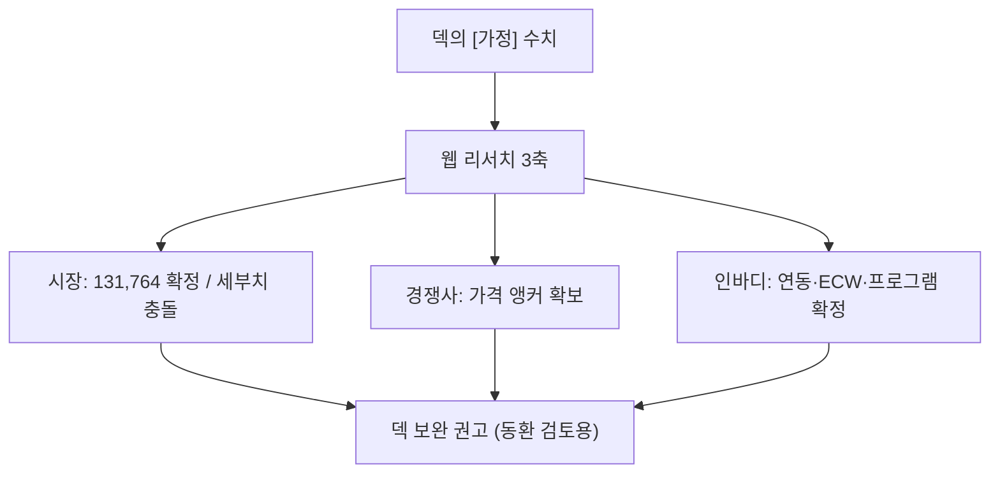

📅 2026-06-08 · 📁 02_몸소 서비스 / 04_발표준비 · note
> **한 줄 정의:** 사업계획서의 `[가정]` 수치를 웹에서 출처·신뢰도와 함께 조사한 메모. **덱 숫자는 바꾸지 않음** — 동환님이 검토 후 직접 반영하시도록 정리만.

---

## A. 핵심 요약

- 웹 리서치 에이전트 3명(시장·경쟁사·인바디)이 출처(URL)·신뢰도와 함께 조사. 못 찾은 건 '확인 불가'로 표시.
- ⚠️ **가장 중요한 발견:** 메인 덱 슬라이드 13의 일부 시장 숫자(`기타 스포츠 교육기관 23,483`, `체력단련장 12,669`)가 **저장소 자체 최신 자료와 어긋남** → 검토·교체 권장.
- **공식 확정된 것:** 스포츠산업 사업체 131,764·매출 84.7조(문체부 2024) / 인바디 연동은 "유료 구독+신청+승인"(즉시연동 아님) / ECW·부위별 위상각은 제품별 차등 / 바디코디 Pro 19.8만·Pro Plus 22만(정상가).
- ⚠️ **InBodyLIKE의 "Claude/네이버클라우드 크레딧"은 공식 사이트에서 웹으로 재확인 안 됨** — 단, 저장소의 공식 프로그램 PDF엔 기재돼 있음(출처 PDF). 발표 전 운영팀에 한 번 더 확인 권장.

## B. 흐름도

## C. 본문

### 1. 시장 규모 (R1)

| 항목 | 결과 | 출처·신뢰도 |
|---|---|---|
| 스포츠산업 사업체 | **131,764개 · 매출 84.7조** (문체부 2024, 2026-01 발표) | e-나라지표 idx_cd=1664 · **높음** |
| 스포츠시설업 49,082 | 연도 표기 미검증 (131,764과 한 세트로 보이나 단일 출처) | 중간 — 연도 확인 후 표기 |
| 기타 스포츠 교육기관 | **20,507개**(스포츠산업조사) ← 덱의 23,483과 충돌 | 저장소 자료와 불일치 |
| 체력단련장 | **체력단련장업 15,548 · 체육교습업 2,999** (2024 등록·신고 체육시설업 현황, 2023말) | 문체부 · 중간~높음 |
| 요가원·필라테스 단독 | **확인 불가** (KOSIS·국세청 모두 단독 코드 없음) | — 대리지표 유지가 맞음 |
| 글로벌 요가·필라테스 스튜디오 | **CAGR ~11.5%** (2023→2031) | 민간 리포트 · 정성 근거로만 |

- **권고:** 덱 슬라이드 13의 `23,483 / 12,669`는 **폐기·교체.** 대신 두 계열로 분리 — ①기타 스포츠 교육기관 20,507(스포츠산업조사) ②체력단련장업 15,548·체육교습업 2,999(등록·신고 체육시설업 현황, 2023말). 131,764는 "문체부 2024년 기준"으로 그대로 OK. 요가원 단독은 끝까지 '대리지표'.

### 2. 경쟁사 (R2) — 가격 앵커 확보

| 대상 | 핵심 수치 | 신뢰도 |
|---|---|---|
| **바디코디** | 4,000센터·앱 170만+ · Pro 정상 19.8만(약정 13.9~15.8만) · Pro Plus 22만 | 높음(공식 가격페이지) |
| 오붓 | 파트너 1,000개 돌파(2026.03, 출시 15개월) | 높음 |
| ClassPass | 파트너 25,000~30,000 · 누적 매출 $3B+ | 높음 |
| Mindbody | $159~$699/월 (실부담 $300~500) | 높음 |
| TeamUp | $104~$309/월 (기능 잠금 없음·인원수 과금) | 높음 |
| Trainerize | $10~$250/월 | 높음 |
| **포인티** | 국내 '퍼스널 리포트' 직접 경쟁 · 가격 비공개 | 기능 높음/가격 확인불가 |
| AI 체형분석 | Exbody·Bodydot(CES2025 혁신상·병원400)·Styku $6,500+·Fit3D $10,000 | 도입 높음/가격 일부 |

- **가격 방어 근거:** 바디코디 19.8~22만 / Mindbody $300~500 대비 momso를 **명확히 낮은 가격대**로 잡으면 "동급 기능, 절반 이하" 메시지가 수치로 방어됨.
- **빈칸 근거:** 요가·필라테스 '그룹 수업기록 + 회원 퍼스널 리포트' 정면 경쟁은 사실상 **포인티 정도뿐** → 포지션 비어 있음.
- **데이터 소유권 대비:** 오붓·ClassPass는 정산단가를 직접가보다 눌러 "스튜디오를 쥐어짠다"는 비판도 → momso의 '센터가 자기 데이터 소유' 차별점.

### 3. 인바디 (R3) — 공식 확정 + 주의점

- **연동(공식 FAQ로 확정):** LookinBody Web/Web API·OAuth API 제공하나 **①유료 구독 ②API 신청서 제출 ③인바디 승인** 3요건 → **즉시연동 불가.** → 덱의 "계약·승인 필요"는 **정확.**
- **ECW·위상각 차등(공식 비교표 2025):** 전신 위상각은 270S부터 OK, **ECW/TBW는 380 이상, 부위별 ECW·위상각은 580/770/970, 최고급 ECW 지표는 970 전용.** → "전문가용 일부 제품군" 표현 유지가 맞음. "모든 인바디가 제공"은 오류.
- **가격:** 가정용 H20~H40 = 21만~46만(공식스토어). 전문가용 770급 ≈ 1,650만(판매처 게시가), 970 "문의". 공식 정가·렌탈가는 비공개 → 슬라이드엔 "판매처 게시가" 단서 필수.
- **InBodyLIKE(공식):** 인바디×블루포인트 100억 펀드 · 마감 6/12 · 인큐베이션 7/20~11/13 · 4분야. (공식 inbodylike.com 확인)
- ⚠️ **"네이버클라우드·Claude 크레딧"**: 공식 사이트 본문에서 **웹으로 재확인 안 됨**(한 검색 캐시에만 언급). 단 **저장소의 공식 프로그램 PDF엔 기재**(네이버클라우드 2,000만·Anthropic Claude $10,000 등). → 출처는 PDF로 표기하되, 발표 전 운영팀(steve@bluepoint.ac)에 한 번 더 확인.

### 4. 발표 시 피해야 할 표현 (재확인)
- "인바디 API로 즉시/자동 연동" ✗ (승인·유료 필요)
- "모든 인바디가 ECW·부위별 위상각 제공" ✗ (380/580/970 차등)
- "요가로 체성분 개선" / "momso가 인바디 변화를 만든다" ✗
- "InBodyLIKE는 Claude 크레딧을 준다"를 단정 ✗ (재확인 후 사용)
- 요가원 TAM을 단정 ✗ (대리지표·추정 표시)

## D. 참조
- **만든 파일:** `04_발표준비/01_리서치_가정채우기_메모.md`
- **근거:** 웹 리서치 3건(시장·경쟁사·인바디, 출처 URL은 각 항목) · 저장소 `research/20260526_market_bm_research.md`(시장 세부치 충돌 확인).
- **인용 (상류):** `260608_시장·BM·인바디연동 검증`(노트 08)
- **피인용 (하류):** `04_발표준비/02_예상_QnA_발표노트`
- **태그:** (나중)
