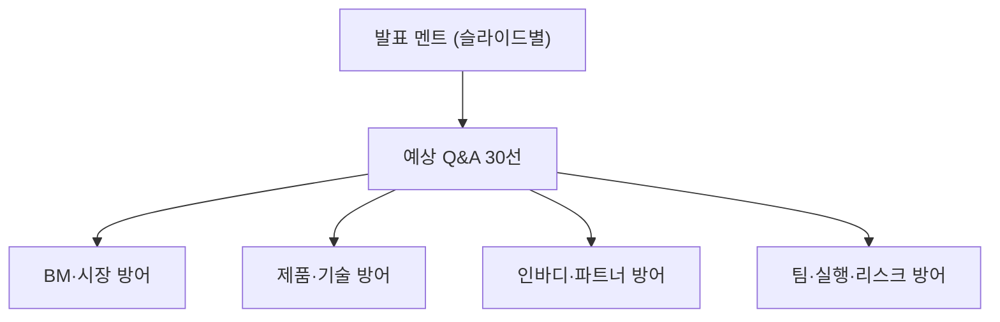

📅 2026-06-08 · 📁 02_몸소 서비스 / 04_발표준비 · note
> **한 줄 정의:** InBodyLIKE 사전 인터뷰(6/29~7/3)·발표 평가(7/6~7/10)용 — 슬라이드별 발표 멘트 + 심사자가 찌를 약점에 대한 예상 Q&A 30선과 방어 답변.

---

## A. 핵심 요약

- **2부 구성:** ① 슬라이드별 발표 멘트(말로 할 핵심) ② 예상 Q&A 30선(약점 방어).
- 방어의 3원칙: **(1) 숫자엔 조건을 붙인다**(60억=공격 시나리오) **(2) 과장 안 한다**(인바디 즉시연동 아님) **(3) 모르면 '검증 예정'으로 솔직히.**
- 가장 자주 찔릴 곳: BM 60억 근거 · 인바디 연동 현실성 · 개인정보 · 왜 바디코디/포인티가 못 하나 · Tiro 의존 · 실현 가능성.

## B. 흐름도

## C. 본문

### 1. 발표 멘트 — 섹션별 '말로 할 한 줄' (3분/10분 공통 골격)

- **표지:** "인바디는 몸의 스펙을 기록합니다. 저희 momso는 그 몸이 *수업 안에서 어떻게 이해되고 바뀌는지*, 수업의 맥락을 기록합니다."
- **문제:** "요가·웰니스 수업의 핵심은 지도자의 말·교정·감각인데, 수업이 끝나면 사라집니다. CRM·예약앱·전사앱·인바디는 각자 *일부만* 기록합니다."
- **단순 녹음 아님:** "그런데 요가 수업은 녹음해서 그냥 공유할 콘텐츠가 아닙니다. 개인정보·타인정보·지도자 노하우가 섞이죠. 그래서 저희는 *동의·검수·노출통제*를 핵심 기능으로 둡니다."
- **솔루션:** "AI가 초안을 만들고, *강사가 검수해 확정한 것만* 개인 리포트로 나갑니다. 작동하는 모바일 웹앱을 직접 보여드리겠습니다." (→ 데모 URL)
- **시장:** "요가 단독이 아니라, 수업 언어가 자산이 되는 *프리미엄 참여형 스튜디오*가 시장입니다."
- **경쟁:** "기존 도구를 대체하지 않습니다. 그 위에 얹히는 *수업 기록 레이어*입니다."
- **BM:** "데이터는 고객 것, 저희는 운영만 합니다. 발레파킹처럼요. *발표 기준은 3년차 500개 업장, 20~26억*입니다."
- **인바디 협업:** "인바디 정량 데이터가 웰니스 현장에서 재방문으로 이어지는지, 8~12주 PoC로 함께 검증하고 싶습니다. 저희는 도메인·현장을, 인바디는 측정 인프라를."
- **클로징:** "사람과 사람의 소통이 안전하고 진실되게 오래 남도록 — 웰니스에 빠져 있던 기록 계층을 만들겠습니다."

> 발표 톤 가드(교수님 멘토링): "요가의 가치"가 아니라 **"수업 맥락 데이터의 부재"**를 문제로 먼저. 공공성 vs 사업성 프레임 충돌 회피.

### 2. 예상 Q&A 30선

**[BM · 시장]**

1. **"연 60억 근거가 뭡니까?"** → "기준 전망은 3년차 500개 업장, 연 20.4~26.4억입니다. 60억은 1,000개 업장 + 업장당 유료 수련생 30명(월 51만)이라는 *공격 시나리오*에서만 나옵니다. 발표 본문은 500개 기준으로 잡았습니다."
2. **"요가원이 몇 개인지 정확히 아세요?"** → "요가원 단독 공식 통계는 약합니다. 그래서 스포츠산업조사·등록 체육시설업의 대리지표(기타 스포츠 교육기관·체력단련장)로 *추정* 표기했고, 단정하지 않습니다. PoC에서 실측할 계획입니다."
3. **"월 30만 원, 비싸지 않나요?"** → "단순 SaaS면 비쌉니다(시장가 15~22만, 바디코디 약정가 15.8만). 30만은 *기록+리포트+세팅을 포함한 프리미엄 패키지* 가격이고, 기본형은 4.9~9.9만으로 따로 둡니다."
4. **"B2C 월 7천 원을 왜 내죠? 저장은 더 쌉니다."** → "저장비가 아니라 *개인 수련 기록권*입니다. 내 몸의 변화를 시간순으로 보고 AI와 대화하는 값이죠. Headspace 월 1.2만 대비 저렴합니다."
5. **"시장이 너무 작지 않나요?"** → "요가는 가장 *까다로운 첫 시장*입니다. 여기서 풀면 필라테스·PT·재활로 같은 구조가 확장됩니다. 동일한 '수업 기록 레이어'가 웰니스 전체에 적용됩니다."
6. **"성장률 근거?"** → "글로벌 요가·필라테스 스튜디오 시장 CAGR ~11.5%(민간 리포트)는 정성 근거로만 인용합니다. 핵심은 시장 크기보다 *비어 있는 기록 계층*입니다."

**[제품 · 기술]**

7. **"이거 그냥 AI 회의록 앱 아닌가요?"** → "전사는 부품입니다. 핵심은 *강사가 초점 단위로 검수해, 민감·노하우를 걷어내고, 회원별로 장기 아카이빙*하는 구조(HITL)입니다. 회의록 앱엔 검수·노출통제·환류 루프가 없습니다."
8. **"녹음·전사는 Tiro가 하잖아요. Tiro에 종속 아닌가요?"** → "Tiro는 음성처리 후보 *중 하나*입니다. OpenAI·온디바이스·자체서버를 대안으로 둡니다. momso의 자산은 전사 엔진이 아니라 *검수·아카이빙 운영 레이어*입니다."
9. **"AI가 틀리면요? 잘못된 리포트가 나가면?"** → "AI는 *초안만* 만들고 강사가 확정한 문장만 발행됩니다. 공유 확정 항목이 없으면 발행 자체가 막힙니다(발행 게이트). 자동 발송은 없습니다."
10. **"개인정보·녹음, 법적으로 괜찮나요?"** → "수업별 명시 동의, 원본·전체 전사 기본 비공개, 회원별 분리, 민감정보 제외를 *제품 구조로* 강제합니다. 개인정보보호법 민감정보 관점에서 동의를 녹음·전사·공유로 분리합니다."
11. **"그룹 수업이면 A 리포트에 B 정보가 섞일 텐데요?"** → "그래서 초기 타깃을 *1:1·2~4인 소그룹*으로 좁혔습니다. 대형 그룹은 PoC·브랜드 실험장입니다. 검수 단계에서 타인정보 초점을 '제외'로 거릅니다."
12. **"수련생이 몰래 녹음하면?"** → "수련생 앱엔 *녹음 기능이 없습니다.* 녹음은 강사만, 무단 녹음은 부정 이용으로 규정합니다. 지도자 노하우를 보호하는 설계입니다."
13. **"데이터 주권이라는데, 그럼 수익은 어디서?"** → "데이터 소유료가 아니라 *운영 자동화 비용*입니다. 발레파킹처럼 차(데이터)는 고객 것이고, 저희는 정리·검수·발행이라는 귀찮은 일을 대행해 돈을 법니다."
14. **"지금 어디까지 만들었나요?"** → "작동하는 모바일 웹앱 데모가 있습니다(강사용 5탭·수련생용 4탭, 발행 게이트·면책 구현). 실연동(저장소·전사·인바디)은 선발 후 PoC에서 검증할 *가설*로 분리해 표기했습니다."

**[인바디 · 파트너]**

15. **"인바디 데이터, 바로 연동되나요?"** → "아니요. 공식 Web API는 *유료 구독 + 신청 + 승인*이 필요합니다(인바디 공식 FAQ). 그래서 초기 PoC는 *동의 기반 결과지 업로드*로 시작하고, API는 검증 후 협의합니다."
16. **"요가에 체성분이 의미 있나요? 요가는 명상인데."** → "맞습니다, 그래서 인바디를 *전부가 아니라 첫 정량 데이터 파트너*로 둡니다. 체성분으로 요가 효과를 증명하지 않고, *수업 맥락과 함께 보는 참고값*으로 씁니다."
17. **"인바디가 왜 momso랑 손잡아야 하죠?"** → "인바디는 헬스·필라테스엔 깔렸지만 *요가원은 미점유*입니다. 저가 BIA·웨어러블·카메라 체형분석의 진입 압력 속에서, momso는 인바디 데이터가 *현장 경험·재방문*으로 이어지는 새 활용처를 엽니다."
18. **"인바디 장비를 팔겠다는 건가요?"** → "아니요. 장비는 비싸서(770급 1,650만대) 저희 패키지에 못 넣습니다. momso는 *데이터를 수업 맥락과 연결하는 소프트웨어 레이어*입니다. 장비 유통이 아닙니다."
19. **"ECW·위상각 같은 지표 쓴다는데, 전 제품이 주나요?"** → "아닙니다. 전신 위상각은 보급형도 되지만 ECW/TBW는 380 이상, 부위별은 580/770/970입니다. *전문가용 일부 제품군* 조건으로 표기했습니다."
20. **"Tiro랑 공식 파트너십 맺었나요?"** → "아직 협의 단계입니다. 공동개발은 어렵고, 구체적 사용량·비용 제안서를 준비 중입니다. 발표엔 '협력 논의 중'으로만 씁니다(과장 안 함)."

**[팀 · 실행]**

21. **"개발자가 없는데 만들 수 있나요?"** → "공동대표 김성균이 제품·기술·문서화를 리드하고, 이미 작동 데모를 만들었습니다. PoC 선발 후 개발자를 채용하고, 인큐베이션의 인프라(네이버클라우드·Claude 등)를 활용해 빠르게 구축합니다."
22. **"왜 두 분이 적임자인가요?"** → "요가 수업은 음악·호흡·산스크리트 용어가 섞이고 개인정보가 민감해, *현장(유동환)과 기술(김성균)이 동시에* 필요합니다. 유동환은 연희동에서 실제 요가원을 운영하는 도메인 전문가입니다."
23. **"빅블루 요가 실적은요?"** → "연희 요가 위크 1,677명(정산 기준) 참여, 빅블루 리뷰 123건 3.5년치, 공개 분석상 빅블루 리뷰 밀도 2위·채움률 93.0%, 외국인 AI 번역 리포트 호평 등 *현장 검증 자산*이 있습니다. momso의 첫 PoC 현장이 곧 저희 요가원입니다."
24. **"공동대표 중 한 명만 발표 가능한가요?"** → "공동대표 체제라 김성균이 발표 가능하다고 블루포인트 운영팀 확인을 받았습니다(사전 안내 조건)."
25. **"실현 일정이 현실적인가요?"** → "6/12 제출은 작동 데모 + 사업계획서, 7~11월 인큐베이션에 빅블루+연희동 3~5곳 PoC, 그 안에서 저장소·전사·인바디 연동을 단계적으로 검증합니다."

**[리스크 · 규제 · 출구]**

26. **"의료기기·진단 규제 걸리지 않나요?"** → "진단·처방을 하지 않습니다. 인바디 수치는 '참고·경향'으로만 표기하고, 화면에 *'진단이 아님'* 면책을 명시합니다."
27. **"수업 녹음 자체가 문제 되지 않나요?"** → "동의·보관기간·삭제권·외부 AI 처리 고지를 분리 동의로 받습니다. '녹음은 문제없다'고 말하지 않고, 안전장치를 *제품 구조로* 보여줍니다."
28. **"경쟁 우위가 지속될까요? 바디코디가 따라하면?"** → "기존 CRM은 운영·결제가 본업이라 수업 *질적 데이터*엔 약합니다. 그리고 요가원별 기록 문법을 학습하는 *adaptive archiving*이 쌓일수록 전환비용이 올라갑니다(락인 아닌 맥락 보존)."
29. **"AI 비용이 마진을 깎지 않나요?"** → "무제한 AI를 막고 '구독+포함량+초과 과금'으로 설계했습니다. 프리미엄은 *BYOK*(고객이 자기 Claude 키 연결)로 AI 비용을 고객이 부담하고 저희는 운영료만 받습니다."
30. **"출구 전략은요?"** → "SW 밸류에이션(연매출 8~20배)과 웰니스 SaaS M&A 사례를 참고합니다. 다만 *지금은 PoC로 검증할 단계*이지, 출구를 단정할 단계는 아니라고 봅니다."

### 4. 근거·출처
- 답변 근거: 노트 06~12, 사업계획서(노트 07), BM 검증(노트 08), 리서치 메모(`04/01`).
- 인바디 연동·ECW·바디코디 가격·InBodyLIKE 일정 = 웹 리서치로 출처 확인(메모 01 참조).

## D. 참조
- **만든 파일:** `04_발표준비/02_예상_QnA_발표노트.md`
- **인용 (상류):** `04_발표준비/01_리서치_가정채우기_메모` · 노트 07 사업계획서 · 노트 08 시장·BM
- **피인용 (하류):** (아직 없음)
- **태그:** (나중)
