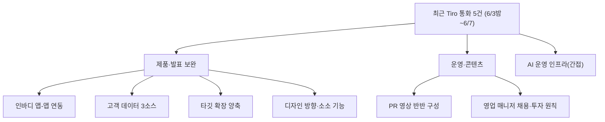

📅 2026-06-08 · 📁 02_몸소 서비스 / 04_발표준비 · note
> **한 줄 정의:** 작성 당시 GitHub에 아직 안 올라간 최근 Tiro 통화 5건(6/3밤~6/7)에서 *기존 노트에 없던 새 내용*만 추려 momso를 보완한 보고서. 핵심은 **인바디 '앱-앱 연동' 확정**, **고객 데이터 3소스**, **타깃 확장 양축**, **PR 영상**, **디자인 방향**.
> 2026-06-08 정리 메모: 원문 보존은 별도 브랜치 `codex/tiro-archive-raw-preservation` / PR #3의 `c2fb592`에서 보강됐다. 이 문서는 이제 "GitHub 미반영 자료"가 아니라 "최근 Tiro 원문을 바탕으로 발표에 반영할 보완점"으로 읽으면 된다.

---

## A. 핵심 요약

- 6/3에 이미 아카이브된 통화 외, **당시 GitHub 미반영이던 '바순'(성균-동환) 통화 5건**(6/3 21:19·6/4·6/5·6/6·6/7)을 정독.
- 대부분은 사적 회고·AI 협업 인프라 얘기라 momso 본체 NEW는 적음. 단 **소수의 핵심 보완점**이 나옴.
- ⭐ **가장 중요:** 인바디는 *기기 직결이 아니라 '앱-앱 연동'* — momso가 인바디 **앱**을 연동(측정데이터 통합 + 인바디 센터 찾기 기능에 올라탐).
- ⭐ **고객 데이터 3소스** 명시: ① 인바디 앱 측정 ② 선생님앱 지도 데이터 ③ 고객 직접 입력.
- ⭐ **PR 영상 '반반 구성'**(유동환 소통-병목 스토리 + 김성균 기술 설계) — 바이럴·공동대표 명분.
- 디자인: AI 영역=투명/그라데이션, 인간(HITL) 영역=아날로그 질감. 색=데이터 상태 매핑.
- ⚠️ 통화들엔 사적 내용이 많음(표시만, 재현 안 함). 미팅 일정: **오늘 6/8 16:00**.

## B. 흐름도

## C. 본문

### 1. 질문 — 무엇이 궁금했나
- 당시 GitHub에 아직 안 올라간 최근 Tiro 대화에, momso를 보완할 새 내용이 있나? 사업계획서·발표에 반영할 게 있나?

### 2. 목적 — 왜 했나
팀이 시시때때로 업데이트 중이라 GitHub 아카이브(~6/3)와 실제 최신 합의 사이에 공백이 있음. 그 공백의 momso 관련 새 결정을 채워 제출물·발표를 최신화하기 위해.

### 3. 내용 — 알맹이 (NEW만)

**(1) ⭐ 인바디 연동 = '앱-앱 연동'으로 확정 (6/6) — 사업계획서 반영 권고**
- *"몸소랑 인바디 기기를 연결시키는 게 아니라, 몸소가 인바디 앱을 연동시킨다."*
- 인바디 **앱**이 주는 두 기능에 올라탐: ① 삼성헬스·피트니스 등 **측정 데이터 통합** ② **인바디 가능 센터 찾기.**
- → 노트 08(인바디 API는 계약·승인 필요)과 모순 아님. *오히려 더 현실적*: 초기엔 장비 API 직결이 아니라 **인바디 앱 데이터 연동/업로드**로 시작. **발표·사업계획서의 인바디 협업 슬라이드를 "기기 통합"이 아니라 "앱 연동"으로 표현하면 오해를 줄임.**
- 인바디 **좌우 균형** 데이터도 활용 포인트로 추가 언급.

**(2) ⭐ 고객용 모드 데이터 3소스 (6/6)**
- 기존 raw→metadata→shareable 3계층과 *별개*로, 고객 앱에 쌓이는 **데이터 출처 3종**을 특정:
  1. 인바디 앱에서 받은 신체 측정 데이터
  2. 몸소 선생님용 앱에서 받은 지도(指導) 데이터
  3. 고객이 직접 입력한 데이터
- → 데이터 도식/리포트 슬라이드에 "3소스"로 추가하면 풍부해짐.

**(3) ⭐ 타깃 확장 양축 서사 (6/6)**
- 인바디 앱 연동으로 타깃이 "요가·필라 수련자"에서 **"인바디를 쓰거나 몸에 관심 있는 모든 사람"**으로 확장 가능. 동시에 좁히면 요가·필라로 수렴.
- 선생님도 **고객용 모드를 본인 몸 관리용으로 일상 사용**하는 신규 시나리오.

**(4) 디자인 방향 (6/3밤) — 프로토타입/데모에 반영**
- **AI 영역 vs 인간 영역의 시각적 구분을 원칙화:** AI 자동 영역=투명/그라데이션(구글·삼성 AI CI 차용), 인간 검수(HITL) 영역=나무 질감·노이즈 등 아날로그 텍스처. "빛의 삼원색=디지털/AI, 색의 삼원색=아날로그/HITL."
- **키컬러 3색 + 데이터 상태 매핑:** 살구(메인=개인/내 것)·노랑(액센트=공유/외부)·라벤더(보조=보류/hold). (단 "너무 빨갛다"며 채도 재조정 여지 — `palette-review` 브랜치의 출처가 이 통화.)
- 소문자 `momso` + 차분한 타이포 위계(= `design` 브랜치 PR #5).

**(5) 소소 기능 아이디어**
- 검수 '공유/내부/보류' 분류를 **단일선택 → 복수선택**으로 변경 요청.
- **사진 안전 전송**(데이터주권 사례): 강사가 1:1 수업 사진을 인스타·블로그에 무단 유포하는 대신, momso로 본인에게만 안전 전송 → 수련생 리포트에 사진 연동·아카이브(수련생도 개인 저장소 가입).
- **수련생 '읽기 API'**: shareable 리포트만 자체 LLM에 연결.
- 'AI 위키' = "AI가 볼 수 있는 위키"로 정의(유동환 "기능적으로 혁신적"). 멀티뷰(카드·문단·워드·맵) 호평.

**(6) 운영·콘텐츠 (6/5, 6/6) — GTM·팀 슬라이드 소재**
- **PR 영상 '반반 구성'(6/6):** 전반 유동환(요가 지도자로서 *소통의 병목*을 겪은 개인 스토리·인터뷰) + 후반 김성균(기술 설계). 바이럴 콘텐츠 + **공동대표 참여 명분**으로도 활용.
- **현금 투자 거절 + 역제안(6/5):** 현금보다 인맥 연결·동행을 역제안. 받더라도 명확한 계약 전제(과거 비계약 관계의 교훈).
- **영업 매니저 채용을 최우선 인사 과제로(6/5):** 팀에 가장 부족한 역할=영업. 단 **투자 유치 → 채용 순서**(불확실성을 후보에게 전가 안 함). → 팀·자금 로드맵 슬라이드에 넣을 만함.
- **연희 요가 위크 평가(6/5):** 모객보다 바이럴, 최대 수혜자는 숙박/공간 사업자 → **운영자본·영업력의 중요성** 재확인.

**(7) AI 운영 인프라 (6/4, 6/7) — 간접 근거**
- Codex+Claude **'우체통' + 8단계(+0단계) 협업 루프**, **'유인원 지침'으로 출력 토큰 ~75% 절감**, **WORM 3계층(원본/인간메모/시스템메모)·Joplin 도입**.
- momso 본체 변경은 아님. 단 *"momso의 HITL·단일 LLM 운영을 어떻게 저비용·반자동으로 굴리나"*의 운영 근거로 발표 Q&A(AI 비용 방어)에 보탤 수 있음.

> **6/12 제출 직접 반영 권고(우선순위):** ① 인바디 협업 = "앱 연동"으로 표현 수정 ② 데이터 도식에 고객 3소스 추가 ③ 타깃 확장 양축 한 줄 ④ PR 영상 기획안을 GTM/명분 슬라이드에 ⑤ 데모 디자인에 AI/HITL 시각 구분·키컬러.

### 4. 근거·출처
- Tiro 통화 5건(BigBlue 계정): `qLso58KfKAiRz`(6/3 21:19,136분)·`Ee4Vt1Liayv3n`(6/4,88분)·`Ri8DEwEV3We23`(6/5,38분)·`5JwBLFcHxry69`(6/6,50분)·`ArBPHb2xmdPu7`(6/7,52분). 각 transcript 정독.
- 이 통화들은 **작성 당시 GitHub 미반영**이었다(아카이브는 6/3 131048/142122/151434까지). 이후 원문 보존은 `codex/tiro-archive-raw-preservation` / PR #3의 `c2fb592`에서 보강됐다. 사적 내용 다수 → momso substance만 추출, 사적은 표시만.

### 5. 논의 과정
- 🧍 환: "최근 Tiro에 GitHub 못 올라간 유의미한 내용 있어. 인식 안 한 데이터로 momso 보완 보고서 써줘. 04_발표준비에 이어서 /note."
- 🤖 클로드: Tiro MCP로 6/3밤~6/7 바순 5건 식별 → 5개 에이전트 병렬 정독 → NEW만 추려 한 노트로.

### 6. 클로드 이해
이 보고서의 실전 가치는 **"인바디 앱 연동"과 "PR 영상"** 두 가지다. 전자는 사업계획서의 인바디 협업 표현을 더 현실적·정확하게 고칠 핵심이고, 후자는 발표 보조자료 + 공동대표 명분 + 바이럴을 한 번에 푸는 카드다. 나머지(디자인·기능·운영)는 데모와 GTM·팀 슬라이드를 살찌우는 재료다.

### 7. 환의 생각
- 환은 팀이 *실시간으로 업데이트 중*이라 GitHub와 실제 최신 합의 사이 공백을 의식하고, 그 공백을 채워 제출물을 최신화하려 한다.
- 인바디를 "기기"가 아니라 "앱"으로 연동한다는 더 현실적인 방향, 그리고 자기 소통-병목 스토리를 PR 영상으로 푸는 데 의미를 둔다.
- 디자인에서 'AI는 투명하게, 사람 손길은 또렷하게'라는 철학(HITL의 시각적 표현)을 중요하게 본다.

## D. 참조
- **만든 파일:** `04_발표준비/04_최근Tiro_보완점.md`
- **인용 (상류):** `04_발표준비/01_리서치_가정채우기_메모` · `04_발표준비/02_예상_QnA_발표노트` · 노트 07 사업계획서 · 노트 12 tiro 아카이브
- **피인용 (하류):** (아직 없음)
- **태그:** (나중)
