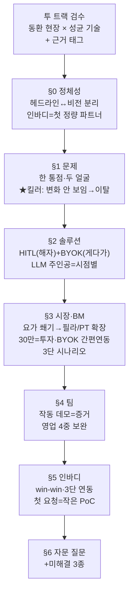

📅 2026-06-08 · 📁 02_몸소 서비스 / 04_발표준비 · note
> **한 줄 정의:** 4시 자문 미팅을 앞두고 §0~§6 워크시트를 한 섹션씩 *함께* 정리하며 내린 결론과 **그 결론에 이른 추론 사슬·근거**를 통째로 보존한 종합 노트. momso 지원서(6/12)의 뼈대이자, 이후 아이디에이팅의 기준선.

---

## A. 핵심 요약

- **방법:** 동환의 채운 워크시트를 두고 *투 트랙*(동환=현장 도메인 / 성균=기술·전략)으로 §0~§6을 한 섹션씩 검수. 빈칸은 **명시한 기준**으로 채우고, 모든 주장에 **근거 태그**를 달았다.
- **근거 태그 체계:** `[현장근거]`(동환 현장 감) · `[기술근거]`(성균 기술·전략) · `[리서치근거]`(공식 통계·웹) · `[가정]`(미검증 → PoC로 실측).
- **가장 큰 수확 3개:** ① §1 **킬러 인사이트**("변화가 안 보여 동기·재방문이 끊긴다") ② §3 **요가 쐐기→필라/PT 인바디 확장**(동환의 고민을 *확장 경로*로 전환) ③ §3 **BYOK→"네이버·클로드 간편 연동"**(부담을 우리가 흡수 — Joplin=OneDrive 호환 인사이트).
- **과장 방지 원칙(관통):** *숫자 앞에 조건을 붙인다.* 모르면 "검증 예정"으로 정직하게.
- 산출물: 14장 초안 덱(`08`)·슬라이드별 설명(`09`)로 즉시 반영됨.
- **성균 정합성 검수(`10_최종정합성검토`):** §0~§6의 정의·HITL·인바디·BM 숫자가 기존 회의록·리서치와 **정합** 확인. 트랙션 숫자는 **"연희 요가 위크 1,677명(정산 기준)"**(공개 보고서 검증)으로 통일 — 과거 '축제 1,664명'은 *역사 자료로만* 둔다.

## B. 흐름도

## C. 본문

### 1. 질문 — 무엇이 궁금했나
4시 자문(지원서 완성도 점검) 전, **백지에 가까운 상태**에서 momso를 다시 세울 수 있나? 동환이 채운 워크시트의 각 답이 *성균의 입장*과 일맥상통하는지·상충하는지 가르고, 두 사람이 *모르는 영역*은 어떤 기준으로 메울지 — 이걸 §0~§6 순서로 풀었다.

### 2. 목적 — 왜 했나
지원서·발표의 **논리 뼈대를 견고히** 하고, 자문가가 찌를 지점을 *미리 방어*하기 위해. 단순 정리가 아니라 *왜 그 결론인지*의 사슬을 남겨, 이후 누가 봐도 재구성 가능하게.

### 3. 내용 — §0~§6 결론과 추론 사슬

#### (0) 정체성 — 헤드라인과 비전을 *분리*한다
- **결론:** 같은 momso를 청중에 따라 다르게 말한다.
  - *심사자 헤드라인:* "수업에서 사라지는 **말·교정·감각**을, **강사가 검수해** 개인 수련 기록으로 남긴다."
  - *소비자 비전:* "그렇게 쌓이면 momso는 내 몸을 가장 잘 아는 **'세컨드 바디'**가 된다."
- **추론:** 심사자는 *문제·시장*에 반응하고 소비자는 *내 몸 알아감*에 반응한다 → 한 문장에 섞으면 초점이 흐려진다. 그래서 둘을 **분리**해 청중별로 *하나만* 앞세운다.
- **인바디 위치:** **헤드라인에서 뺀다.** `[현장+기술]` 이유 = 종속 인상 방지. 인바디는 고객 데이터 **3소스 중 하나**(①인바디앱 ②강사앱 지도 ③직접입력)일 뿐 → "전부가 아니라 **첫 정량 데이터 파트너**". momso는 인바디 *없이도* 작동.

#### (1) 문제 — 한 통점, 두 얼굴, 그리고 킬러 장면
- **한 통점:** 수업의 핵심(말·교정·감각)이 *끝나면 휘발*된다.
- **두 얼굴:**
  | 수련생 | 강사·운영자 |
  |---|---|
  | 일상에서 다시 못 씀 · 또 다침 · 내 몸 변화 모름 | 수십 명 다 기억·관리 못 함 · 전문성이 안 남음 · **변화 못 보여줘 재방문 놓침** |
- **★ 킬러 인사이트(동환의 현장 발화):** **"변화는 일어나는데, 강사는 *보여줄* 수 없고 수련생은 *볼* 수 없다."** → 동기를 줄 자극점이 안 생기고 **재방문이 끊긴다.** `[현장근거]`
  - *왜 이게 핵심인가:* 이 한 장면이 §3의 **리텐션 BM**(30만=재방문 투자)과 §5의 **인바디 다리**(변화를 '보이게')를 동시에 정당화한다. 인바디가 변화를 *보이게* 하고, momso가 거기 *수업의 의미*를 입힌다.
  - *보조 사실:* 웰니스 유료 고객의 **80~90%가 여성** `[현장 관찰]`. 표현은 "변화를 함께 본다(참고값)" O / "살을 뺀다" X.
- **기존 도구 공백:** CRM(예약·결제)·예약앱(접근)·전사앱(글)·측정기(수치)가 *각자 일부만* → **수업 맥락 기록 계층이 통째로 비어 있다.**
- **LLM의 위치(짚은 질문):** momso는 기록을 넘어 LLM까지 구상 중. 이를 헤드라인서 *뺀 건 누락이 아니라 층 분리* — **인바디=데이터 소스, LLM=엔진, HITL=해자**는 서로 다른 축. LLM은 *비전층(세컨드 바디)*에 둔다.

#### (2) 솔루션 — 차별점의 *순서*가 메시지다
- **흐름:** 수업 전 → 녹음(강사만) → **AI 초안 → 강사 검수(공유/내부/보류/제외) → 발행** → 회원별 축적 → 다음 수업 회수.
- **차별점 순서(확정):**
  1. **① 해자 = HITL + 수업 맥락 기록.** 요가의 민감성(노하우·개인·타인정보)을 *강사가 초점 단위로 검수*해, 검수본만 회원별 장기 축적. **AI 회의록·CRM엔 구조 자체가 없다.**
  2. **② 게다가 = BYOK(비용·데이터 주권).** "게다가"의 위치 — 헤드라인 아닌 *받침*.
  - *왜 이 순서:* 현장 원장이 가장 끄덕이는 건 *검수+맥락*이지 *키 연결*이 아니다. BYOK를 앞세우면 "그래서 뭐?"가 된다.
- **경쟁 정면 비교("걔네는 X, 우리는 Y + 강사 검수"):** 바디코디=센터 운영 / 오붓=수업에 가게 / Tiro=음성을 글로 / 인바디=몸의 스펙 / 포인티=PT 운동기록 → momso=수업 경험·맥락·감각.
- **LLM 주인공 = 둘 다, 단 *시점이 다름*:**
  - *지금(데모·지원서)* → **강사의 AI 위키**(수업 정리·맥락 회수). 6/12 데모는 강사 흐름을 완성형으로.
  - *미래(비전·마케팅)* → **수련생의 세컨드 바디**(쌓일수록 내 몸 이해). "구현 완료"로 단정하지 않고 *PoC 검증*으로.

#### (3) 시장·수익·확장 — 동환의 *고민*을 강점으로 뒤집다
- **첫 시장 결정(관문):** 동환의 솔직한 고민 = "요가가 편한데 인바디는 필라에 많다." → **층을 나눠 해소:**
  - **쐐기 = 요가**(빅블루·연희동 1:1·소그룹). 성균 논리와 합치 = *"요가=암묵지 가장 큰=가장 어려운 첫 시장 → 뚫으면 모델 증명"* `[기술근거]`.
  - **정의 시장 = 요가+필라+PT 프리미엄 참여형 스튜디오**(규모·방어용).
  - **인바디가 필라에 많다 = 약점 아닌 *확장 경로*** → "가장 까다로운 요가에서 인바디 없이도 통하게 만들고 → 인바디 깔린 필라/PT로 넘어가 협업을 키운다." (고민이 *확장 시나리오의 논리*로 전환.)
- **수익 — 30만을 "고정비"가 아니라 "투자"로 의식하게(동환 핵심 통찰):**
  - 자영업자는 *고정지출*을 줄이려 한다 → momso를 *투자개발비*로 의식하게 하려면 **"30만 안에 무엇이 들었고 무슨 효과인지"**를 기능표로 보여줘야 한다(숫자만 X).
  - *기능→효과:* AI 위키(정리시간↓)·검수 리포트(재방문↑=§1 킬러 해결)·데이터 3소스(차별화 마케팅)·사진 안전전송(신뢰)·네이버·클로드 간편연동(주권). → **"회원 1~2명만 더 잡아도 회수되는 리텐션 투자."**
  - **B2C 월 7천 = 바이럴 엔진**(주 매출 아님). 싸야 입소문 → 원장을 끌어옴(B2B2C).
- **★ BYOK → "네이버·클로드 간편 연동"(Joplin 인사이트):**
  - 동환의 비유 — Joplin을 고른 이유 = *이미 쓰던 OneDrive에 자연스레 호환*돼 "뭘 또 사야 하나" 고민이 없었다. **"BYOK가 장점"이라고만 쓰면 역효과**("그럼 내가 클로드 구독·API 키 발급하라고? 귀찮다"). 자유 = 부담.
  - **해법:** InBodyLIKE 스폰서가 **네이버·앤트로픽**이니 *공모전 나가는 김에* 이 인프라를 **"가입·결제 대행(web2.5)"**으로 감싸 **"간편 연동"**으로 제공 → **부담을 우리가 흡수.** 사용자는 키를 *몰라도* "연동 켜기"만.
  - ⚠️ "**별도 결제 없이**"는 *스폰서 크레딧 확정 시*에만 표기 — 서류 통과 후 운영팀 확인(동환: "서류 붙고 나서 알 수 있다").
- **단위경제·시나리오:**
  - 곳당 월 = B2B 30만 + (회원수 × 전환율 × 7천). **전환율 = 50%**(동환 추정, *서비스 완성·마케팅* 가정 — 업계 대비 공격적이라 *상단*으로만) `[현장근거·가정]`.
  - **3단 매출(조건 붙여 말함):** 기본(보수) **20~26억** → 성숙(전환 50%) **35~39억** → 공격(1,000곳·유료多) **~60억**. *"60억"은 항상 조건부.*
  - **BYOK 숨은 마진:** 고객 키로 LLM 추론 → momso가 추론비 안 냄 → 원가↓ `[기술근거]`.
- **확장 레버:** 인바디 앱 연동(타깃 양축)·데이터 3소스·바이럴(검수 리포트·사진). 가정용 인바디 소비자는 *④단계 한 줄로만*(첫 시장과 안 섞음).
- **시장 규모:** TAM = 전국 체육·웰니스 사업체 **131,764곳·89.9%가 1~4인** `[리서치]`. SOM = 500(기본)~1,000곳(공격). (덱 03 슬라이드13 하위숫자 교체 권고는 `01_리서치 메모` 참조.)

#### (4) 팀 — "개발자도 없는데 되나"를 뒤집다
- **왜 우리:** 요가를 *아는* 동환(도메인·빅블루·연희동) + *만드는* 성균(기술·전략·주권 설계), 50:50.
  - *검증된 트랙션:* 연희 요가 위크 **1,677명(정산 기준)** · 리뷰 123건 · 리뷰 밀도 2위·채움률 93.0% — 공개 분석 보고서(`07_연희요가위크_도메인근거`)로 검증.
- **3단 방어:** ① *이미 작동하는 데모*가 증거(momso.vercel.app) ② AI 보조개발로 2인이 PoC 도달 ③ 채용은 *투자 후*(불확실성 후보 전가 안 함).
- **영업 공백 — 부정 말고 4중 보완:** ①창업자 직접영업(초기 B2B는 founder-led가 *정석*) ②연희동 클러스터 등대(밀집 레퍼런스 확산) ③B2C-pull(수련생→원장 inbound) ④인바디 파트너 채널. → playbook 검증 후 *영업 매니저 1순위* 채용. *(가장 부족한 역할이 영업임은 정직하게 인정.)*

#### (5) 인바디 협업 — win-win, 그러나 과장하지 않는 연동
- **인바디가 얻는 것:** 요가원(미점유) **진입 통로** + 측정값의 "그래서 뭐?"를 *수업 맥락*으로 풀어 앱 가치·리텐션↑. → 종속 아닌 **win-win**.
- **3단 연동 로드맵(동환 "모르겠어"를 단계론으로 해소):** ①직접 입력(즉시·계약 불필요) → ②앱 연동(인바디 앱 데이터·센터찾기, *앱-앱*) → ③공식 API(계약·승인 후 직결). **"기기 즉시 직결"은 약속하지 않는다.** `[2026-06-06 합의]`
- **첫 요청 = 작은 문을 먼저 연다:** 큰 API·계약이 아니라 **빅블루 1곳 8~12주 공동 PoC + 데이터 해석 멘토링.** 거절 비용이 낮고, 잘 되면 앱연동·API는 자연히 따라온다. *(이 가설은 자문 Q1로 검증.)*

#### (6) 자문 질문 + 미해결 3종
- **질문(미팅 본론):** ①인바디 첫 요청은? ②전환율 50%(완성 가정)를 과장 안 들리게? ③영업 채용 순서(투자 후)? ④데모 범위? ⑤가장 약한 섹션·심사자 의심점?
- **미해결(PoC/서류 후 실측):** 전환율(20~50% 띠) · "별도 결제 없이"(크레딧 확정) · 인바디 첫 요청(가설=PoC).

### 4. 근거·출처
- **현장근거(동환):** 빅블루 운영 감(여성 80~90%, 회비 단가, 전환율 50%, Joplin=OneDrive 비유, 30만 투자 프레임).
- **기술근거(성균):** "요가=가장 어려운 첫 시장" 논리, BYOK 원가 구조, 데이터 주권/web2.5.
- **리서치근거:** 공식 통계(사업체 131,764·89.9% 1~4인), 경쟁/시장 리서치 → `01_리서치 메모`.
- **합의 근거:** 인바디 앱-앱 연동(2026-06-06), 영업 채용·투자 원칙(2026-06-05) → `04_최근 Tiro 보완점`.
- **원본 파일:** `05_지원서_생각정리_워크시트.md`(빈 틀) · `Input/260608_지원서 워크시트.txt`(동환이 채운 답) · `08_몸소_지원서초안.pptx`/`09_상세설명`(산출물).

### 5. 논의 과정
- 🧍 환: "나의 지점과 성균 입장을 *투 트랙*으로 동시에 만들어가자. 모르는 영역은 *어떤 기준·근거로* 메우는지 명시해줘. §0부터."
- 🤖 클로드: 섹션마다 동환 답 ↔ 성균 입장 ↔ 빈칸을 가르고 근거 태그로 채움. 각 결론에 *왜*를 붙임.
- 🧍 환(§1): 킬러 인사이트 — "변화가 일어나도 강사는 못 보여주고 수련생은 못 본다." LLM까지 말하는 게 맞나 질문.
- 🤖 클로드: LLM=엔진, 비전층에 배치(헤드라인서 빼되 누락 아님).
- 🧍 환(§2): 차별점 순서 = ①HITL ②BYOK. LLM 주인공 "둘 다."
- 🧍 환(§3): "30만은 *기능·효과를 명시*해 *투자개발비*로 의식하게. Joplin이 OneDrive에 호환되듯, 네이버·클로드 *간편 연동*으로." 전환율 = 50%(완성 가정).
- 🧍 환(§4): 영업이 더 우선. 대책? → 🤖 4중 보완.
- 🧍 환(§5): 연동 방식 "모르겠어" → 🤖 3단 로드맵·첫 요청=작은 PoC.

### 6. 클로드 이해
이 정리의 진짜 가치는 *결론*이 아니라 **결론에 이른 사슬**이다. 특히 동환의 두 통찰 — (1) "30만을 *투자*로 의식하게(기능표)" (2) "BYOK를 *간편 연동*으로(부담 흡수)" — 은 기술 언어(BYOK·데이터 주권)를 *자영업자의 회계·심리 언어*로 번역한 것이고, 이게 지원서를 "맞는 말"에서 "설득되는 말"로 바꾼다. §3의 첫 시장 해소(고민→확장 경로)도 같은 종류의 *재프레이밍*이다.

### 7. 환의 생각
- 환은 *현장 자영업자의 머릿속*을 기준으로 삼는다 — 원장은 고정비를 줄이려 하므로, momso를 *투자개발*로 보이게 해야 지갑이 열린다.
- "자유는 곧 부담"을 직관적으로 안다 → BYOK의 *자유*가 소비자에겐 *귀찮음*이 될 수 있음을 경계하고, 스폰서(네이버·앤트로픽)를 지렛대 삼아 부담을 흡수하려 한다.
- 인바디·숫자에 *솔직*하려 한다 — "별도 결제 없이"는 서류 붙은 뒤에야 안다고, 전환율 50%도 *완성 가정*임을 분명히 한다. 과장보다 *조건부 정직*을 택한다.

## D. 참조
- **만든 파일:** `04_발표준비/10_지원서_생각정리_종합.md`(이 노트) · `05_워크시트` · `08_초안덱` · `09_상세설명`
- **인용 (상류):** [260608_momso 정의와 제품원칙](:/44ad4f27a41245e3a6f5d77e4a14b508) · [260608_시장·BM·인바디연동 검증](:/72527ef83b5145fcac0db5af56267207) · [260608_예상 QnA·발표노트](:/1c7f1adc0ab64edb8bfbf9277e78adf7) · [260608_최근 Tiro 보완점 (인바디 앱연동·PR영상)](:/7ca9e8b74b5b4423bb4d537922472bb5)
- **피인용 (하류):** (아직 없음)
- **태그:** (나중)
