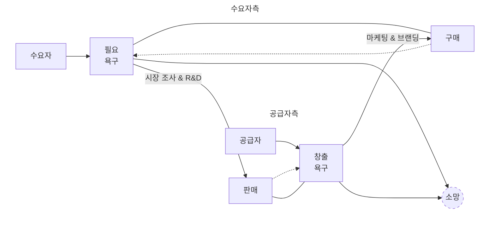

# @2026년 3월 24일 회의

edit-time: 2026년 3월 24일 오후 9:19
gen-time: 2026년 3월 23일 오후 7:42
block-ID: 66
category: 메모
contents: 텍스트
index: 회의록
on/off: No
status: cowork
time: 2026년 3월 24일 오후 12:15 (GMT+9) → 오후 6:10
Hash tag: ADMINISTRATIVE WORK, BRANDING, MARKETING

# 개요

2026년 3월 24일 회의에 대한 기록입니다.

## *history*

- 2026년 3월 21일에 돌아오는 주 정기 회의를 2026년 3월 24일 오후 12:00로 약속함
- 2026년 3월 23일 유선 상으로[*회의 준비*](@2026%EB%85%84%203%EC%9B%94%2024%EC%9D%BC%20%ED%9A%8C%EC%9D%98%2032c5f502504180af938bcd6529fcaa28.md), 논의 내용을 김성균이 기록하였음
- 2026년 3월 24일 오후 12:15 김성균 연희동 도착, 2026년 3월 24일 오후 1:30까지 점심 먹으면서 회의
- 2026년 3월 24일 오후 1:30 → 오후 6:10 회의
- 2026년 3월 24일 오후 6:10 회의 끝, 스튜디오 내에서 유동환 도시락으로 함께 저녁 식사
- 이후 밤 시간대에 유선 회의로 계속하자고 약속했으나, 유동환 컨디션 난조로 무산됨

---

# 일반

## *회의 준비*

### *유동환 → 김성균*

> **생활건강체육진흥회 입점 제안**
> 
- 전화로 안내받은 후 수신한 문자
    
    ---
    
    안녕하세요 대표님
    생활건강체육진흥회 김무진 이사입니다🙂
    
    유선상 설명드렸던 내용 다시 한 번 보내드립니다.
    
    현재 저희 생활건강체육진흥회는 서울, 경기, 광주, 제주 지역에서 활동 중이며
    전 지역을 확장을 목표로 운영하고 있습니다.
    (총 협약센터는 300개 이상, 총 4380명 이상 참여 하고 있습니다.)
    
    이번 취미지원사업을 통해 해당 센터에 약 20명 내외 인원이 배정될 예정이며,
    3개월 단위 등록 / 총 예산 3,300,000원 규모로 운영됩니다.
    
    지역 주민분들이 부담 없이 운동을 시작할 수 있도록 센터와 함께 건강한 환경을 제공하고자 합니다.
    
    ※ 단, 취미지원사업으로 등록하신 분들은 지원사업의 재신청은 불가능하며
    생활건강체육진흥회 측에서 인원을 전부 모집하고 배정해 드릴 예정입니다.
    
    지원사업의 3개월이 끝난 후 회원으로의 전환은 진흥회 측에선 일체 관여하지 않습니다.
    
    센터마다 차이가 있으나 평균 재등록률은 32%이며
    이후 센터 재등록으로 이어지는 것은 대표님께도 추가 회원 확보의 기회가 될 수 있을것으로 보입니다.
    
    추가적으로 저희 협회에서 센터 홍보까지 도와드리고 있으며 센터에서 지불하는 금액은 일절 없음을 안내 드립니다.
    
    모집 일정은 3월 27일 모집시작, 4월 15일 일괄 운동시작으로 기획되어 있습니다.
    
    내용 확인하시어 참여 여부 회신 부탁드립니다.’
    
    감사합니다.
    
    공식 인스타그램
    [https://www.instagram.com/kwasa_korea/](https://www.instagram.com/kwasa_korea/)
    공식 홈페이지
    [https://kwasakorea.co.kr](https://kwasakorea.co.kr/)
    

김성균과 논의하고자 공유함

> **의존성 제거와 독자적인 마케팅 노선 구축**
> 

나중에 요가원 사정이 안정되면, 프립·솜씨당을 포함하여 오붓까지 모두 정리해서 창구를 닫고자 한다.

플랫폼의 광고 효과에 의존하지 않고, 돈을 좀 써서라도 독자적인 마케팅을 수행해보고 싶다.

유동환이 지금 생각하기로는, 과거 박준형PD(현 시이작 요가원 원장)이 세겔라이오 목공방 영상을 찍어준 것처럼
빅블루 요가 스튜디오 공간을 소개하는 영상 기록물을 각잡고 찍어놓고 싶다.

제대로된 마케팅 콘텐츠는 한 번 만들어놓으면 오랫동안 쓸 수 있기 때문이다.

> **오세득 쉐프 프랑스 요리 가게 입점**
> 

요가원 건물 3층에 원래 있던 여행사가 나가고, 곧 오쉐득 쉐프의 프랑스 요리 가게가 입점한다고 한다.

지난 몇 년 동안 유동환과 투닥거리던 건물 경리가 귀띔해주었다.

유동환이 알기로 연희동에는 아직 프랑스 요리점이 없다, 그런 것은 강남쪽에나 더 어울리지 싶다.

어찌되었건, 본래 빅블루 요가원이 위치한 골목은 연희동 주요 상권에서 약간 벗어나있었으나
만약 트래픽이 더 몰리게 된다면 exterior 정비에 더 힘써야겠다고 생각했다.

하는 김에, 나중에 명함까지 제대로 만들어보고 싶다.

> **가격 전략 미세 수정**
> 

유동환이 지난 주말 혼주를 하며, 양가 부모님의 한복을 대여하러 갔었음.

그런데 해당 업체 매니저가 우선 50만원대의 높은 가격대 상품을 먼저 제시하고,
그 다음에 차선책으로 30만원대 상품을 보여줬음. (마케팅에서 전형적으로 쓰이는 ‘문간에 발 들여놓기’ 전략)

[*상품 조합별 가격 분배*](@2026%EB%85%84%203%EC%9B%94%2020%EC%9D%BC%20%E2%86%92%202026%EB%85%84%203%EC%9B%94%2021%EC%9D%BC%20BM%20&%20%EA%B3%A0%EA%B0%9D%EC%97%AC%EC%A0%95%EC%A7%80%EB%8F%84%20%EC%A0%95%EB%B9%84%2032a5f5025041809182cef5180e229013.md)는
그 자체로 논리적 완결성은 높으나, 이러한 소비자의 제한된 합리성이 묻어나는 심리적 변수는 고려하지 않은 상태.

그래서 각 상품군(개인/그룹/패키지)의 상위 상품의 가격을 조금씩 인상하였음

- **개인**
    - 10회 : 85만원 (15% OFF) → 90만원 (회당 9만원)
    - 20회 : 150만원 (25% OFF) → 160만원 (회당 8만원)
- **패키지**
    - [개인] 10회 + [그룹] 12회 (90일) : 102만원 (15% OFF) → 106만원 (15% OFF)
    - [개인] 10회 + [그룹] 무제한 (90일) : 125만원 (20% OFF) → 128만원 (20% OFF)

→ 개인 상품의 가격을 인상함에 따라 패키지 상품 가격도 변동 (그룹 상품군은 금액 변동 없음)

→ 개인 상품의 할인율 설명을 ‘%’에서 ‘회당 N만원’으로 바꾸어 느낌을 바꾸었음

또한, [**개인 지도 (Personal Lesson) : 정밀 교정과 전문성 강화**](@2026%EB%85%84%203%EC%9B%94%2020%EC%9D%BC%20%E2%86%92%202026%EB%85%84%203%EC%9B%94%2021%EC%9D%BC%20BM%20&%20%EA%B3%A0%EA%B0%9D%EC%97%AC%EC%A0%95%EC%A7%80%EB%8F%84%20%EC%A0%95%EB%B9%84%2032a5f5025041809182cef5180e229013.md)에 들어가있는 각 상품의 ‘정리(대표 설명 문구)’도 한 번 일괄 수정하고자 함

### *김성균 → 유동환*

> **쇼츠 레퍼런스 공유**
> 

추후 빅블루 요가 스튜디오 유튜브 채널에서 정보성 쇼츠를 생산하게 될 때 참고할 레퍼런스를 공유하였다

- 좋은 예시: https://youtube.com/shorts/8n99j7uAOIo?si=szPMfyZnhZoHGCj4
- 지양하고자 하는 느낌: https://youtube.com/shorts/DwcNwY10Tqg?si=nHiYyV8rJ5nvre2P

며칠 전 유동환으로부터 이촌동요가원 채널에 대해 소개받은 후로 계속 모니터링 중인데,
콘텐츠 자체는 훌륭하나 영상 구도가 미묘하게 정보과다 느낌이라 후킹되지 않음.

반대로 DMT는 수학채널에 필요한 명료한 전달력을 담백하게 갖추어, 오히려 이쪽을 지향하고 싶음.

굳이 비교를 해보자면, 이촌동요가원 채널 소개에도 적혀있듯이 ‘최신 해부학 지식을 요가에 적용’하는,
트렌드를 좇는 콘텐츠를 만듦. 이것은 생산성은 좋으나, 휘발성이 높다고 보여짐.

반면 DMT 채널은 기본적이고 기초적인, 그리고 변하지 않는 지식을 알기 쉽게 전달하는 데에 초점을 맞추고 있음.

추후 빅블루 요가 유튜브 채널의 콘텐츠를 기획할 때에도, 기본이 되는 내용으로 만들어진 콘텐츠 제작에 시간을 쏟되,
생산성이 과하게 떨어질 정도로 질질 끌면 안될 것 같다고 생각함.

> **워크스페이스 내 아이콘 업로드**
> 

https://drive.google.com/drive/folders/1rrIOe_M_LNqQ44X-3aOW1D0KoFoanp-c?usp=drive_link에 있는 CI들을, Notion에서 사용할 수 있도록 업로드하였음.

- 아이콘의 명칭은 다음의 규칙을 따르니 참고할 것
    
    ---
    
    - `종류_maincolor-backgroundcolor`
    - `backgroundcolor`가 없을 경우 ‘nobg’라 표시함
    - 구글드라이브에서 ‘종류’에 대한 명칭이 없을 경우 김성균이 임의로 부여함: 에센스, 리커버리
    

> **공유용 포트폴리오 생성 계획**
> 

아가르 스튜디오 / 빅블루 요가 / 빅블루 여정의 포트폴리오를 공유하기 위한 페이지를 만들고자 함

장기적으로 보았을 때 이 계획은 자사웹 구축의 전단계이며, 프로토타입으로서는 Notion으로 만드는 것이 적합함

다음의 아카이브를 참조: [포트폴리오 공유용 Notion 제작](%ED%8F%AC%ED%8A%B8%ED%8F%B4%EB%A6%AC%EC%98%A4%20%EA%B3%B5%EC%9C%A0%EC%9A%A9%20Notion%20%EC%A0%9C%EC%9E%91%2032c5f50250418049b7e0f6fc96ac655d.md) 

---

## *회의록*

### *유튜브 레퍼런스 분석 및 콘텐츠 피드백 로직 도출*

김성균의 유튜브 레퍼런스에 대한 설명을 듣고, 유동환이 요즘 생각하는 피드백 로직(루프)를 소개하였음…

이것은 비단 유튜브 콘텐츠 뿐만 아니라 모든 시장 영역에 적용 가능할 것이라 봄

- 아래 설명글과 mermaid 도식은 Gemini의 도움을 빌려 작성한 것
    
    ---
    
    비즈니스 모델의 핵심은 공급자가 시장의 결핍과 자신의 자아를 어떻게 전략적으로 결합하여 멈추지 않는 루프를 만드는가에 있습니다.
    
    우선 공급자는 수요자가 가진 '필요의 욕구'를 해결해 주기 위해 시장 조사와 R&D를 수행합니다. 이를 통해 수요자가 실제로 가려워하는 지점을 긁어주는 콘텐츠를 내놓음으로써 자연스럽게 판매를 유도합니다. 동시에 공급자는 자신이 세상에 보여주고 싶은 '창출의 욕구'를 포기하지 않으면서도, 이를 시장에 안착시키기 위해 마케팅과 브랜딩이라는 도구를 사용합니다. 이 과정을 거치면 본래 수요자의 영역에 있던 구매라는 행위를 공급자의 의도와 영향력 아래로 가져올 수 있게 됩니다. 이렇게 만들어진 구매 경험이 다시 수요자의 필요를 자극하는 장치로 작동할 때 루프는 선순환의 동력을 얻습니다. 결국 공급자가 주도하는 이 두 가지 경로가 수요자의 결핍과 공급자의 열망을 '소망'이라는 하나의 지점으로 통합시킬 때, 비즈니스는 무한히 반복될 수 있는 견고한 구조를 갖추게 됩니다.
    
    요가 콘텐츠 시장에 이 로직을 대입해 보면 공급자인 강사의 주도적인 역할이 명확히 드러납니다. 강사는 거북목이나 통증 같은 수요자의 구체적인 필요를 조사하여 이를 해결하는 프로그램을 기획함으로써 즉각적인 판매를 만들어냅니다. 이와 동시에 강사는 자신이 추구하는 수련 철학과 라이프스타일을 마케팅과 브랜딩으로 녹여내어, 공급자의 자아실현이 담긴 콘텐츠를 수요자가 기꺼이 구매하고 싶게끔 만듭니다. 여기서 수요자가 경험하는 구매와 변화가 다시 그들의 또 다른 필요를 자극하는 피드백으로 이어질 때 루프는 멈추지 않고 회전합니다. 결과적으로 살을 빼고 싶다는 수요자의 필요와 요가의 정수를 전하고 싶은 공급자의 욕구가 '건강한 삶'이라는 소망으로 일치되는 순간, 강사는 시장에 매몰되지 않으면서도 자신의 자아를 시장 가치와 완벽히 결합한 모델을 완성하게 됩니다.
    

유동환이 보기에는, 이촌동요가원 채널도 나름 이 피드백 루프를 자신들만의 방식으로 적용하고 있어 보인다.

따라서 빅블루 요가 유튜브 채널에 필요한 준비사항 중에서 이러한 부분도 고려를 해야 할 것이다.

### *2026년 3월 25일 발표 준비*

요약

### 실행 항목

- [ ]  유동환: 김성균이 제작한 발표자료 및 신청서 내용 완전히 숙지
- [ ]  유동환: 3분 발표 + 7분 질의응답 형식에 맞춰 발표 연습
- [ ]  팀: 저녁 이후 추가 회의 진행

### 발표 핵심 메시지 구조

**대전제**: 팀 빅블루의 2026년 목표는 빅블루 OS 시제품 제작 

**소전제**: UOS 창업동아리를 통해 이 목표를 이루고 싶음 (활동의지 50% 배점) 

**수미상관 구조**: 발표 마지막에 다시 창업동아리 지원 필요성으로 돌아와 마무리 

### 문제 정의 (3가지)

- 웰니스 기반 소규모 복합문화공간 운영의 반복적 비효율성 - 예약, 결제, 일정 변경, 상담 등이 여러 플랫폼(네이버 예약, 메모앱 등)에 조각조각 흩어져 있어 통합 관리 어려움
- 수업 현장의 코칭 커뮤니케이션 병목 현상
- 외부 솔루션의 구조, 정책, 가격에 종속되는 벤더락인 문제

### 창업 목표 (문제에 대응하는 3가지)

- 데스크 기능으로 운영 흐름을 끊기지 않게 만들기
- 바디노트 기능으로 수업 설명과 피드백 구조화
- 외부 솔루션 과잉기능에 휘둘리지 않고 빅블루 OS 안에서 필수 흐름을 자체 통제

### 창업 경험 (강조할 요소)

**문제의 당사자성**: 웰니스 사업 직접 운영 경험 (2023-2024 아가르 스튜디오, 2025-현재 빅블루 요가) - 문제를 직접 경험했고, 직접 정의한 당사자  

**시장 검증 우위**: 연희동 요가원 사장님 네트워크 보유 - 제품 개발 시 질 좋은 예비 고객군으로부터 피드백 수집 가능. 이미 이 시장에 참여하고 있는 예비 창업자가 아닌 현직 사업자    

**학습 의지**: 2023년 UOS 창업동아리 활동으로 도움 받았던 경험. 소프트웨어 사업은 새로운 영역이므로 다시 교육과 지원이 필요함   

### 아이템 소개 (참신성 20% 배점)

**빅블루 OS 구조**: 데스크와 바디노트 두 축으로 구성 

**데스크 3가지 기능**:

- 일정관리 기능 (예약, 수련 시간표 관리)
- 미니멀 SNS 기능 (지도자-수련생 프라이빗 피드백, 콘텐츠 사업 요소)
- 매출/지출 원장 기능

**바디노트 키워드**: 동서양 의료 지식 통합, 초경량화 버전, 수업 중 바로 활용 가능한 편리한 조작감 

**핵심 차별점 - 데이터 종속성 제거**: 모든 데이터를 자체 OS 안에 통합하여 AI 활용 가능. 외부 플랫폼에 데이터가 흩어져 있으면 AI에게 질의 불가능. 데이터 소유권이 있어야 AI를 통한 무제한적 성장 가능    

**소규모 1인 창업의 필수 조건**: 직원 없이 운영하려면 마케팅, 브랜딩, 자금관리를 AI 도움으로 해결해야 하며, 이를 위해 데이터 통합 필요 

### 구현 방식

**다이브코딩/노션 활용**: 최종 앱 개발 전 MVP 형태로 구현. 다이브코딩은 제품이 아닌 초기 설계 비용, 투자 비용. UI/UX 설계도를 먼저 만든 후 개발자 고용 시 효율적 견적 산정 가능     

**현장 검증**: 연희동(웰니스 성지) 요가원 사장님 네트워크를 통한 근거 기반 사용자 경험 개선  

### 비즈니스 모델 (시장성 30% 배점)

**기본 전제**: 오픈소스로 공개 

**수익화 모델**:

- OS는 무료 배포, 교육/강의 유료화
- Github 같은 허브 플랫폼에서 커뮤니티 형성, 네트워크 효과
- 강의 영상, 맞춤 버전 관리 등 부가가치 서비스 유료 제공

**공대생 마인드셋 강조**: 일단 만드는 것에 집중, BM은 차차 구체화. 이미 사업 경험 있어 수익의 중요성은 인지하고 있음 

### 2026년 구체적 목표

- 핵심 기능(데스크, 바디노트) 완성
- 검증 가능한 사용자 경험 확보

### 평가 기준 및 전략

**배점**: 활동의지 50%, 아이템 참신성 20%, 시장성 30% 

**절대평가**: 상대평가가 아니므로 모든 요소를 과락 없이 준비하면 됨. 시장성은 BM을 염두하고 있다는 것만 보여주면 충족  

**발표 시간**: 3분 발표 + 7분 질의응답  

### 발표 시 주의사항

**복합문화공간 언급**: 3분 발표에서는 생략 가능. 질의응답 시 SNS 콘텐츠 기능과 연결하여 "나만의 마이크로플랫폼, 콘텐츠 유통이 가능한 복합문화공간 지향 OS"로 설명    

**비효율성 구체화**: "반복적으로 발생하는 비효율성"의 구체적 사례 설명 필요 (예약, 취소, 일정 변경, 상담 등이 여러 플랫폼에 분산)  

### 김성균 피드백 요약

유동환의 신청서 이해도 98% 완벽. 나머지 2%는 순서와 인과관계 디테일 

**보완 필요 사항**:

- 창업경험을 서류작업 능력이 아닌 문제 당사자성과 시장 네트워크로 재구성
- 다이브코딩을 계획이 아닌 방법론/투자비용으로 포지셔닝
- 데이터 종속성 제거의 중요성(AI 활용) 명확히 설명
- 창업동아리 교육 필요성과 성장 의지 강조

메모

받아쓰기

네, 지금 시각은 오후 5시 24분, 3월 24일 회의 중에 이번 주 금요일 발표 준비에 대한 토의를 하고 있습니다. 우선 빅블루팀의 발표자는 유동환씨이기 때문에 유동환씨가 발표자료와 신청서의 내용을 모두 숙지할 필요가 있었고요. 그래서 김성균이 제작한 발표자료 및 신청서를 쭉 훑어보고 유동완이 직접 머릿속에 구조화한 내용을 피드백 받기로 했습니다. 네, 유동완 씨 발언해 주세요. 유동완 발언합니다. 그...

여기 창업 동아리 참가 신청서에서는 총 5개의 큰 틀을 가지고 얘기하는 것을 분석을 했는데 다섯가지 단계를 구조화 한다면 첫번째 문제점 문제점을 또 세가지로 나눠보면 웨니스 기반 소규모 복합 문화 공간을 운영하는 데 있어서 반복적으로 발생하는 비효율성, 두번째 수업 현장에서 발생하는 코칭 커뮤니케이션의 병목 현상들, 세번째, 외부 솔루션의 구조, 정책, 가격에 종속되는 벤더락인 문제, 이 세가지 문제점이 있고 이 문제점에 따른 우리의 창업 목표는 데스크 기능을 통해서 운영 흐름을 끊기지 않게 만드는 것.

두번째 바디노트 기능을 통해서 수업에서 설명 피드백을 구조화 시키는 것 세번째 외부 솔루션 과잉기능에 휘둘리지 않으면서 우리 빅블루 os 안에서의 필수 흐름을 우리 통제하에 구성시키는 것 이렇게 세가지 목표가 있습니다. 각 문제점에 따른 분명한 목표 세가지가 있어요. 이거를 하기 위해서 창업 동아리 면접에서 중요하게 보는 것은 나의 활동 경험과 그에 따른 의지를 중요하게 보는데 나의 과거 창업 경험에 대해서 세 가지로 나눠보면 첫 번째는 2023년도에 우리 실입대학교에서 창업 동아리 활동 경험이 있다는 점. 이게 뭘 의미하느냐 전반적인 그 동아리 운영이 어떻게 굴러가는지 아니까 학교에서 원하는 실무적이고

노무적인 서류작업들에 대해서 난 인지하고 있고 그거에 대해서 재깍재깍 제출할 수 있다라는 것 두번째는 실제 웰리스 기반의 사업 운영을 해봤다는 것, 총 3년동안 2023년부터 2024년까지 아가르 스튜디오, 2025년부터 현재까지는 빅블루 요가 운영하고 있다는 것 그리고 세 번째 소구묘 복합문화 공간의 형태를 띈 사업장을 같이 운영했다는 것 이것이 시사하는 바가 뭐냐면 우리는 목공하고 요가를 같은 공간 안에서 운영을 했었는데 그에 따라서 비효율성이 병목되는 현상들을 정확히 인지하고 있다. 그리고 소규모로 1인으로 운영해봤기 때문에 얼마나 농구적으로 불필요한 일들을 많이 경험했고 힘든 부분이 있었는지를 알고 있다.

그리고 이에 따라서 우리가 사업화 시키고 싶은 아이템에 대해서 어떻게 개입하고 구체화 시킬거냐 두가지로 이건 나눌 수 있는데 구현을 하는 방식은 신청서에서는 이제 다이브코딩 기반으로 했는데 다이브코딩 혹은 노션이 포함될 수 있다. 그렇게 해서 최소 기능 제품으로 MVP의 형태로 구현시키는 거고 그리고 두번째, 구현이 됐다면 검증의 단계로 갔죠. 사용자 경험 그리고 사람들이 어떻게 친숙하게 이 서비스를 이용할 수 있을지 그 디자인 요소들을 근거 기반으로써 개선시키고

그리고 다섯번째, 수익화 관점에서 우리의 사업의 비즈니스 모델을 얘기할 때는 일단 기본 대전제는 우리가 만든 아이템은 오픈소스로 공개를 전제로 하고 뿌리고나서 공유된 형태에 대해서 사람들이 더 알고 싶고 교육받고 싶고 하는것은 유료화 서비스를 진행을 할거다 이에 따라서 우리 현 시점, 2026년도의 구체적인 목표는 핵심 기능들, 데스크, 바디노트 핵심 기능들을 완성시키고 이것에 따라서 검증가능한 사용자 경험을 확보시키는 것이 되겠다 총 5단계의 흐름으로써 신청서가 구성되어 있고 이 5단계의 흐름이 그대로 발표 자료 안에서도 녹아들 수 있게 순서는 조금 바뀔 수 있지만 내가 신청서에서 봤던

방식은 이런 단계가 조금 더 합리적인 것 같아요. 좋습니다. 김성균 발언하겠습니다. 완벽합니다. 98% 완벽해요. 나머지 2%의 디테일 제가 집어드릴게요. 나머지 2%는 방금 말씀하신 것처럼 순서라던가 혹은 각 단계 사이에 어떻게 인과관계가 있는지를 조금 더 디테일을 짚어드리려고 하는 거예요. 틀린 거 전혀 없어요. 완벽합니다. 일단 순서대로 적으신 순서대로 볼게요 문제점 3개 목표 3개 너무 잘 찍으셨고 틀린 거 없어요 대응도 완벽하고 근데 조금 더 자세하게 물어볼 수도 있어요 예를 들어서 반복하는 반복적으로 발생하는 비효율이라는 문장은 신청서에 제가 적어 놓은 건데 그게 구체적으로 어떤 건지 설명할 수 있어야 됩니다 발표 전화에는 당연히 나와 있겠지만요 예약하고 결제하고 여러 가지 업무가 있죠

사람들이 예약했다가 취소할수도 있고 일정 바꿀수도 있고 선생님 저 근데 주 1회말고 주 2회로 하고싶은데 고민이에요 이런게 올수도 있잖아요 되게 여러가지 일들이 있는데 그러면 일정표 들어가서 예약변경도 하고 상담도 했다가 이게 넘나드는 일이란 말이에요 그것을 통합적으로 관리하기가 힘들다는거죠 왜냐면 어떤거는 네이버 예약해서 사람들 일정표 관리하든지 사람들이 그 일정을 바꾼 근거를 적을 수 있는 거는 또 네이버 예약이 없어. 그러니까 또 따로 메모를 해놔야 돼. 그러면은 그게 다 조각조각 정보가 여기저기 가있고 저기가 있고 흩어져 있다. 이거를 반복적으로 발생하는 비효율이다라고 표현했다는 점 그 사람들한테 확실히 전해줘야 되는 거야. 우리 머릿속에는 있지만 심사위원들은 요가원을 경험해보지 않았기 때문에 저게 무슨 말인지 머릿속에 안 그려지기 때문에 1번이 조금 모호하게 들을 여지가 있어요.

좋습니다. 그 다음에 또 뭐가 있었냐면은 문제점이랑 목표 너무 잘 적어줬고 대응을 했어요. 창업경험으로 넘어갈게요. 세번째 요소인 창업경험에

좀 기다릴게요. 이동한 선생님께서 메모를 하고 계십니다. 창업경험이 지금 또 1, 2, 3번이 있는데 저거 약간 제가 조금만 수정할게요. 2023년 창업동아리 활동경험이 있었다는 걸 부각시키는 맥락을 서류작업 잘한다 그거 얘기하신다 했는데 이건 넌센스입니다. 그러니까 이거는 직접 내가 발표로 드러낼 그게 아니에요. 그냥 그 사람들이 알아서 알게 될 겁니다. 이거는 이제 뭐냐면 조금 나중에 설명할게요 조금 나중에 설명할게요 이거는 창업경험이 있는걸 어떤 방식으로 드러내야 할지는 좀 뒤에 말하겠습니다 그 다음에 지금 아가레 스튜디오부터 빅블루 요가까지 웰리스 업을 직접 해봤다 그리고 소규모 복합문화공간에서 목공과 요가를 직접 해봤다 어 이거 좋습니다 내가 직접 해봤고

여기서 중요한 거는 내가 직접 해봤고 그래서 내가 저 문제점을 직접 경험해봤고 그래서 저 문제점을 직접 정의를 했다 내가 그... 단순히... 뭐 요즘에 인터넷에서 이런 게 핫하다던데 해서 창업을 한 게 아니라 내가 직접 경험했기 때문에 직접 문제를 정의했고 그걸 어떻게 풀어나가기 위해 고민을 한 당사자라는 퍼사를 부각시켜줘야 되는 거예요. 그 점에서는 2번이랑 3번을 지금 웰리스 키워드랑 북한 문화공간으로 분리를 해놓으셨는데 사실은 이제 뭐...

같은 얘기라고 할 수 있는 겁니다 넘어갈게요

그 다음에 활동 방식을 얘기하면서 창업 경험 요소랑 조금 더 얘기를 같이 해야 되는 부분이 있어요. 더 얘기해볼게요. 빠른 구현, 빠른 구현 좋습니다. MVP를 만들 때 나중에 개발자를 고용해서 앱을 만들더라도 우선은 바이브코딩으로 먼저 해볼 수 있고 그래서 견적을 짠 다음에 외주를 맡길 수 있으니까 이거는 계획이라기보다는 그냥 마인드셋 정도로만 소개를 해주시면 됩니다 제가 이게 무슨 뜻이냐면 저는 바이브코딩을 계획으로 하고 있어요 라고 말하는 거는

약간 좀 짜치는 맥락입니다. 무슨 말인지 아시죠? 어떻게 설명해야 될까? 저는 밀키트로 창업을 할 거예요. 약간 이런 말이랑 똑같은 거예요. 밀키트를 여기저기서 밀키트를 구매해보고 나만의 레시피를 만든 다음에 창업을 할 거예요. 음식점을 창업할 거예요. 이렇게 말해야지. 저는 밀키트로 창업할 거예요. 이거는 말이 안 되잖아요. 바이브 코딩을 내 계획의 요소로 보고 있다는 말은 그거랑 똑같을 겁니다. 그러니까 이거는 하나의 방법론으로 소개를 해야 되는 거예요.

제가 나중에 앱을 구현하기 위해서 어느정도 견적이 나왔을 때 개발자를 구인하겠지만은 우선 바이브코딩으로 제가 원하는 사용자 경험부터 UI, UX를 전부 설계도를 어느정도 만들어보고 그 다음에 하겠다 이런식으로 넘어가는 겁니다. 그래야지 신청서에 적혀있는 바이브코딩을 위한 AI 구매 항목이 설명이 되는거에요. 단순히 바이브코딩으로만 애플리케이션 개발하겠습니다 라고 말하면 허무 맹랑하게 들리니까 아시겠죠? 한마디로 바이브코딩이라는건 투자비용인겁니다 투자비용 인건비가 아니라 인건비를 대체할수있는 비용으로써의 AI가 아니라 내가 나중에 인건비를 효율적으로 지출하기 위한 전단계로써 바이브코딩으로 스케치를 그리는

그렇게 할 때 스케치하죠. 그런 비용인 겁니다. 초기 설계 비용이라고 생각하시면 돼요.

그 다음에 다음 요소로 현장검증 얘기를 하셨는데 여기서 조금 부족한 부분이 있습니다 사용자 경험과 디자인 요소를 근거 기반으로 개선하겠다고 말씀을 하셨는데 그 피드백을 어디서 받을 건지를 말해줘야 돼요 그 피드백을 어디서 받을까요? 바로 당신이 욕아온 사장님 아닙니까 요거는 사장님 네트워크가 있잖아요 연희동에서 연희동이 또 웰리스 성지잖아요 그렇게 말해줘야 돼요 그렇게 말해줘야 되는데 나한테는 진짜로 소통하던 사장님 네트워크가 있기 때문에 그 사람들한테 받을 수 있다 근거 기반적이라는 게 단순히 저는 원래 근거 기반적으로 사고해요 뿐만 아니라 내가 실제로 그 근거를 수집할 수 있는

예비 고객군이 굉장히 질 좋은 풀이다 그런 거를 언급해 줄 수 있는 거예요 왜냐하면 앞에서 말했지만 창업 경험에 있어서 당신은 요가원 사장님이잖아요 연희동 소재 요가원 사장님이잖아요 그게 여기로 이렇게 이어지는 겁니다 그래서 창업경험할 때 제가 이거 두개를 묶어가지고 내가 문제를 경험하고 정의해봤습니다를 하나의 요소로 하라 했잖아요. 그걸 요소 하나로 치환을 하고 여기서 요소 하나를 더 해줘야 돼요. 나는 연희동에 요가원 네트워크가 있기 때문에 내 제품을 만들고 검증할 때 그 사람들한테 도움을 받을 수 있다. 나는 이미 이 시장에 어떻게 보면 참여하고 있다. 예비 창업자가 아니잖아요.

대표님은 예비 창업자가 아니라 이미 나는 여기 끈이 있어 줄이 있어 나 여기서 굴러봤어 이거를 언급해 줘야 되는 거야

문제의식의 당사자입니다 라는 포인트도 하나 있고 내가 이 시장 돌아가는 이 바닥을 알아 이것도 하나가 별개로 있어야 되는 거야 그래야지 시장 검증할 때 제가 이런 유리 어드밴티지가 있습니다로 연결되는 거니까

그 다음에 스위카로 넘어갈게요. 스위카 너무 잘하셨어요 뭐 어떻게 비행을 굴릴지 어느정도 염두하고 있다 설명 너무 잘하셨는데 현실적 목표를 할 때, 창업 경험에서 1번, UOS 창업 동아리 활동 경험, 제가 나중에 설명했다고 했던 얘가 이렇게 이어지는 거예요. 이렇게 이은 것처럼 얘도 여기로 이어주셔야 됩니다. 창업동아리 활동 경험이 있어서 올해 내가 목표를 어느 수준까지 세웠고 이거를 해볼 수 있겠다. 이렇게 논리가 되어야 되는 건데요. 창업 동아리 활동을 해봐가지고 도움을 많이 받았다라는 기억을 되짚어 주셔야 됩니다. 처음에 아가레 스튜디오부터 멜리스 사업자로 자리 잡을 때까지 여기서 교육을 많이 받았다. 기본적인 현금 흐름 보는 것부터 해가지고 마케팅이란 어떤 원리에 기반할 수 있는지 교육을 많이 받았을 거 아니에요.

근데 지금 도전하시는 사업은 어떻게 보면 아예 새로운 사업이죠. 이거는 소프트웨어 만드는 사업이잖아요. 그렇기 때문에 저는 또 교육이 필요하다. 근데 그거를 학교에서 받고 싶다. 이런 기대감을 어필하면 좋습니다. 유동환씨가 여기에 지원하니? 이렇게 말할 수도 있잖아요, 질문을. 유동환씨 너무 훌륭한데 왜 지원했어요? 여기는 진짜 미숙하고 절박한 사람 뽑는 건데 우리가 보기에 유동환씨는 너무 훌륭합니다. 우리는 안 뽑아도 잘하겠는데요? 안 뽑을게요. 이렇게 말할 수도 있잖아요, 그쵸? 가정을 하는 거예요. 이렇게 말할 수도 있잖아요. 그러니까...

저는 아직 부족합니다. 시립대의 중지에서 제 첫 날갯짓을 시작하고 싶습니다. 약간 이런 서사를 넣어줘야 되는 거예요. 그래서 내가 전에 창업동아리 하면서 도움을 많이 받았다 그래서 여기에 앞으로 창업동아리 가입을 하면은 교육같은 프로그램이 많이 개최되는 걸로 아는데 거기에 열심히 참여하고 싶고 거기서 뭔가를 더 얻어가고 싶다 이런 거를 이제 끝에 강조해주면 발표 흐름의 마지막 부분에 굉장히 좋아집니다. 이해되셨죠? 여기까지가 이제 유동완 대표님이 이해하신 내용에 대한 피드백입니다. 어떻게, 좀 어떠세요?

너무 원체 이거를 잘 이해를 하셔가지고 2%만 짚어드렸습니다. 디테일을

내용이 훌륭하세요

아 그리고 이거는 필요 없어서 언급을 안하긴 했는데 저희가 예전부터 문화복합공간이라는 단어에 익숙해져 있었는데 실제 발표에서는 복합문화공간이라고 말해야 됩니다. 근데 그거 이미 잘 적으셨어요? 혹시라도 이제 저는 23년도에 어반플레이가서 문화복합공간이 아니라고 지적을 많이 당한 경험이 있어가지고 그쪽 사람들한테

유동환 발언할게요

이 사업 아이템에서 복합 문화 공간이라는 말이 꼭 필요한가. 에 대해서 고민을 했을 때. 사실은. 없어진다고 생각합니다 그쵸 왜냐하면은 그 사업 목표 근거로 봤을 때 복합문화공간적 요소가 한가지도 없다. 이게 더 큰 그림에서는 포함이 되는 맥락인데 이거는 수익하는 제품 완성한 검증 이유를 당해 더 큰 그림에서 구체화 계획입니다. 에는 이게 매칭이 되고 이거를 더 자세히 얘기하면은 가능한 영역. 맞습니다. 근데 여기서는 그거를 발표에서는 그거를 구체적으로 얘기 안해도 된다 그래서 여기서 차업검문경험의 3번은 빼도 된다 좋습니다 김성균 발언하겠습니다 이제 그 부분에 대해서 잘 짚어 주셨는데

말했지만 발표가 3분이에요. 그리고 질의응답이 7분입니다. 그래서 모든 걸 다 드러내보여줄 수는 없어요. 그렇기 때문에 지금 3분 동안 얘기할 내용을 선택과 집중을 하기 위해서 북한문화공간 키워드가 그렇게 필요하지 않겠는데 얘기해주신 거예요. 3분 안에... 네 너무 훌륭합니다. 근데 이제 그러면 질의응답이 들어왔을 때 어디서 드러내야 하느냐 하면은 제가 정확히 알려드리겠습니다. 빅블루 os의 데스크를 보면은 2번에 sns 기능이 있습니다. 그리고 sns 기능이

콘텐츠 사업이죠? 그러니까 단순 웰리스에 콘텐츠를 끼얹었기 때문에 결국에는 저 OS가 복합문화 공간을 위한 OS가 되는 거예요. 무슨 말인지 이해하셨죠? 그러니까 우리 저번에 갔던 홍대 입구에 있는 그 카페 얘기하셨죠? 카페 이름 뭐였죠? 거기는 그냥 카페였습니다. 근데 음료를 팔지만 동시에 건축 관련된 교육 영상 플랫폼이 있었죠. 복합문화공간의 기본적인 유형을 저희가 아까 회의 시작 전에 잠깐 담소를 나눴을 때는 그 콘텐츠가 끼얹어 있는 형태를 보통 우리는 복합문화공간으로 부르더라라고 했으니까 어쨌든 이 OS도

말할 시간이 충분히 주어지면 저기에 일정관리기능, 매출원장기능, SNS기능이 있는데 저 부분에서 단순히 수련생과 지도자의 피드백 뿐만 아니라 나만의 마이크로플랫폼, 나만의 클래스원으로 만들 수 있는 그런 콘텐츠 유통이 가능한 복합문화공간 지향 OS라고 설명을 해주시면 그 사람들 머릿속에도 처음에 3분 얘기 들었을 때는 이게 왜 복합문화공간을 위한 OS지라고 생각을 했는데 나만의 복합문화공간, 나만의 플랫폼을 만들기 위해 이 사람이 운영체제를 저렇게 꾸렸구나. 저의 필수기능을 세가지로 뽑았구나 라고 납득을 시켜주면 되는겁니다.

물론 3분안에 다 설명하기는 어려울거에요 그렇지만 지리응답 때 충분히 얘기를 해주면 됩니다 근데 대표님 말씀하신것대로 창업경험에 있어서 소금의 북한문화공간은 굳이 말 안해도 되는데 얘기하다보면 나올거에요 근데 이게 SNS콘텐츠사업요소랑은 바로 이어지지 않는다 머릿속에는 맞아요 바로 이어지지 않는다 대표님 나름이죠 속에서만 봤을 때는 여기서 연결되는 거는 더 큰 그림 속 그러니까 오히려 김성균 발언하겠습니다. 이런 게 좋아요. 그러니까 저 속에서만 읽었을 때 심사위원 머릿속에 어디에 공백이 생기는지 그 지점을 염두하고 계시면

인간은 부족한 걸 채워주는 자극을 너무 좋아하는 동물이에요. 발표해서 그 지점을 잘 찝어주면 아주 가점이 있을 겁니다. 혹시 그러면 이제 제가 준비한 걸로 넘어가도 될까요? 제가 준비한 걸로 넘어가겠습니다. 지금 유동환이 이해한 이 신청서 및 발표자료의 구조랑 김성균이 전달하고자 하는 신청서와 발표 자료의 구조를 이제 비교하는 시간으로 왔어요. 유동환 선생님의 이해는 너무나 훌륭했습니다. 저는 뭐 내용에 대한 측면을 말하는 게 아니라 전체적인 흐름에 대한 거를 좀 더 짚어드릴게요.

아까도 대표님이 이 흐름의 순서가 바뀔 수도 있고 그런 말씀을 하신 것처럼 제가 염두한 흐름을 알려드릴게요. 칠판에 조금 적어놨습니다. 우선 100점에 대한 부분을 다시 말씀드리고 싶은데 100퍼센트 중에 50퍼센트가 동아리 활동의지 20퍼센트가 아이템의 참신성 30%가 시장성입니다. 그리고 또 다행인 점은 절대평가입니다. 상대평가가 아니에요. 그러니까 뭐 막말로 신청한 팀이 50팀이다 50팀 다 붙을수도 있습니다 물론 그렇진 않겠지만 절대평가라는 점 그래서 예를 들면 절대평가라는게 이제 왜 다행이냐면 시장성에서 설명해야 되는 부분이 이 아이템의 비즈니스 모델이잖아요

이 아이템의 기능이 이런 구조로 되어있는데 어디서 수익이 창출된다를 설명하는 게 시장성에 대한 평가가 이뤄지는 부분인데 다른 사람들보다 더 뛰어나게 발표할 필요가 없다는 겁니다 절대평가는 그래서 얘가 이 아이템을 설계를 할 때 BM을 어느 정도는 염두는 해놨네? 그 정도로만 심사위원한테 보이면 통과 과략 개념이라고 생각하면 됩니다. 얘가 준비한 발표중에 동아리 활동 의지도 들어있고 참신성도 들어있고 시장성도 들어있다 하면은 과략되는 부분이 없다 하면은 붙여주는거야. 이렇게 생각하시고 마음 편하게 하면 됩니다.

자 그러면은 하나하나 짚어 볼게요. 잠시만요 제가 칠판 앞으로 가겠습니다.

자

위에서 부터 보겠습니다.

가장 중요한, 무게가 신뢰하려는 메시지는 팀 빅블루의 2026년 목표가 운영체제의 빅블루OS 시제품을 제작하는 것입니다. 이게 가장 강력한 주장, 이게 대전제여야 합니다. 이게 대전제여야 해요. 그리고 이거에 대한 소전제가 뭐냐면 그 다음으로 따라와야 되는 문장이 근데 저는 UOS 창업 동아리를 통해서 이 목표를 이루고 싶어요 라고 말하는게 이 발표의 골짜입니다 다시 저팀 빅블루는 2026년 목표가 빅블루OS라는 운영체제를 시제품을 제작하는 겁니다 그런데 UO에서 창업 동아리를 통해서 이 목표를 이루고 싶어요 라고 해야 돼요 왜냐면 이 부분이 활동의지거든요 50% 배점이 들어간다고 했었던 활동의지에요 이 문장이

근데 이제 제가 어떻게 목표를 이룰 거냐면요 제가 참업동아리를 통해서 어떻게 할 거냐면요 그거는 여기 말하면 이제 구구절절 돼버리니까 그거는 수미상관 구조로 두 갈식으로 한 문장 말하고 나중에 설명하는 걸로 가겠습니다 그래서 일단 EOS 창업 동아리를 통해 이 목표를 이루고 싶어요 라고 말한 다음에는 아이템 소개가 들어가야 돼요. 아까 참신성 20% 라고 말했었던 그 부분이 아이템 소개하는 부분이죠. 그래서 이 아이템 소개 그림은 우리 발표자료에 들어있는 겁니다. 그렇죠? 빅블루 OS는 데스크와 바디노트라는 두 가지 축으로 이루어져 있고 데스크에는 세 가지 기능이 있습니다.

예약이라던가 사람들 일정할 그 수련 시간표 관리하는 일정관리 기능이 있고 그 다음에 지도자랑 수련생이 프라이빗하게 피드백할 수 있는 그런 미니멀한 sns 기능이 있구요 세번째로는 그 센터의 매출과 혹은 지출까지 함께 기입할 수 있는 원장 기능이 있어요 이 세가지 기능이 있습니다

되게 단순한 기능이에요. 구현하기 너무 쉬울 수도 있어요. 오히려 구현이 너무 빨리 끝나서 심사위원들께서 근데 저거 뭐 너무 단순하고 간단한 기능 아니냐? 저거 구현해서 뭐 할래? 뭐 이런 식으로 말을 할 수도 있어요. 근데 이제 여기서 아까 유동완 씨께서 파악하신 그 내용에는 또 중요한 게 하나 안 들어가 있는 게 있어요 사실 제가 말할까 말까 하다가 제 순서에서 말하려고 했는데

센터에서 다루는 데이터가 외부에 종속되지 않아야 하는 이유를 지금 유동환 대표님이 아직 짚어내지 못했어요 방금 그 메모에서는 그렇죠?

근데 종속되지 않으면 어떻게 되냐면 이 데이터를 내가 쓸 수 있어요 예를 들어서 지금 빅블루 요가에서도 예약 기능은 네이버에서 하고 출연생 메모는 노션에서 하고, SNS 같은 거는 인스타그램이나 그런 데서 사람들이랑 카카오톡으로 DM이나 개인 채팅으로 사진 같은 거 보내주고 지금 다 찢어져 있죠. 모든 기능이 다 찢어져 있습니다. 근데 만약에 이게 하나로 다 통합되어 있다면 AI한테 물어볼 수 있어요. 이 사람은 그 사람과 빅블루 요가 스튜디오의 상호작용을 한번 추적해 줄래? 그럼 그 사람은 언제 어떤 상품을 등록했고 재결제 주기가 어떻게 되며 우리 요가원 매출의 몇 퍼센트를 차지하고 있고 이 사람이랑 나눴던 대안은

AI라는 도구가 이 세상에 나왔기 때문에 그 무엇보다도 외부 종속성 제거가 중요해진 겁니다. 모든 데이터가 내 손아귀에 있어야지 AI를 종속성이 있으면 쓸래야 쓸 수가 없어요. 왜냐면 다 내 손아귀 바깥에 데이터가 있는데 그걸 어떻게 AI한테 물어봅니까? 이제 그거를 조금 날카롭게 설명을 해주셔야 됩니다 이해하셨죠? 오픈소스가 단순히 사람들한테 이걸 무료로 풀어주고 싶어서 자산사업하려고 풀어주는게 아닙니다 오픈소스를 하는 이유는 종속성 없는 구조를 누구나 가질 수 있어야 되고 어떤 대표님이든 어떤 사장님이든 어떤 사업을 하는 사람들이든 자기 사업에 대한 데이터를 종속성 없는 구조로 보유할 수 있어야 되고 그런 구조를 보유하고 있을 때 AI를 통한 무제한적인 성장이 가능한 거죠

지금 그 논리가 연결이 돼야 됩니다. 우리는 소규모 창업이에요. 1인 창업입니다. 우리는 직원을 구해서 쓸 수가 없어요. 그래서 마케팅이든 브랜딩이든 자금 관리든 그런 거를 혼자서 다 해야 되기 때문에 AI의 도움을 받아야지만 성장할 수 있는 상황인 거예요. 근데 AI의 도움을 받기 위해서는 내 손하귀에 데이터가 모두 모여 있어야 된다. 그래서 내 손하귀에 데이터를 모두 모을 수 있는 구조를 빅블루OS로 만드신 거예요, 대표님이. 이 서사가 잘 전달되어야지 아이템 속에 있는 참신성, 이 20%가 충족이 됩니다.

너무 데스크에 대한 설명만 치우쳤는데 이제 바디노트도 적당히 같이 얼버무려 주시면 되요. 바디노트는 기능이 확정된게 아니라서 그냥 키워드만 적어놨습니다. 동양과 서양의 의료 지식을 합쳐서 베이스로 만들었고 그 다음에 초경량화된 버전 의대생들이 쓰는 그런 무거운 프로그램이 아니라 누구나 핸드폰이나 태블릿에 깔아서 쓸 수 있는 초경량화된 버전이어야 하고 수업때 바로 활용할 수 있는 편리한 조작감이 있어야 한다 그 정도의 키워드만 제가 적어놨습니다 그런걸 적당히 설명을 해주시면 됩니다 내가 뭘 만들건지, 내가 이걸 왜 만들고 싶은지까지 설명을 다 했어요 그럼 이제 시장성론에 대한 얘기를 해야 되는데

아까 말씀드렸다시피 절대평가니까 얘가 BM이라던가 시장성이라는 요소를 이해하고 있는지만 확인하면 돼요 실제로 시장성이라는 게 제일 어려워요 대학생들 발표시켜보면 활동의지나 아이템 소개까지는 잘하는데 시장성이 제일 어렵습니다 그래서 심사위원으로 나오신 교수님이라던가 기업대표님이 오실 수도 있는데 그 사람들은 시장성에 별 기대를 안합니다 그냥 얘가 이거를 염두하고 있는지 없는지 현실상으로 상품인지만 검증을 해요. 그래서 그리고 또 저번에 말했지만 대표님은 공대생입니다. 공대생 어드밴티지가 있어요. 그래가지고

비엠은 약간 차차 할게요 제가 차차 할 생각입니다 여기서 아까 그 창업 경험도 들어오는 건데 이미 사업해 본 사람이니까 돈 벌어야 되는 중요성은 알고 있어 어디에서 돈이 나올지 그리고 그걸 어떻게 캐치해야 되는지를 저도 알고 있어요 근데 제가 차차 할게요 약간 이런 마인드로 말씀을 해주시면 돼요 구체적으로 구현한 건 없지만 오히려 뻔뻔하게 나가셔야 됩니다 그래서 제 비전은요 그것부터 비전부터 소개하기 이 빅블루 OS를 사람들한테 배포하고 관리하기 위해서는 하나의 허브가 필요할 것인데, 마치 Github처럼요. 그런 허브를 만들고 이 OS를 사람들한테 알리고 사람들한테 피드백을 받는 과정에서 분명히 커뮤니티가 생길 것이고, 그 커뮤니티에서 창출할 수 있는 네트워크 효과가 있을 것이다. 거기서

수입원을 찾을 수 있을 거라고 예상한다. 예를 들면 이 OS 자체는 오픈소스로 무료로 풀리지만 이 OS를 먼저 다운받고 써보는 사이에 누군가가 이거 좋긴 좋은데 이거 강의영상 하나 있으면 좋겠다. 이런 사람들이 생길 건데 분명히. 그러면 그때 강의영상을 유료로 풀면 OS는 무료지만 부가가치가 창출되는 그런 식의 수입이 발생하는 거죠. 이 OS 다운을 받았는데 자기네 요가원에 좀 더 맞게 버전을 각색해서 좀 관리를 해주라 이러면은 매니저를 고용해서 거기에 파견시켜 가지고 그 매니저 파견에 대한 노무 비용을 청구할 수도 있고 그런 식으로 수입원에 대한 그 파이프라인은 얼마든지

상상해낼 수 있습니다. 이렇게 설명을 하면은 아 이 사람은 사업을 할 줄 아는 사람이네 하고 넘어갑니다. 근데 공대생 마인국은 뭐다? 나는 일단 이걸 만들고 싶어. 나는 만드는 거에 혈안이 되어있다. 그거를 좀 보여주셔야 돼요. 그래서 구현을 위한 단계별 계획이 나는 중요하다고 생각을 해서 일단 올해에는 이 OSC제품을 만든게 목표야 라고 말하고 끝내면 돼요. 그럼 이제 이게 수미상관 구조 제가 아까 말씀드렸는데 결국엔 여기를 다시 돌아오는 거예요.

OS 제품 만드는 게 일단 저는 올해 목표입니다. 근데 그 목표를 이루기 위해서 창업 동아리에서 교육도 받고 지원금도 받고 싶은 거예요. 제가 참 동안에 정말 도움을 많이 받았습니다. 좋게 봐주시면 감사하겠습니다. 미약하지만 이 둥지에서 제 첫 말깃질을 시작하고 싶습니다. 이렇게 딱 말해버리면 완전 완벽한 발표입니다. 누구한테 보냈는지 이해 되셨나요? 질문 받겠습니다 질문 없어요? 질문 없나요? 이미 이해하고 계신 그게 완벽해 가지고 질문 없을 수도 있습니다

질문없고 유동환 반항하실건가요? 아니요

일단 뭐 여기까지만 할까요? 뭐 저녁 이후에 또 더 하자고 하셨으니까 현재 시각 5시 57분 약 30분 동안 설명을 주고 받았는데 일단 여기서 끝나겠습니다.
		

---

## *결정사항 및 향후 조치 사항*

- 앞으로 평일 중 대면 회의/업무는 어렵겠으나, 그나마 금요일 오후가 가능할 것으로 보임
- 2026년 3월 27일 전까지 저녁 시간에 비대면 화상 회의로 발표 연습을 할 것

---

# 세부사항